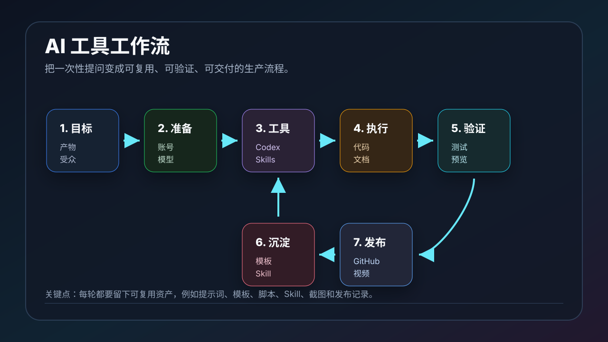

# AI 工具工作流：从一次性提问到可复用生产流程

很多人使用 AI 工具时，习惯直接问一句「帮我做一下」。这样当然能得到结果，但很难稳定复用，也很难把质量做上去。

更好的方法是把 AI 工具使用变成一套工作流：先定义目标，再准备环境，选择工具，执行任务，验证结果，最后把经验沉淀成模板或 Skill。



## 一、为什么要建立工作流

AI 工具真正提高效率的地方，不是一次回答多快，而是能不能让你把重复任务变成稳定流程。

没有工作流时，常见问题是：

- 每次都要重新解释背景。
- 提示词越写越长，但质量不稳定。
- 出错后不知道该从哪里排查。
- 结果无法验证，只能凭感觉判断。
- 成功经验没有沉淀，下次还要重来。

有工作流后，你会更像在管理一个小团队：

- Codex 负责代码、文档、验证和提交。
- Claude Code 负责另一套开发和审查流程。
- HyperFrames / Remotion 负责视频生成。
- Skills 负责沉淀重复流程。
- GitHub 负责版本记录和协作。

## 二、完整工作流总览

推荐把 AI 工具使用拆成 7 步：

```text
1. 明确目标
2. 准备环境
3. 选择工具
4. 执行任务
5. 验证结果
6. 发布交付
7. 沉淀复用
```

这 7 步看起来简单，但能解决大多数 AI 工具使用混乱的问题。

## 三、第一步：明确目标

不要一开始就说：

```text
帮我写一个文档。
```

更好的说法是：

```text
请写一篇面向 AI 工具新手的中文教程，主题是 Codex + Remotion 能做什么。
要求包含 GitHub 链接、效果图、使用流程、常见问题，并更新 README 后提交推送。
```

目标至少要包含：

- 要交付什么：文章、代码、视频、表格、PPT、脚本。
- 给谁看：新手、开发者、团队成员、客户、自己。
- 用在哪里：GitHub、公众号、课程、项目文档、社交媒体。
- 完成标准：是否需要图片、是否需要提交、是否需要测试。

目标越清楚，AI 越像执行者；目标越模糊，AI 越像聊天对象。

## 四、第二步：准备环境

准备工作决定后面能不能顺利执行。

这个项目里已经有两篇准备类文章：

- [通过 CC Switch 将 DeepSeek 等模型接入 Codex](./codex-cc-switch-deepseek.md)
- [注册美区和土区 Google 邮箱的合规指南](./google-account-us-tr-region.md)

准备环境时可以检查：

- GitHub 是否能正常 push。
- Codex 是否能访问当前仓库。
- 是否需要 Chrome 登录态。
- 是否需要 API Key。
- 是否需要第三方模型。
- 是否需要安装视频、文档、表格、浏览器相关插件。
- 是否需要准备截图、素材、Logo、音频。

很多任务失败不是因为 AI 不会做，而是环境没有打通。

## 五、第三步：选择工具

不同任务不要都用同一种工具硬做。

| 任务类型 | 推荐工具 |
| --- | --- |
| 改代码、写文档、提交 GitHub | Codex |
| Claude Code 工作流和代码辅助 | Claude Code |
| 可复用流程 | Skills |
| 网页测试和截图 | Browser / Chrome |
| HTML 动效视频 | HyperFrames |
| React 参数化视频 | Remotion |
| Word / Excel / PPT | Documents / Spreadsheets / Presentations |
| 图片生成和封面图 | Imagegen |

例如：

- 写一篇教程：Codex。
- 把教程变成短视频：Codex + Remotion。
- 做 HTML 动效视频：Codex + HyperFrames。
- 把重复发布流程沉淀下来：Codex Skill。

工具选对，后面的提示词会自然变短。

## 六、第四步：执行任务

执行阶段不要只让 AI 一次性输出最终结果。更稳定的方式是分阶段：

```text
1. 先读现有项目。
2. 给出改动计划。
3. 新增或修改文件。
4. 自检 diff。
5. 运行必要验证。
6. 提交并推送。
```

如果是写文章，可以要求：

```text
请先保持仓库现有风格，新增一篇独立 Markdown 文档，更新 README 入口，最后提交并推送。
```

如果是写视频项目，可以要求：

```text
请先写 DESIGN.md，再创建项目，生成 composition，运行 lint/inspect 或 still 检查，最后给出预览和渲染命令。
```

好的执行流程会让 AI 每一步都有可检查的产物。

## 七、第五步：验证结果

验证是工作流里最容易被省略、但最关键的一步。

不同产物的验证方式不同：

| 产物 | 验证方式 |
| --- | --- |
| Markdown 文档 | 检查链接、标题层级、图片路径、README 入口 |
| 代码 | 测试、lint、构建、运行应用 |
| 网页 | 浏览器打开、截图、移动端检查 |
| HyperFrames 视频 | `npx hyperframes lint`、`inspect`、`preview`、`render` |
| Remotion 视频 | Studio 预览、`remotion still`、`remotion render` |
| GitHub 任务 | `git status`、commit log、远端同步 |

验证的目标不是证明 AI 没错，而是把错误尽早暴露出来。

## 八、第六步：发布交付

发布可以是：

- commit 到 GitHub
- push 到远端
- 创建 PR
- 输出 MP4
- 生成 PPT
- 导出文档
- 给出预览链接
- 更新 README

发布时要留下清晰记录：

```text
提交哈希
变更文件
输出路径
预览地址
未完成事项
```

这样后面回溯和继续迭代都更容易。

## 九、第七步：沉淀复用

这是最能拉开差距的一步。

如果某个任务以后还会做，就不要只停留在「完成一次」。可以沉淀成：

- 提示词模板
- Markdown 模板
- 项目脚手架
- `.agents/skills/` 项目 Skill
- `~/.agents/skills/` 个人 Skill
- 自动化脚本
- 图片和视频素材模板
- README 目录规范

例如这个仓库已经开始形成几类资产：

- 准备工作文档
- Skills 安装与使用文档
- 视频生成工作流文档
- SVG 效果图和流程图
- README 分组目录

当这些资产越来越多，AI 工具就不再只是聊天窗口，而是你的内容生产系统。

## 十、推荐提示词模板

下面是一个通用模板：

```text
请在当前仓库完成一个任务：

目标：
新增一篇中文教程，主题是【主题】。

要求：
- 保持现有文档风格。
- 开头放快速入口。
- 带一张图片或效果图。
- 更新 README 目录。
- 检查 diff。
- 提交并推送。

完成后告诉我：
- 新增文件路径
- 图片路径
- commit hash
- 是否已经推送
```

如果是代码任务，可以改成：

```text
请先阅读项目结构，再实现【功能】。
要求运行测试或构建，最后提交并推送。
不要改无关文件。
```

如果是视频任务，可以改成：

```text
请使用 Codex + Remotion / HyperFrames 制作【主题】视频。
要求先生成视觉方案，再实现 composition，最后给出预览和渲染命令。
```

## 十一、截图建议

后续制作图文版时，可以补充这些截图：

- `images/workflow/goal.png`：任务目标拆解示例
- `images/workflow/tool-choice.png`：工具选择表
- `images/workflow/codex-diff.png`：Codex 修改 diff
- `images/workflow/verify.png`：验证命令输出
- `images/workflow/github-commit.png`：GitHub commit 记录
- `images/workflow/reusable-skill.png`：把流程沉淀成 Skill

截图时注意遮挡 API Key、账号、私有路径、未公开项目和内部资料。

## 十二、工作流清单

每次使用 AI 工具前，可以按这个清单过一遍：

- 目标是否清楚？
- 输入资料是否齐全？
- 工具是否选对？
- 是否需要联网、登录或 API Key？
- 是否需要截图、图片或视频？
- 是否有验证方式？
- 是否需要提交和推送？
- 这次经验是否值得沉淀成模板或 Skill？

把这几个问题问清楚，AI 产出的稳定性会明显提升。

## 十三、总结

AI 工具的核心不是「替你想一下」，而是「帮你完成一套可验证的流程」。

从一次性提问升级到工作流之后，你会得到三个好处：

- 产出更稳定。
- 错误更容易排查。
- 成功经验可以复用。

这也是这个项目后续可以持续扩展的方向：不只是记录工具怎么用，而是把不同工具组合成一套真正可执行的 AI 工作方法。
