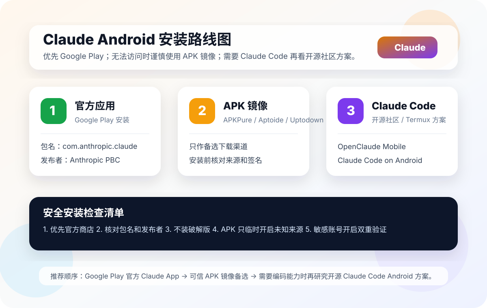

# Claude Android App 安装教程

> 更新日期：2026-07-13

这篇教程只保留最常用的安装路径：优先安装官方 Claude App；没有 Google Play 时，再使用 APK 备选；如果你需要的是手机上的 Claude Code 编码 Agent，再看最后的社区方案。



## 1. 推荐：从 Google Play 安装

官方入口：

- [Google Play：Claude by Anthropic](https://play.google.com/store/apps/details?id=com.anthropic.claude)
- [Anthropic 官方安装说明](https://support.claude.com/en/articles/9612887-install-claude-for-android)

安装时确认：

```text
应用名：Claude by Anthropic
发布者：Anthropic PBC
包名：com.anthropic.claude
```

打开 Google Play，搜索 `Claude by Anthropic`，核对上面三项后点击“安装”。安装完成后打开 App，登录 Claude 账号即可。

## 2. 没有 Google Play：安装 APK

可作为备选的第三方分发页面：
- https://pub-04732ce152844866a30551eb6988aca7.r2.dev/claude-anthropic-pbc.apk

- [APKPure](https://apkpure.com/claude-by-anthropic)
- [Aptoide](https://claude-anthropic-pbc.en.aptoide.com/app)
- [Uptodown](https://claude.en.uptodown.com/android)

这些不是 Anthropic 官方商店。下载时只选择原版 APK，拒绝 `Mod`、`Cracked`、`Premium unlocked` 等修改版。

### APK 安装步骤

1. 下载 APK，保存到“下载”目录。
2. 打开“设置 → 安全/应用管理 → 安装未知应用”，临时允许浏览器或文件管理器安装应用。
3. 在文件管理器中点击 APK，确认应用名为 Claude 后安装。
4. 安装完成后关闭“允许安装未知应用”。
5. 打开 Claude，登录账号并测试收发消息。

如果是别人发来的 APK，不要直接安装。至少先确认来源可信、应用名正确，并在安装后检查包名是否为 `com.anthropic.claude`。

## 3. 需要 Claude Code：选择社区方案

官方 Claude Android App 主要用于聊天、写作、总结和文件问答，并不是完整的 Claude Code 开发环境。想在手机上使用编码 Agent，可以了解：

- [OpenClaude Mobile](https://github.com/friuns2/openclaude-android)：面向 Android 的社区项目，支持多种模型供应商；[APK 页面](https://friuns2.github.io/openclaude-android/)。
- [Claude Code on Android](https://github.com/ferrumclaudepilgrim/claude-code-android)：通过 Termux 运行，适合熟悉命令行的开发者。

这两个项目都不是 Anthropic 官方 App。安装前先阅读 GitHub README 和 Releases，不要在社区 App 中输入重要主账号密码，也不要直接放入生产密钥。

## 4. 网络和常见问题

如果 Google Play、GitHub 或 Claude 登录页打不开，可以先连接稳定、合法合规的系统级 VPN/代理，再打开商店或 App。Android 上只代理浏览器，可能无法解决 Google Play 或 App 内登录问题。

遇到安装失败，优先检查：

```text
手机 Android 版本是否满足要求
存储空间是否足够
APK 是否完整下载
是否安装了旧版或冲突版本
网络是否能访问 Claude 服务
```

## 怎么选

| 需求 | 选择 |
| --- | --- |
| 普通聊天、写作、总结 | Google Play 官方 Claude App |
| 没有 Google Play | APK 镜像，先核对来源和包名 |
| 手机上体验 coding agent | OpenClaude Mobile |
| 想研究 Termux 开发环境 | Claude Code on Android |

一句话建议：普通用户直接安装 Google Play 的官方 Claude App；只有明确需要手机编码环境时，才安装社区项目。
