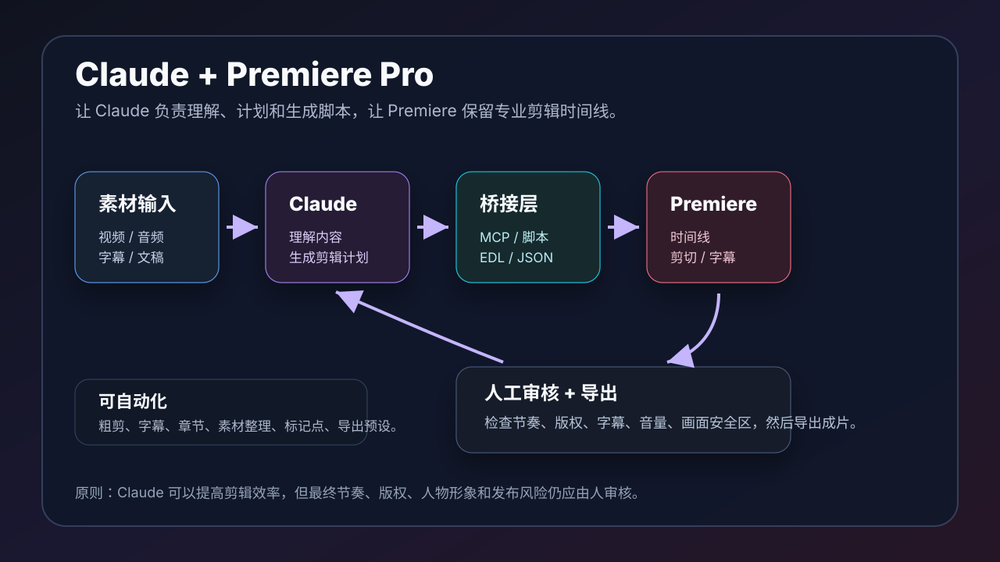

# Claude 集成 Premiere Pro 做视频剪辑：从剪辑计划到自动化时间线

本文介绍如何把 Claude 和 Adobe Premiere Pro 结合起来做视频剪辑。重点不是让 Claude 取代剪辑师，而是让它承担「理解内容、整理素材、生成剪辑计划、写脚本、批量处理重复步骤」这些工作，让 Premiere Pro 继续负责专业时间线和最终成片。

## 快速入口

- Adobe Premiere Pro UXP API：https://developer.adobe.com/premiere-pro/uxp/
- Premiere Pro ExtendScript Scripting Guide：https://ppro-scripting.docsforadobe.dev/
- Adobe UXP Premiere Pro Samples：https://github.com/AdobeDocs/uxp-premiere-pro-samples
- Adobe CEP PProPanel 示例：https://github.com/Adobe-CEP/Samples/tree/master/PProPanel
- Model Context Protocol 文档：https://modelcontextprotocol.io/docs/getting-started/intro
- Anthropic MCP 介绍：https://www.anthropic.com/news/model-context-protocol

如果你想做真正的 Claude + Premiere 自动化，建议先看 Adobe 的 UXP / ExtendScript 文档，再看 MCP。Premiere 是被控制的一端，Claude 是理解和决策的一端，中间通常需要一个本地桥接层。



## 一、先说结论：Claude 不能直接“神奇剪片”

很多人听到「Claude 集成 Premiere」，会以为可以直接对 Claude 说一句：

```text
帮我把这个视频剪成爆款短视频。
```

然后 Premiere 自动完成所有工作。

实际情况更像这样：

```text
Claude 负责理解和规划
Premiere 负责专业剪辑和导出
桥接脚本负责把 Claude 的计划变成 Premiere 能执行的操作
人负责最终审核
```

也就是说，Claude 可以很强地参与剪辑流程，但它通常需要以下其中一种连接方式：

- 手动协作：Claude 给剪辑方案，人手动在 Premiere 操作。
- 半自动脚本：Claude 生成 ExtendScript / UXP 脚本，在 Premiere 中执行。
- MCP / 本地服务：Claude 调用本地工具，由工具操作 Premiere 或生成可导入文件。
- 文件交换：Claude 生成 EDL、XML、字幕、标记点、剪辑清单，再导入 Premiere。

## 二、Claude 适合参与哪些剪辑工作

Claude 特别适合做这些事：

### 1. 素材理解

给 Claude 文稿、字幕、转录文本、镜头列表后，它可以帮你：

- 找出高光片段。
- 标出废话、停顿、重复内容。
- 提取章节结构。
- 总结人物观点。
- 识别适合做短视频的片段。
- 判断哪些地方适合加 B-roll。

### 2. 剪辑方案

Claude 可以输出很清晰的剪辑计划：

```text
00:00-00:05 冷开场：使用第 03 段最强观点
00:05-00:18 背景：保留主持人解释问题
00:18-00:42 主体：切入三个案例
00:42-00:55 总结：保留行动建议
00:55-01:00 CTA：加标题卡和关注引导
```

这类计划可以直接给剪辑师，也可以转成脚本或标记点。

### 3. 字幕和标题

Claude 可以生成：

- 短视频标题
- 字幕分段
- 重点词高亮
- 章节标题
- 片头文案
- 片尾 CTA
- 社媒发布文案

尤其适合把长视频改成短视频时，提炼钩子和标题。

### 4. 自动化重复操作

通过脚本或本地工具，Claude 可以间接帮你自动化：

- 导入素材
- 创建 sequence
- 放置 clip
- 添加 marker
- 插入字幕
- 根据时间码裁切
- 添加基础转场
- 添加 adjustment layer
- 批量改名字
- 套用导出预设

## 三、Claude + Premiere 的三种集成层级

### 层级一：手动协作

这是最简单、风险最低的方式。

工作流：

```text
1. 把视频转录成文字。
2. 把转录文本发给 Claude。
3. Claude 输出剪辑方案、标题、字幕和镜头建议。
4. 人在 Premiere 里手动剪辑。
5. Claude 帮你检查成片文案和发布标题。
```

适合：

- 新手
- 不想写脚本的人
- 内容分析和文案优化
- 重要项目的初稿规划

优点：

- 不需要插件开发。
- 不容易误操作项目。
- 人始终掌控时间线。

缺点：

- 仍然需要手动剪辑。
- 无法批量处理大量视频。

### 层级二：脚本半自动

Premiere Pro 可以通过脚本和插件方式被扩展。常见路线有：

- ExtendScript：传统的 Premiere 脚本能力。
- UXP：Adobe 新一代插件平台。
- CEP Panel：老一代面板扩展方式，很多历史示例仍然有参考价值。

工作流：

```text
1. Claude 根据需求生成剪辑 JSON。
2. Claude 生成 ExtendScript 或 UXP 脚本。
3. 人检查脚本。
4. 在 Premiere 中运行脚本。
5. Premiere 根据脚本创建 sequence、标记点、字幕或剪辑片段。
6. 人检查时间线并精剪。
```

适合：

- 批量导入素材
- 自动创建项目结构
- 添加 markers
- 生成字幕轨
- 根据时间码做粗剪
- 套用固定片头片尾
- 批量导出

优点：

- 效率提升明显。
- 保留 Premiere 工作流。
- 可以逐步自动化，不需要一口气做完整系统。

缺点：

- 需要懂一点脚本。
- Premiere API 能力有边界。
- 部分操作可能仍需人工完成。

### 层级三：MCP / 本地服务深度集成

更高级的做法是写一个本地 MCP server 或本地桥接服务，让 Claude 可以调用工具。

结构大概是：

```text
Claude
  -> MCP server / local bridge
    -> 读取素材、字幕、项目文件
    -> 生成剪辑计划
    -> 调用 Premiere 脚本
    -> 返回执行结果
```

Claude 不能凭空直接控制 Premiere。它需要一个工具层。MCP 的价值是给 Claude 一个标准化工具接口，让它能调用本地能力。

适合：

- 团队内部自动化剪辑系统
- 批量短视频生产
- 固定模板项目
- 内容工厂
- 课程剪辑流水线
- 播客切条

优点：

- 可持续复用。
- 可以和素材库、字幕、项目管理系统连接。
- 可以把剪辑流程做成工具。

缺点：

- 开发成本更高。
- 需要处理权限、安全和误操作风险。
- 要设计回滚和人工确认机制。

## 四、推荐架构

比较稳妥的架构是：

```text
素材文件
  -> 转录工具生成 transcript.srt / transcript.json
  -> Claude 分析内容，生成 edit-plan.json
  -> 本地脚本把 edit-plan.json 转成 Premiere 操作
  -> Premiere 创建粗剪 timeline
  -> 人工审核和精剪
  -> 导出成片
```

`edit-plan.json` 可以长这样：

```json
{
  "project": "podcast-short-001",
  "output": "60s vertical short",
  "sequence": {
    "width": 1080,
    "height": 1920,
    "fps": 30
  },
  "clips": [
    {
      "source": "interview.mp4",
      "in": "00:03:12.400",
      "out": "00:03:26.200",
      "track": 1,
      "label": "hook"
    },
    {
      "source": "interview.mp4",
      "in": "00:04:10.000",
      "out": "00:04:32.500",
      "track": 1,
      "label": "main point"
    }
  ],
  "captions": [
    {
      "start": "00:00:00.000",
      "end": "00:00:03.000",
      "text": "真正提高效率的不是工具，而是工作流。"
    }
  ],
  "markers": [
    {
      "time": "00:00:00.000",
      "name": "Hook",
      "comment": "Use strongest quote first"
    }
  ]
}
```

这个 JSON 是关键。它把 Claude 的自然语言判断，变成脚本可以执行的结构化计划。

## 五、剪辑工作流示例：长访谈切成 60 秒短视频

### 1. 准备素材

准备：

- 原始访谈视频
- 转录文本
- 目标平台
- 目标时长
- 账号风格
- 是否需要字幕
- 是否需要 B-roll

提示词：

```text
请阅读这段访谈转录，帮我找出适合剪成 60 秒竖屏短视频的 3 个片段。
要求：
- 每个片段给出起止时间码。
- 给出开头钩子。
- 给出字幕标题。
- 说明为什么适合短视频。
```

### 2. Claude 输出候选片段

Claude 可以输出：

```text
候选 1：工作流观点
时间码：00:03:12-00:04:32
开头钩子：很多人用 AI 没效率，是因为没有工作流
理由：观点明确，有反差，适合做教育类短视频
```

### 3. 生成剪辑计划

继续提示：

```text
请把候选 1 转成 edit-plan.json。
目标是 1080x1920，30fps，60 秒以内。
保留重要句子，删除停顿和重复表达。
```

### 4. 生成 Premiere 脚本

再提示：

```text
请根据 edit-plan.json 生成 Premiere ExtendScript 脚本。
脚本要做：
1. 检查项目中是否存在 interview.mp4。
2. 创建一个 1080x1920 的 sequence。
3. 按 clips 数组插入片段。
4. 添加 markers。
5. 不自动导出，最后弹窗提示人工检查。
```

### 5. 在 Premiere 中执行和人工审核

脚本创建的是粗剪，不是最终片。

人工还要检查：

- 节奏是否自然
- 剪切点是否突兀
- 字幕是否准确
- 人物表情是否合适
- 音频是否爆音
- 是否有版权或隐私风险
- 是否适合发布平台

## 六、剪辑工作流示例：课程视频自动加章节

适合课程、直播回放、长教程。

输入：

- 转录文本
- 课件大纲
- 视频时间码

Claude 可以输出：

```text
00:00 课程介绍
02:14 为什么需要工作流
06:40 工具选择
13:20 Codex 示例
21:05 视频生成示例
32:10 总结
```

然后生成 Premiere markers：

```json
[
  {"time": "00:00:00.000", "name": "课程介绍"},
  {"time": "00:02:14.000", "name": "为什么需要工作流"},
  {"time": "00:06:40.000", "name": "工具选择"}
]
```

这些 markers 可以用于：

- Premiere 时间线定位
- YouTube chapters
- B 站分 P 说明
- 课程目录
- 后续短视频切条

## 七、剪辑工作流示例：批量生成字幕和标题卡

Claude 很适合把口语内容改成适合屏幕阅读的字幕：

原句：

```text
其实我觉得很多人用 AI 效率不高，主要不是工具不行，而是他没有一个固定的工作流。
```

屏幕字幕：

```text
用 AI 没效率？
问题往往不是工具，
而是没有固定工作流。
```

可以要求：

```text
请把这段转录改成短视频字幕。
要求：
- 每行不超过 14 个汉字。
- 每条字幕不超过 2 行。
- 保留原意。
- 强调关键词。
- 输出 SRT。
```

再把 SRT 导入 Premiere。

## 八、Premiere 自动化能做什么

通过脚本或插件，常见可自动化任务包括：

- 创建项目和 sequence
- 导入素材
- 查询项目素材
- 插入片段到时间线
- 添加 markers
- 操作 metadata
- 设置导出参数
- 调用渲染和导出队列
- 管理 bins
- 读取和修改部分时间线元素

需要注意：Premiere 的 API 并不是所有 UI 操作都能覆盖。有些精细操作仍然更适合人工完成，比如复杂音频混音、精修转场、颜色风格、人物表情选择等。

## 九、Claude 生成脚本时的安全规则

让 Claude 写 Premiere 脚本时，一定要加安全边界：

```text
请生成脚本，但不要删除素材、不要覆盖原项目、不要自动导出、不要修改原始文件。
如果需要创建文件，请写到 output/ 目录。
执行前先解释脚本会做什么。
```

建议所有脚本都遵守：

- 不删除文件。
- 不覆盖原项目。
- 不直接发布。
- 不直接上传。
- 不修改原始素材。
- 执行前人工审查。
- 先在复制项目上测试。

## 十、Claude + Premiere 的提示词模板

### 1. 内容分析模板

```text
请分析这份视频转录，帮我找出适合剪成短视频的片段。

要求：
- 每个片段 30-90 秒。
- 给出起止时间码。
- 给出开头钩子。
- 给出标题。
- 给出保留理由。
- 标出需要删除的停顿、重复和跑题内容。
```

### 2. 剪辑计划模板

```text
请把这个候选片段转成剪辑计划。

输出格式：
- 片段顺序
- 源文件名
- in / out 时间码
- 字幕文本
- B-roll 建议
- 音乐和音效建议
- 需要人工确认的风险
```

### 3. Premiere 脚本模板

```text
请根据 edit-plan.json 生成 Premiere Pro ExtendScript。

要求：
- 只创建新 sequence，不修改原 sequence。
- 不删除任何素材。
- 不覆盖现有文件。
- 添加 markers 方便人工检查。
- 脚本末尾弹窗提示“请人工检查时间线”。
- 先解释脚本逻辑，再给代码。
```

### 4. 成片检查模板

```text
请根据这份成片字幕和剪辑计划做发布前检查。

检查：
- 是否有事实错误
- 是否有版权风险
- 是否有隐私风险
- 标题是否夸张
- 字幕是否口语化但不失真
- 是否适合目标平台
```

## 十一、适合本项目的用法

这个 `AI-guide-book` 项目后续可以把文章变成视频：

- 把每篇教程生成讲解脚本。
- 用 Claude 生成短视频分镜。
- 用 Premiere 剪辑真人讲解或录屏素材。
- 用 Claude 生成字幕、标题和章节。
- 用 Remotion / HyperFrames 做片头、转场和动效补充。
- 最终在 Premiere 做合成和导出。

例如：

```text
把《AI 工具工作流》这篇文章改成 3 分钟讲解视频脚本。
再生成 Premiere 剪辑计划，包含章节、字幕、B-roll 和片尾 CTA。
```

## 十二、常见误区

### 1. 以为 Claude 能完全代替剪辑师

Claude 可以做分析和自动化，但成片节奏、情绪、人物状态、版权判断仍然需要人。

### 2. 直接让 Claude 输出最终脚本并执行

不建议。脚本要先解释、再审查、再在复制项目中测试。

### 3. 只给视频不提供转录

Claude 更适合处理文本。先转录，再分析，效果会稳定很多。

### 4. 忽略素材命名

素材命名混乱时，自动化很容易失败。建议统一命名：

```text
interview_main.mp4
broll_workspace_01.mp4
music_soft_loop.wav
logo_white.png
```

### 5. 没有人工审核

尤其是人物视频、商业项目、客户素材，必须人工检查。

## 十三、建议的最小可行方案

如果你刚开始，不要一上来做完整 MCP 插件。

建议先做这个最小流程：

```text
1. 用转录工具得到 SRT。
2. 让 Claude 分析高光片段。
3. 让 Claude 输出 edit-plan.json。
4. 人手动在 Premiere 粗剪一次。
5. 总结重复动作。
6. 再让 Claude 写小脚本自动添加 markers 或字幕。
7. 稳定后再考虑 MCP。
```

这样更安全，也更容易逐步验证。

## 十四、截图建议

后续制作图文版时，可以补充这些截图：

- `images/claude-premiere/transcript-analysis.png`：Claude 分析转录文本
- `images/claude-premiere/edit-plan-json.png`：生成 `edit-plan.json`
- `images/claude-premiere/premiere-markers.png`：Premiere 时间线 markers
- `images/claude-premiere/script-panel.png`：Premiere 脚本或插件面板
- `images/claude-premiere/subtitles.png`：字幕导入效果
- `images/claude-premiere/export-settings.png`：导出设置
- `images/claude-premiere/review-checklist.png`：发布前检查清单

截图时注意遮挡人物隐私、客户素材、未公开视频、文件路径和授权信息。

## 十五、总结

Claude 集成 Premiere Pro 的正确姿势，不是让 AI 一键替你完成所有剪辑，而是建立一条稳定流水线：

```text
转录 -> 分析 -> 剪辑计划 -> 脚本 / 标记点 -> Premiere 时间线 -> 人工精剪 -> 导出
```

Claude 负责理解内容和生成结构化计划，Premiere 负责专业剪辑和成片输出。中间用 ExtendScript、UXP、MCP 或文件交换连接起来。

对于经常做课程、访谈、播客切条、产品视频和教程视频的人来说，这套流程能显著减少重复劳动，同时保留人工创作判断。

## 参考资料

- Adobe Premiere Pro UXP API：https://developer.adobe.com/premiere-pro/uxp/
- Premiere Pro ExtendScript Scripting Guide：https://ppro-scripting.docsforadobe.dev/
- Adobe UXP Premiere Pro Samples：https://github.com/AdobeDocs/uxp-premiere-pro-samples
- Adobe CEP PProPanel 示例：https://github.com/Adobe-CEP/Samples/tree/master/PProPanel
- Model Context Protocol 文档：https://modelcontextprotocol.io/docs/getting-started/intro
- Anthropic MCP 介绍：https://www.anthropic.com/news/model-context-protocol
