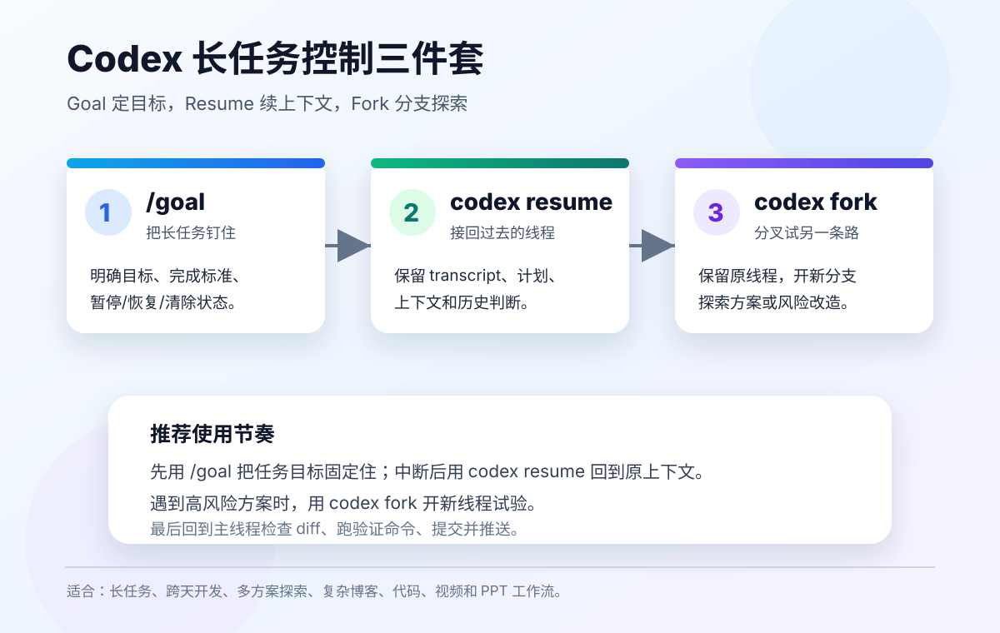

# 熟练运用 Goal、Resume、Fork：把 Codex 长任务做稳

官方参考：

- Codex CLI Features：https://developers.openai.com/codex/cli/features
- Codex CLI Reference：https://developers.openai.com/codex/cli/reference
- Codex CLI Slash Commands：https://developers.openai.com/codex/cli/slash-commands
- Codex App Commands：https://developers.openai.com/codex/app/commands

很多人用 Codex 时，只把它当成“问一句、改一次”的工具。但真正高效的用法，是把 Codex 当成长任务执行系统来控制。

长任务最怕三件事：

- 目标漂移：做着做着忘了最初要交付什么。
- 上下文断裂：隔天回来，又要重新解释一遍。
- 方案绑死：走错方向后，不敢尝试另一条路线。

`/goal`、`codex resume`、`codex fork` 正好分别解决这三个问题。



一句话概括：

```text
/goal 负责钉住目标。
codex resume 负责接回上下文。
codex fork 负责分叉探索。
```

## 一、先澄清：Goal 不是普通的 codex goal 子命令

这里说的 Goal，更准确地说是 Codex 的 **Goal mode** 或 `/goal` 斜杠命令。

在 Codex App、IDE Extension、CLI 里，可以通过 `/goal` 设置一个持续目标。官方手册说明，Goal 会附着在当前线程上，让 Codex 围绕这个目标持续工作，直到任务完成、暂停，或者需要你补充信息。

CLI 里常用方式：

```text
/goal Finish the migration and keep tests green
```

查看当前 goal：

```text
/goal
```

暂停、恢复、清除：

```text
/goal pause
/goal resume
/goal clear
```

如果 `/goal` 不出现在命令列表里，官方文档给出的方式是启用 `features.goals`：

```bash
codex features enable goals
```

或者在配置里启用：

```toml
[features]
goals = true
```

Goal 的目标文本有长度限制。官方手册写到，goal objective 不能为空，最多 4000 字符。更长的说明应该放到文件里，再让 goal 指向那个文件。

## 二、为什么 `/goal` 很重要

普通 prompt 更像一次性指令：

```text
帮我写一篇博客。
```

Goal 更像任务合约：

```text
/goal 在当前仓库新增一篇中文博客，主题是 Codex Goal、Resume、Fork 的重要性。
要求：
- 文章包含图文说明。
- 更新 README 入口。
- 检查图片路径和链接。
- 提交并推送到 main。
```

两者差别很大。

普通 prompt 只约束下一轮输出。Goal 会变成整个长任务的持续参照物。中间如果出现测试失败、需要重写、需要补图、需要推送，它都能围绕同一个目标继续推进。

适合用 `/goal` 的场景：

- 连续写多篇博客。
- 开发一个完整功能。
- 做一轮代码迁移。
- 修复一批 CI 问题。
- 生成视频、PPT、图片并配套文档。
- 把多个 session 或 agent 的结果合并成最终交付。

不适合用 `/goal` 的场景：

- 只问一个概念。
- 只查一个命令。
- 只改一行文案。
- 任务边界还完全没想清楚。

边界不清楚时，先用 `/plan`。等计划清楚后，再把计划改成 `/goal`。

## 三、`codex resume`：不要每次都从零开始

`codex resume` 是 Codex CLI 的稳定子命令。官方文档说明，Codex 会在本地保存 transcript，这样你可以重新打开之前的线程，而不是重复解释上下文。

最常用：

```bash
codex resume
```

它会打开最近 interactive sessions 的选择器。

直接恢复当前目录下最近一次 session：

```bash
codex resume --last
```

查看所有目录的 session：

```bash
codex resume --all
```

指定 session ID：

```bash
codex resume <SESSION_ID>
```

恢复时顺便补一句新指令：

```bash
codex resume --last "继续刚才的博客任务，检查 README 入口并提交推送"
```

官方文档还说明，非交互式 `codex exec` 也可以 resume：

```bash
codex exec resume --last "Fix the race conditions you found"
codex exec resume <SESSION_ID> "Implement the plan"
```

这对自动化很有用。比如第一阶段让 Codex 扫描问题，第二阶段继续同一个上下文修复问题。

## 四、为什么 `resume` 比重新开线程更稳

重新开线程的问题是：你以为自己说清楚了，但很多细节其实留在旧上下文里。

例如：

- 用户偏好：改完就提交推送。
- 项目习惯：文章要更新 README。
- 已经验证过的事实：某个链接会跳转。
- 已经踩过的坑：push 前可能需要 rebase。
- 未完成状态：某张图已经放进 `images/`。

如果重新开始，Codex 可能需要重新读文件、重新推理、重新确认。

`codex resume` 的价值是把工作接回原来的时间线：

```text
上一轮做了什么 -> 现在缺什么 -> 下一步怎么完成
```

适合使用 `resume` 的场景：

- 昨天写了一半的功能，今天继续。
- 长文章已经起草，需要补图和 README。
- 任务被网络、权限、冲突打断。
- 需要在同一个上下文里继续跑测试。
- 一个复杂修复分成多阶段执行。

注意：恢复 session 不等于代码一定还是旧状态。最好恢复后先让 Codex 执行：

```bash
git status --short --branch
git log -1 --oneline
```

确认本地文件和 Git 状态，再继续。

## 五、`codex fork`：给复杂任务留一条试错分支

`codex fork` 也是 Codex CLI 的稳定子命令。官方命令概览写到，它可以把之前的 interactive session 分叉成一个新线程，并保留原始 transcript。

最常用：

```bash
codex fork
```

分叉最近一次 session：

```bash
codex fork --last
```

分叉指定 session：

```bash
codex fork <SESSION_ID>
```

分叉时直接给新方向：

```bash
codex fork --last "换一种文章结构：先讲失败案例，再讲 Goal、Resume、Fork"
```

`fork` 的价值不是“复制聊天”，而是“保留原线程，同时开一条新路线”。

适合 fork 的场景：

- 你想比较两个实现方案。
- 你要做高风险重构，但不想污染原线程。
- 你想让 Codex 用不同风格重写文章。
- 你要探索一个新方向，但还不确定是否采用。
- 你需要保留当前主线，另开线程处理支线问题。

例如写博客时可以这样用：

```bash
codex fork --last "把这篇文章改成更适合小红书风格的版本，只给结构建议，不要改文件"
```

如果 fork 后的方案不好，直接丢掉分叉线程，主线程不受影响。

## 六、Goal、Resume、Fork 的组合打法

一个稳定的 Codex 长任务流程可以这样设计：

```text
1. 用 /plan 把任务拆清楚。
2. 用 /goal 固定最终交付标准。
3. 让 Codex 执行、验证、提交。
4. 中断后用 codex resume 回到原线程。
5. 遇到不确定方案时用 codex fork 分叉探索。
6. 选定方案后回到主线程合并。
```

以本项目写博客为例：

```text
/goal 新增一篇中文博客，主题是 Codex Goal、Resume、Fork。
要求：
- 带一张本地图片。
- 更新 README。
- 检查链接和 git diff。
- 提交并推送到 main。
```

如果中途断了：

```bash
codex resume --last "继续刚才那篇博客，先检查 git status 和 README 入口"
```

如果想试另一个标题和结构：

```bash
codex fork --last "尝试把文章改成新手教程风格，先给提纲，不要修改文件"
```

最后回到主线程，让 Codex：

```text
比较主线和 fork 方案，保留更清晰的结构。
然后检查图片路径、README 入口、git diff，提交并推送。
```

## 七、三者的分工表

| 能力 | 解决的问题 | 最佳使用时机 | 常用命令 |
| --- | --- | --- | --- |
| `/goal` | 目标漂移 | 长任务开始前 | `/goal ...` |
| `codex resume` | 上下文断裂 | 中断后继续 | `codex resume --last` |
| `codex fork` | 方案试错 | 不确定路线时 | `codex fork --last "..."` |

如果只能记一句：

```text
开始用 goal，回来用 resume，犹豫用 fork。
```

## 八、常见错误

### 1. Goal 写得太虚

不要写：

```text
/goal 优化这个项目
```

要写：

```text
/goal 修复登录页移动端错位问题。
完成标准：
- 375px 宽度不溢出。
- 登录按钮不遮挡输入框。
- npm run lint 通过。
- 提交前给出截图检查结果。
```

### 2. Resume 后不检查 Git 状态

恢复线程后，先确认当前代码状态。否则 Codex 可能带着旧上下文处理新文件状态。

推荐恢复后的第一句话：

```text
先运行 git status --short --branch 和 git log -1 --oneline，确认当前状态，再继续。
```

### 3. Fork 后让两个线程同时改同一批文件

fork 是为了探索，不是让两个线程抢同一块代码。

如果两个 fork 都要改文件，最好给它们不同边界：

```text
Fork A：只改文章结构。
Fork B：只改图片和 README。
主线程：最后合并判断。
```

### 4. 把 fork 当成最终答案

fork 的结果需要回到主线评估。不要让分叉线程直接接管所有提交，除非你明确决定采用这条路线。

## 九、推荐模板

### 长任务 Goal 模板

```text
/goal 完成【任务名称】。
交付物：
- 【文件/功能/文章】
- 【图片/测试/文档】
- 【README 或使用说明】

完成标准：
- 【验证命令】
- 【人工检查项】
- 【提交和推送要求】

限制：
- 不做无关重构。
- 不修改无关文件。
- 遇到冲突先汇报。
```

### Resume 模板

```bash
codex resume --last "继续上次任务。先检查 git status、README 入口和未提交文件，再判断下一步。"
```

### Fork 模板

```bash
codex fork --last "探索另一种方案。只输出计划和风险，不要修改文件。"
```

## 十、总结

熟练运用 `/goal`、`codex resume`、`codex fork`，本质上是在给 Codex 长任务加控制系统。

```text
/goal 让 Codex 不忘目标。
codex resume 让 Codex 不丢上下文。
codex fork 让 Codex 可以安全试错。
```

对于简单问题，它们可能不是必须的。

但只要任务跨越多个文件、多轮对话、多个方案，或者需要提交推送，它们就会明显提升稳定性。

真正会用 Codex 的人，不只是会写 prompt，而是会管理任务生命周期：定义目标、延续上下文、分叉探索、验证结果、最后交付。
