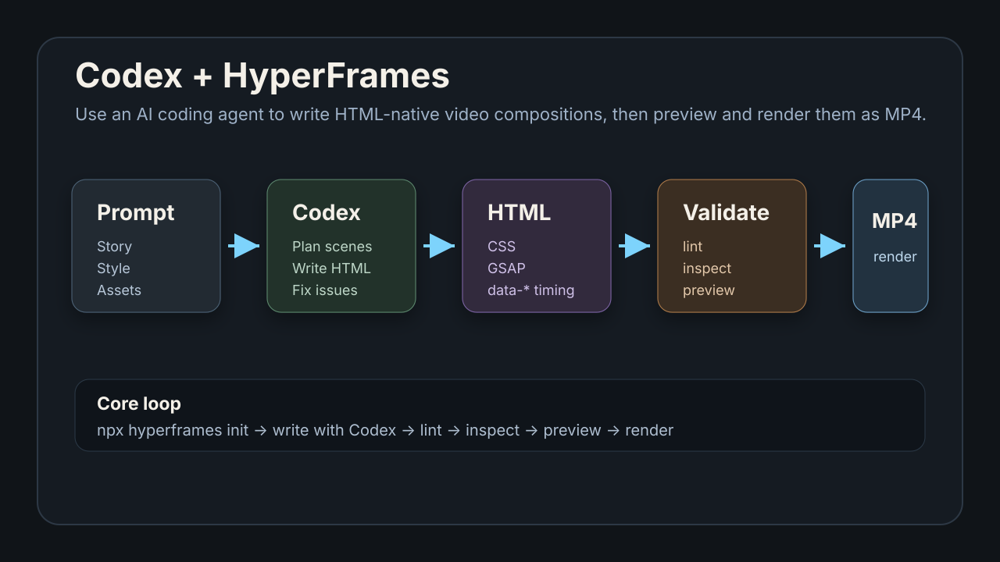

# 使用 Codex + HyperFrames 制作视频：从提示词到 MP4

本文介绍如何把 Codex 和 HyperFrames 结合起来，用 AI 编程代理完成视频脚本、HTML composition、动画、预览、检查和渲染。

## 快速入口

- HyperFrames GitHub：https://github.com/heygen-com/hyperframes
- HyperFrames 官网：https://hyperframes.heygen.com
- HyperFrames Quickstart：https://hyperframes.mintlify.app/quickstart
- HyperFrames Skills 安装命令：

```bash
npx skills add heygen-com/hyperframes
```

如果你只想先看项目源码和示例，优先打开 `https://github.com/heygen-com/hyperframes`。这个仓库是 HyperFrames 的官方开源入口，里面包含 CLI、Skills、示例 composition 和文档。



## 一、HyperFrames 是什么

HyperFrames 是一个面向 AI coding agent 的视频生成框架。它的核心思路很直接：

```text
用 HTML / CSS / JavaScript 写视频，再渲染成 MP4。
```

和传统剪辑软件不同，HyperFrames 把视频当成一个可编程的网页 composition：

- HTML 负责结构。
- CSS 负责视觉样式。
- GSAP 负责动画。
- `data-*` 属性负责时间轴、轨道和片段时长。
- CLI 负责检查、预览和渲染。

这让 Codex 这类编程代理很适合参与视频制作，因为 Codex 擅长读写代码、维护文件结构、修复 lint 错误、根据截图和检查结果迭代。

## 二、Codex 在这个流程里做什么

Codex 不只是帮你写几行 HTML。更理想的分工是：

| 环节 | Codex 做什么 | HyperFrames 做什么 |
| --- | --- | --- |
| 创意规划 | 拆脚本、分镜、节奏、画面风格 | 提供 composition 结构 |
| 工程搭建 | 创建项目、组织文件、管理素材 | 提供 CLI scaffold |
| 动画实现 | 写 HTML、CSS、GSAP timeline | 负责时间轴同步 |
| 检查修复 | 根据 lint / inspect 结果修改代码 | 输出错误和布局问题 |
| 预览交付 | 帮你解释预览地址和渲染结果 | 本地预览和渲染 MP4 |

一句话：Codex 负责「写和修」，HyperFrames 负责「播和渲」。

## 三、适合用 Codex + HyperFrames 做什么

比较适合：

- 产品介绍短视频
- 开源项目发布视频
- 教程片头和片尾
- 数据可视化动画
- 社交媒体短视频
- 网站转宣传视频
- 代码功能演示视频
- 带字幕、旁白、音乐的讲解视频

不太适合：

- 需要大量真人实拍剪辑的长视频
- 高度依赖复杂手工调色的影视项目
- 需要非线性剪辑师长期精修的商业大片

如果你的素材主要是截图、网页、文字、图标、产品画面和简单音频，HyperFrames 会非常顺手。

## 四、准备环境

HyperFrames CLI 通过 `npx hyperframes` 使用。开始前建议确认：

- Node.js 版本不低于 22。
- 本机安装 FFmpeg。
- 可以运行 Chrome 或 Chromium。
- 项目目录可以安装 npm 依赖。

先检查环境：

```bash
npx hyperframes doctor
```

如果 doctor 报错，优先修环境，再让 Codex 写视频。视频渲染链路依赖浏览器和 FFmpeg，环境没通时，后面写得再漂亮也渲不出来。

## 五、安装 HyperFrames Skills

如果你的 Codex 支持 Skills，可以先安装 HyperFrames Skills：

```bash
npx skills add heygen-com/hyperframes
```

安装后，你可以在 Codex 里明确说：

```text
使用 HyperFrames 帮我制作一个 15 秒产品介绍视频。
```

或者：

```text
用 HyperFrames 创建一个 1080x1920 的竖屏短视频，主题是 AI 工具学习指南。
```

安装 Skills 的好处是，Codex 会更清楚 HyperFrames 的规则，比如：

- composition 必须有 `data-composition-id`
- timeline 要注册到 `window.__timelines`
- 视频元素要 `muted playsinline`
- 音频要用独立 `<audio>`
- 先 lint 和 inspect，再 preview 和 render

## 六、创建第一个视频项目

可以让 Codex 帮你创建项目，也可以自己先执行：

```bash
npx hyperframes init ai-guide-video
```

常见模板：

```bash
npx hyperframes init ai-guide-video --example product-promo
npx hyperframes init ai-guide-video --example kinetic-type
npx hyperframes init ai-guide-video --example swiss-grid
npx hyperframes init ai-guide-video --example warm-grain
```

如果你已经有视频或音频素材：

```bash
npx hyperframes init ai-guide-video --video demo.mp4
npx hyperframes init ai-guide-video --audio narration.mp3
```

建议让 Codex 先读一遍项目结构，再开始改：

```text
请先阅读这个 HyperFrames 项目结构，告诉我 index.html、compositions、assets 分别负责什么，然后再开始制作视频。
```

## 七、给 Codex 的提示词模板

下面是一个比较稳的提示词：

```text
请使用 HyperFrames 制作一个 15 秒横屏视频。

主题：介绍 AI-guide-book 是一个帮助大家学习 AI 工具的开源项目。
风格：清爽、技术感、适合 GitHub README 展示。
尺寸：1920x1080。
结构：
1. 0-4 秒：标题和项目定位。
2. 4-9 秒：展示三个使用场景：Codex、Claude Code、HyperFrames。
3. 9-13 秒：展示从文档到视频的流程。
4. 13-15 秒：收尾，显示 GitHub 项目名。

要求：
- 使用 HTML/CSS/GSAP。
- 每个场景都有 entrance animation。
- 场景之间要有 transition。
- 先运行 npx hyperframes lint。
- 再运行 npx hyperframes inspect --samples 15。
- 修复所有错误后再告诉我 preview 地址。
```

如果你要做竖屏短视频，把尺寸换成：

```text
尺寸：1080x1920。
```

## 八、推荐制作流程

### 1. 先定视觉风格

不要一上来就写动画。先让 Codex 确认：

- 视频是横屏还是竖屏
- 目标平台是 YouTube、B 站、TikTok、X 还是官网
- 色彩风格
- 字体风格
- 是否需要品牌色
- 是否使用截图、Logo、产品图

可以让 Codex 生成一个 `DESIGN.md`：

```text
请先为这个 HyperFrames 视频写一个 DESIGN.md，包含色彩、字体、动效风格和不要做的事情。
```

### 2. 再写静态 hero frame

HyperFrames 很强调「先布局，再动画」。

让 Codex 先把每个场景最完整的一帧写出来，确认文字不重叠、元素不出界，再加 GSAP 动画。

### 3. 写 timeline

每个 composition 都要注册 timeline：

```js
window.__timelines = window.__timelines || {};
const tl = gsap.timeline({ paused: true });
window.__timelines["main"] = tl;
```

注意：timeline 要同步构建，不要放进 `setTimeout`、`Promise` 或 `async` 逻辑里。

### 4. 运行 lint

```bash
npx hyperframes lint
```

lint 会检查结构问题，例如：

- 缺少 `data-composition-id`
- 轨道重叠
- timeline 没注册
- 错误使用 timing 属性

### 5. 运行 inspect

```bash
npx hyperframes inspect --samples 15
```

inspect 会在时间轴上抽样检查视觉布局，尤其适合发现：

- 文字溢出
- 卡片内容被裁剪
- 元素跑出画布
- 字幕和标题重叠

### 6. 本地预览

```bash
npx hyperframes preview
```

默认会启动本地 Studio。交付给别人看时，用 Studio 地址，而不是直接打开 `index.html`。

地址形式通常类似：

```text
http://localhost:3002/#project/ai-guide-video
```

### 7. 渲染 MP4

迭代阶段：

```bash
npx hyperframes render --quality draft
```

最终输出：

```bash
npx hyperframes render --fps 60 --quality high --output ai-guide-video.mp4
```

如果要透明背景：

```bash
npx hyperframes render --format webm
```

## 九、常见坑

### 1. 直接打开 index.html 看到不对

不要把 `index.html` 当成最终预览入口。HyperFrames 需要通过 preview studio 管理时间轴和播放状态。

正确方式：

```bash
npx hyperframes preview
```

### 2. 画面有内容但渲染出来黑屏

常见原因：

- 没有正确写 `data-composition-id`
- timeline 没有注册到 `window.__timelines`
- 使用了异步构建 timeline
- composition 被放进了错误的 `<template>`

### 3. 文字在预览里正常，渲染后溢出

先跑：

```bash
npx hyperframes inspect --samples 15
```

并让 Codex 根据 inspect 输出修复。不要只靠肉眼看第一帧。

### 4. 音频不同步

视频和音频要分开：

```html
<video src="demo.mp4" muted playsinline></video>
<audio src="demo.mp4" data-volume="1"></audio>
```

不要依赖 video 自带声音。

### 5. 动画无限循环导致渲染失败

不要用：

```js
repeat: -1
```

应该根据视频时长计算有限循环次数。

## 十、如何让 Codex 做得更好

给 Codex 的信息越结构化，输出越稳定。建议每次至少给：

- 视频时长
- 横屏或竖屏
- 目标平台
- 观众是谁
- 场景结构
- 文案草稿
- 色彩和字体偏好
- 是否有素材
- 是否需要字幕、旁白、音乐
- 最终输出格式

一个好提示词不是「帮我做个视频」，而是「帮我按这个分镜做一个可 lint、可 inspect、可 render 的 HyperFrames 项目」。

## 十一、截图建议

后续制作图文版时，可以补充这些截图：

- `images/codex-hyperframes/doctor.png`：`npx hyperframes doctor` 检查结果
- `images/codex-hyperframes/init.png`：`npx hyperframes init` 初始化项目
- `images/codex-hyperframes/project-structure.png`：HyperFrames 项目目录
- `images/codex-hyperframes/lint.png`：`npx hyperframes lint` 输出
- `images/codex-hyperframes/inspect.png`：`npx hyperframes inspect --samples 15` 输出
- `images/codex-hyperframes/preview-studio.png`：HyperFrames Studio 预览页面
- `images/codex-hyperframes/render-output.png`：最终 MP4 输出

截图时注意遮挡本地用户名、私有路径、API Key、未发布项目名和内部素材。

## 十二、推荐工作流总结

最推荐的 Codex + HyperFrames 工作流是：

```text
1. 明确视频目标
2. 让 Codex 写 DESIGN.md
3. 初始化 HyperFrames 项目
4. Codex 写 HTML / CSS / GSAP
5. npx hyperframes lint
6. npx hyperframes inspect --samples 15
7. 修复问题
8. npx hyperframes preview
9. npx hyperframes render
10. 输出 MP4 / WebM
```

这个流程的关键不是一次生成完美视频，而是让 Codex 和 HyperFrames 形成一个可验证的闭环：写代码、检查、预览、修复、渲染。

## 参考资料

- HyperFrames GitHub：https://github.com/heygen-com/hyperframes
- HyperFrames 官网：https://hyperframes.heygen.com
- HyperFrames Quickstart：https://hyperframes.mintlify.app/quickstart
- HyperFrames Launch Video 示例：https://github.com/heygen-com/hyperframes-launch-video
