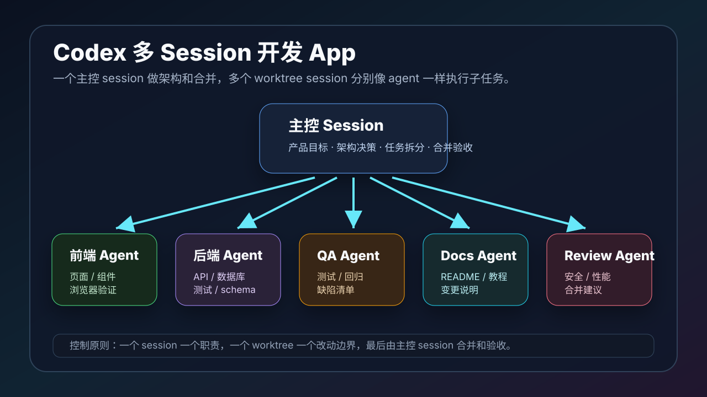

# 用 Codex 多 Session 开发 App：把多个会话当成不同 Agent 来协作

本文介绍如何用 Codex 开发 App 时，把多个 session 当成不同的 agent 来协作：一个主控 session 负责规划和合并，多个工作 session 分别负责前端、后端、测试、文档、审查等子任务。

这不是简单地多开几个窗口，而是把 Codex app 的 thread、worktree、skills 和 Git 工作流组合起来，形成一个可控的 AI 开发团队。

## 快速入口

- Codex Skills 官方文档：https://developers.openai.com/codex/skills
- Codex Worktrees 官方文档：https://developers.openai.com/codex/app/worktrees
- Codex Subagents 官方文档：https://developers.openai.com/codex/concepts/subagents
- OpenAI Skills GitHub：https://github.com/openai/skills
- OpenAI Curated Skills：https://github.com/openai/skills/tree/main/skills/.curated
- OpenAI System Skills：https://github.com/openai/skills/tree/main/skills/.system

如果你要用 Codex 长期开发 App，建议先打开 `https://github.com/openai/skills`，把常用 skill 的目录和安装方式熟悉一下。Codex 的官方 Skills 仓库会告诉你哪些能力是系统自带，哪些可以通过 `$skill-installer` 安装。



## 一、为什么开发 App 要用多个 Session

开发一个 App 通常不是单线程任务。

你可能同时需要：

- 产品需求拆解
- UI 设计和前端实现
- 后端 API
- 数据库 schema
- 登录和权限
- 浏览器测试
- 性能检查
- 安全审查
- README 和部署文档
- GitHub PR 和 CI 修复

如果全部塞进一个 session，容易出现两个问题：

- 上下文污染：日志、报错、截图、讨论全部混在一起。
- 决策混乱：同一个会话既写前端、又改后端、又跑测试，很难保持边界。

多个 session 的价值是：让每个 session 像一个专门 agent，只处理一个清晰职责。

## 二、核心架构：一个主控，多条执行线

推荐结构：

```text
主控 Session：产品经理 + 架构师 + 合并负责人
前端 Session：页面、组件、样式、交互
后端 Session：API、数据库、权限、业务逻辑
QA Session：测试、浏览器验证、回归清单
Docs Session：README、使用文档、部署说明
Review Session：安全、性能、可维护性审查
```

主控 session 不一定直接写很多代码。它更像技术负责人：

- 定义目标
- 拆分任务
- 分配文件边界
- 收集各 session 结果
- 解决冲突
- 决定是否合并
- 最后提交、推送、发 PR

执行 session 则只做自己的子任务。

## 三、Local、Worktree 和 Session 的关系

Codex app 里每个 thread 都可以在不同模式下运行：

- **Local**：直接在当前项目目录工作。
- **Worktree**：为这个任务创建独立 Git worktree。
- **Cloud**：在远程环境中运行。

开发 App 时，最推荐用：

```text
主控 Session：Local
执行 Session：Worktree
```

这样主控 session 保持当前项目干净，多个执行 session 各自在 worktree 里改代码，互不干扰。

例如：

```text
Session A：实现登录页，worktree/frontend-login
Session B：实现用户 API，worktree/backend-user-api
Session C：写 Playwright 测试，worktree/qa-login-flow
Session D：写 README 和部署说明，worktree/docs-deploy
```

每个 worktree 都可以独立 commit、测试、推送或 handoff 回 Local。

## 四、什么时候用多个 Session，什么时候不要用

适合多 session：

- 一个 App 有多个相互独立模块。
- 前端和后端可以并行。
- 测试和文档可以独立处理。
- 需要多角度 review。
- 任务很大，单 session 上下文会太长。

不适合多 session：

- 只改一个小 bug。
- 多个任务都要改同一个核心文件。
- 项目还没有基本架构。
- 需求还没想清楚。
- 你没有时间合并和 review。

规则很简单：

```text
读多写少，可以多 agent。
写同一块代码，要少 agent。
```

## 五、如何控制多个 Session 不乱写

这是关键。

多个 session 最大的问题不是不会写，而是写得太积极。

你需要给每个 session 设置边界。

### 1. 明确角色

不要说：

```text
帮我做一下登录功能。
```

要说：

```text
你是前端实现 session。
只负责登录页 UI 和表单交互。
不要修改后端 API、数据库 schema、README。
```

### 2. 明确文件范围

例如：

```text
允许修改：
- src/pages/login/**
- src/components/auth/**
- src/styles/auth.css

不要修改：
- server/**
- db/**
- README.md
- package.json
```

### 3. 明确完成标准

例如：

```text
完成标准：
- 登录页能渲染。
- 表单有 loading / error / disabled 状态。
- 移动端不溢出。
- 运行 npm run lint。
- 不提交，最后只汇报 diff 和验证结果。
```

### 4. 明确是否允许提交

有些 session 只能探索，有些可以提交。

建议：

```text
探索型 session：不提交，只给结论。
实现型 session：可以提交到自己的 worktree 分支。
主控 session：负责最终合并和推送。
```

### 5. 禁止自动大重构

每个执行 session 都要加一句：

```text
不要做无关重构，不要改项目结构，不要格式化无关文件。
```

这句话朴素但有用。

## 六、推荐的多 Session 开发流程

### 第 1 步：主控 Session 写任务地图

先让主控 session 读项目并拆任务：

```text
请作为主控 session，先阅读项目结构。
目标：开发一个简单的任务管理 App。
请拆分成前端、后端、QA、文档、Review 五个子任务。
每个子任务要包含：
- 目标
- 允许修改的文件
- 禁止修改的文件
- 验证方式
- 完成后需要汇报什么
先不要改代码。
```

主控 session 输出任务地图后，再开多个 worktree session。

### 第 2 步：创建前端 Session

提示词：

```text
你是 Frontend Agent。

任务：
实现任务列表页面和新增任务表单。

允许修改：
- src/app/**
- src/components/tasks/**
- src/styles/**

禁止修改：
- server/**
- db/**
- README.md
- package.json

要求：
- 保持现有 UI 风格。
- 提供 loading、empty、error 状态。
- 移动端不溢出。
- 完成后运行 npm run lint。
- 不要提交，最后汇报修改文件、验证命令和剩余风险。
```

### 第 3 步：创建后端 Session

提示词：

```text
你是 Backend Agent。

任务：
实现 tasks CRUD API。

允许修改：
- server/routes/tasks/**
- server/services/tasks/**
- db/schema/**
- tests/api/tasks/**

禁止修改：
- src/components/**
- src/styles/**
- README.md

要求：
- API 返回结构稳定。
- 添加最小测试。
- 不要改前端。
- 完成后运行 API 测试并汇报结果。
```

### 第 4 步：创建 QA Session

QA session 可以先不写代码，只读和测。

```text
你是 QA Agent。

任务：
基于当前项目设计任务管理 App 的测试清单。

要求：
- 不改业务代码。
- 只新增或修改 tests/e2e/**。
- 覆盖新增任务、完成任务、删除任务、空状态、错误状态。
- 如果无法运行测试，说明阻塞原因。
```

### 第 5 步：创建 Docs Session

```text
你是 Docs Agent。

任务：
更新 README 和 docs/usage.md，说明如何启动、测试和使用任务管理 App。

禁止修改业务代码。
完成后检查链接和命令是否和 package.json 一致。
```

### 第 6 步：主控 Session 合并

所有执行 session 完成后，让主控 session 做：

```text
请作为主控 session，汇总这些 worktree 的结果：
- Frontend Agent
- Backend Agent
- QA Agent
- Docs Agent

请检查：
- 是否有文件冲突
- API contract 是否一致
- 前端是否调用正确接口
- 测试是否覆盖核心路径
- README 是否准确

不要盲目合并。先输出合并计划。
```

## 七、多个 Session 的写作控制协议

可以给每个 session 一份固定协议：

```text
你必须遵守：

1. 只处理本 session 的任务。
2. 不修改禁止范围内的文件。
3. 不做无关重构。
4. 遇到跨边界问题，先记录，不要直接改。
5. 每次完成后汇报：
   - 修改了哪些文件
   - 为什么修改
   - 如何验证
   - 还有哪些风险
6. 没有明确许可，不要提交和推送。
```

如果你想让 session 更像真正团队成员，可以加：

```text
你的输出要像工程师交接说明，而不是聊天总结。
```

## 八、推荐安装哪些 Skills

开发 App 时，建议优先安装这些 Skills。

### 1. skill-creator

用途：把你自己的开发流程沉淀成 Skill。

GitHub：

```text
https://github.com/openai/skills/tree/main/skills/.system/skill-creator
```

适合：

- 创建项目专用 app-dev skill。
- 创建 review skill。
- 创建 release skill。

### 2. skill-installer

用途：安装官方 curated / experimental skills。

GitHub：

```text
https://github.com/openai/skills/tree/main/skills/.system/skill-installer
```

安装方式通常是：

```text
$skill-installer <skill-name>
```

### 3. openai-docs

用途：查 OpenAI / Codex / API 官方文档。

GitHub：

```text
https://github.com/openai/skills/tree/main/skills/.system/openai-docs
```

适合：

- App 使用 OpenAI API。
- 查 Codex 配置、skills、plugins、MCP。
- 选择模型和升级模型。

### 4. gh-address-comments

用途：处理 GitHub PR review comments。

GitHub：

```text
https://github.com/openai/skills/tree/main/skills/.curated/gh-address-comments
```

适合：

- 一个 session 专门处理 PR 评论。
- 主控 session 汇总 review 反馈。

### 5. gh-fix-ci

用途：修 GitHub Actions / CI 失败。

GitHub：

```text
https://github.com/openai/skills/tree/main/skills/.curated/gh-fix-ci
```

适合：

- QA Agent 或 CI Agent。
- 合并前自动看失败日志。

### 6. yeet

用途：发布本地改动到 GitHub，创建 PR。

GitHub：

```text
https://github.com/openai/skills/tree/main/skills/.curated/yeet
```

适合：

- 主控 session 最终提交、推送、开 PR。
- 不建议让每个执行 agent 都使用。

### 7. playwright / playwright-interactive

用途：浏览器自动化测试和交互检查。

GitHub：

```text
https://github.com/openai/skills/tree/main/skills/.curated/playwright
https://github.com/openai/skills/tree/main/skills/.curated/playwright-interactive
```

适合：

- 前端 Agent。
- QA Agent。
- 检查页面渲染、按钮点击、表单流程。

### 8. screenshot

用途：截图和视觉检查。

GitHub：

```text
https://github.com/openai/skills/tree/main/skills/.curated/screenshot
```

适合：

- 前端视觉验收。
- 记录 bug 复现画面。

### 9. security-best-practices / security-threat-model

用途：安全设计和威胁建模。

GitHub：

```text
https://github.com/openai/skills/tree/main/skills/.curated/security-best-practices
https://github.com/openai/skills/tree/main/skills/.curated/security-threat-model
```

适合：

- 登录、权限、支付、个人数据相关 App。
- Review Agent。

### 10. figma-implement-design

用途：根据 Figma 设计实现页面。

GitHub：

```text
https://github.com/openai/skills/tree/main/skills/.curated/figma-implement-design
```

适合：

- UI Agent。
- 设计稿还原。

### 11. vercel-deploy / netlify-deploy / cloudflare-deploy

用途：部署 Web App。

GitHub：

```text
https://github.com/openai/skills/tree/main/skills/.curated/vercel-deploy
https://github.com/openai/skills/tree/main/skills/.curated/netlify-deploy
https://github.com/openai/skills/tree/main/skills/.curated/cloudflare-deploy
```

适合：

- Deploy Agent。
- Preview 环境和生产部署。

## 九、推荐的 Agent 组合

一个中型 App 可以这样配：

| Agent | Session 模式 | 主要 Skill | 是否允许写代码 |
| --- | --- | --- | --- |
| 主控 Agent | Local | skill-creator、yeet | 谨慎 |
| 前端 Agent | Worktree | playwright、screenshot、figma-implement-design | 是 |
| 后端 Agent | Worktree | openai-docs、security-best-practices | 是 |
| QA Agent | Worktree | playwright、gh-fix-ci | 是，限 tests |
| Docs Agent | Worktree | openai-docs | 是，限 docs |
| Review Agent | Worktree 或只读 | security-threat-model、gh-address-comments | 默认不写 |
| Deploy Agent | Worktree | vercel-deploy / netlify-deploy | 谨慎 |

最重要的是：

```text
不要让所有 Agent 都有无限写权限。
```

## 十、如何合并多个 Session 的结果

合并时不要急着 cherry-pick。

建议流程：

```text
1. 每个 session 输出 summary。
2. 主控 session 查看每个 worktree 的 diff。
3. 按模块顺序合并：后端 -> 前端 -> QA -> Docs。
4. 每合并一个模块就运行一次验证。
5. 最后跑完整测试。
6. 让 Review Agent 做最终审查。
7. 提交、推送、开 PR。
```

如果出现冲突，让主控 session 处理，不要让两个执行 session 互相改。

## 十一、写 App 的完整提示词模板

可以直接使用：

```text
请作为主控 session，帮我规划一个多 session 开发 App 的任务。

App 目标：
【填写 App 目标】

请输出：
1. 功能拆分
2. 建议的 session / agent 分工
3. 每个 agent 的允许修改文件
4. 每个 agent 的禁止修改文件
5. 每个 agent 的验证方式
6. 推荐安装的 skills
7. 合并顺序和风险点

先不要改代码。
```

前端 Agent：

```text
你是 Frontend Agent。
只负责【页面/组件】。
允许修改【路径】。
禁止修改【路径】。
完成后运行【验证命令】。
最后汇报 diff、验证结果和风险。
```

Review Agent：

```text
你是 Review Agent。
请只审查当前 diff。
优先找 bug、安全风险、测试缺口和回归风险。
不要改代码，除非我明确要求。
```

## 十二、什么时候沉淀成项目 Skill

如果你连续 3 次都用同一套多 agent 流程，就应该沉淀成项目 Skill。

可以创建：

```text
.agents/skills/app-dev-orchestrator/SKILL.md
```

内容可以包括：

- 默认 agent 分工
- 文件边界规则
- 验证命令
- 合并顺序
- review 清单
- release 清单

这样以后只要说：

```text
$app-dev-orchestrator 帮我拆分这个功能。
```

Codex 就能按你的团队流程来。

## 十三、常见坑

### 1. 多个 Session 同时改同一个文件

这是最常见冲突来源。解决方法是提前分配文件边界。

### 2. 主控 Session 也下场乱改

主控最好少写代码，多做决策和合并。

### 3. 每个 Agent 都能提交推送

不建议。默认只有主控 session 可以最终提交推送。

### 4. 没有统一 API contract

前后端并行时，先写接口契约：

```text
GET /api/tasks
POST /api/tasks
PATCH /api/tasks/:id
DELETE /api/tasks/:id
```

否则前端和后端会各写各的。

### 5. 没有最终 Review

多 agent 工作看起来快，但也容易把局部正确拼成整体错误。必须有最终 review。

## 十四、最小可行流程

如果你刚开始，不要一次开 7 个 session。

建议从 3 个开始：

```text
主控 Session：拆任务和合并
实现 Session：写功能
Review Session：只审查
```

熟悉后再加：

```text
QA Session
Docs Session
Deploy Session
Security Session
```

## 十五、总结

用 Codex 多 session 开发 App，本质上是在搭一个小型 AI 工程团队。

关键不是多开窗口，而是三件事：

```text
分工清楚
边界清楚
验证清楚
```

当你能让每个 session 都像一个有职责、有边界、有验收标准的 agent，Codex 就不只是一个写代码助手，而是一个可以并行推进 App 开发的工程系统。

## 参考资料

- Codex Skills：https://developers.openai.com/codex/skills
- Codex Worktrees：https://developers.openai.com/codex/app/worktrees
- Codex Subagents：https://developers.openai.com/codex/concepts/subagents
- OpenAI Skills GitHub：https://github.com/openai/skills
- OpenAI Curated Skills：https://github.com/openai/skills/tree/main/skills/.curated
- OpenAI System Skills：https://github.com/openai/skills/tree/main/skills/.system
