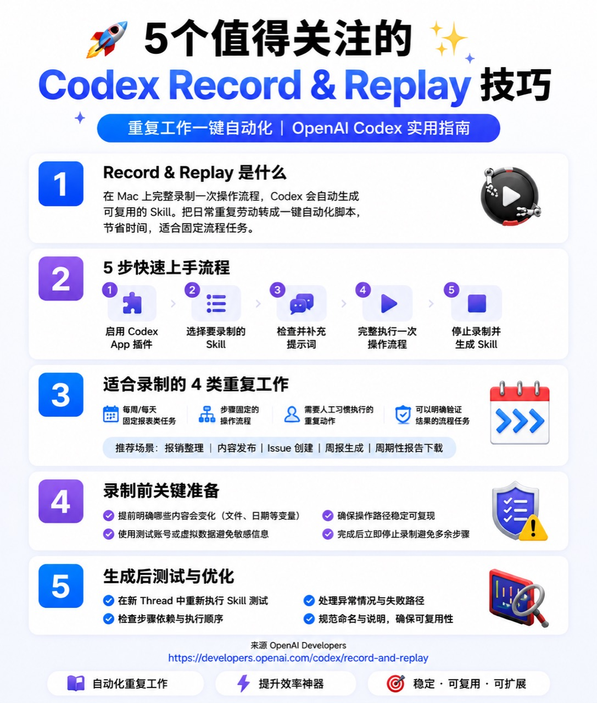

# Codex Record & Replay：把重复操作录制成可复用 Skill

官方文档：https://developers.openai.com/codex/record-and-replay

Record & Replay 是 Codex 里一个很适合“重复工作自动化”的功能：你在 Mac 上完整演示一次操作流程，Codex 会根据这次演示生成一个可复用的 Skill。以后遇到同类任务时，就不需要重新写长 prompt，而是让 Codex 按这个 Skill 复现流程。



上图可以概括成一句话：

```text
把你经常重复做、步骤稳定、结果可验证的操作，录制成 Codex 可以反复使用的工作流。
```

## 一、Record & Replay 是什么

Record & Replay 的核心不是“录屏”，而是“录制一段可复用的工作方式”。

你在 Mac 上演示一次完整流程，Codex 会观察操作过程、窗口内容和关键步骤，然后草拟一个 Skill。这个 Skill 通常会包含：

- 什么时候应该使用这个流程。
- 这个流程需要哪些输入。
- 每一步应该怎么执行。
- 执行完成后如何验证结果。
- 哪些命名、字段、路径或偏好需要保留。

官方文档里给出的典型例子包括报销、预订车位、创建配置正确的 issue、发布视频、下载周期性报告等。这些任务都有一个共同点：不是一次性创作，而是有固定套路的重复操作。

需要注意：官方说明里 Record & Replay 当前面向 macOS，并且需要 Computer Use 可用且已启用。如果你在 Codex 里看不到入口，可能是地区、组织配置或 Computer Use 权限限制导致的。

## 二、5 步快速上手流程

### 第 1 步：启用 Codex App 插件

先确认你使用的是 Codex App，并且相关插件、Computer Use 能力处于可用状态。

如果入口正常，你可以在 Codex App 的 Plugins 区域找到录制相关操作。

### 第 2 步：选择要录制的 Skill

不要一开始就录很大的流程。

更好的选择是：

```text
一个固定目标 + 一组稳定步骤 + 一个明确完成标志
```

例如：

- 每周生成一次项目周报。
- 按固定格式创建 GitHub Issue。
- 下载某个后台的周期性报表。
- 把文章发布到固定平台。
- 按固定规则整理发票或报销材料。

不推荐录制：

- 每次判断都完全不同的流程。
- 依赖大量人工主观选择的流程。
- 包含密码、验证码、银行卡、私密聊天记录的流程。
- UI 经常变化、路径不稳定的网站后台。

### 第 3 步：检查并补充提示词

录制前最好先告诉 Codex 这次流程的目标和变量。

例如：

```text
我要录制一个“创建标准 GitHub Issue”的 Skill。
这个流程以后会复用。
每次变化的输入是：标题、问题描述、优先级、关联模块。
请重点记录字段填写顺序、标签选择规则和创建后验证方式。
```

这样 Codex 不会只记住你点了哪些按钮，还会理解哪些内容是固定规则，哪些内容是下次要替换的变量。

### 第 4 步：完整执行一次操作流程

开始录制后，按平时真实工作方式做一遍。

录制时建议遵守三个原则：

- 流程要完整：从起点做到结果出现。
- 操作要干净：不要中途切去无关页面。
- 数据要安全：不要暴露真实 token、密码、客户隐私或敏感账号。

如果需要输入示例数据，建议使用测试账号、假数据或脱敏内容。

### 第 5 步：停止录制并生成 Skill

流程完成后，立刻停止录制。

不要继续做无关清理动作，否则 Codex 可能把这些步骤也理解成 Skill 的一部分。

停止后，Codex 会整理录制内容，并生成一个可复用 Skill。你可以继续让 Codex 优化这个 Skill，例如：

```text
请把这个 Skill 里的变量抽出来，包括标题、日期范围、文件名和项目名称。
请补充失败路径：如果页面加载失败、按钮不可见、字段为空，应该怎么处理。
请补充验证步骤：完成后要检查哪些页面或文件。
```

## 三、最适合录制的 4 类重复工作

### 1. 每周或每天固定报表类任务

典型场景：

- 周报生成
- 销售报表下载
- 运营数据导出
- 财务流水整理
- 内容发布统计

这类流程适合录制，是因为它们通常有固定入口、固定筛选条件、固定导出方式。

录制前要明确：

```text
日期范围是否每次变化？
文件名是否有命名规范？
导出后放到哪个目录？
是否需要截图或校验数字？
```

### 2. 步骤固定的操作流程

典型场景：

- 创建 GitHub Issue
- 创建 Linear 任务
- 发布一篇文章
- 上传一个视频
- 给客户创建一个项目空间

这类流程重点不是“能不能点完”，而是“每次都按同一套规范点完”。

例如创建 issue，不只是填标题和正文，还可能包括：

- 选择 label
- 选择 assignee
- 设置 milestone
- 粘贴复现步骤
- 检查 issue 创建后的 URL

这些细节非常适合沉淀成 Skill。

### 3. 需要人工习惯执行的重复动作

有些流程不是纯 API 自动化，但你每次都按自己的习惯做。

例如：

- 发布文章前先检查标题、封面、摘要和标签。
- 上传视频前先检查字幕、封面、分类和可见性。
- 整理客户材料时按固定目录改名和归档。

这类流程适合 Record & Replay，因为它能把“你脑子里的习惯”变成 Codex 可读的步骤。

### 4. 结果可以明确验证的流程

Record & Replay 最喜欢这种任务：

```text
做完后，可以明确判断成功还是失败。
```

例如：

- issue 是否创建成功。
- 报表文件是否下载到指定目录。
- 文章是否进入已发布状态。
- 视频是否生成公开链接。
- 周报是否包含指定几个模块。

如果一个流程没有验收标准，生成的 Skill 后续也很难稳定复用。

## 四、录制前的关键准备

### 明确哪些内容会变化

录制前先列出变量：

| 变量 | 示例 |
| --- | --- |
| 日期 | 本周、上周、指定月份 |
| 文件 | report.csv、video.mp4、draft.md |
| 项目 | AI-guide-book、客户 A 项目 |
| 平台 | GitHub、Notion、后台系统 |
| 输出 | issue URL、下载文件、发布链接 |

录制时要让 Codex 知道这些值不是固定死的。

### 使用测试账号或脱敏数据

不要在录制中暴露：

- 登录密码
- API token
- 银行卡信息
- 客户隐私
- 私密聊天
- 真实手机号和验证码

如果必须演示登录后的流程，建议先登录好，再从目标页面开始录制。

### 确保操作路径稳定可复现

适合录制的路径应该尽量稳定。

例如：

```text
打开后台 -> 进入报表页 -> 选择日期 -> 点击导出 -> 检查下载文件
```

不稳定的路径包括：

- 页面入口经常变化。
- 每次弹窗都不同。
- 需要随机选择大量内容。
- 依赖临时验证码或人工审核。

### 完成后立即停止录制

这是很多人会忽略的一点。

当结果已经出现时，就应该停止录制。否则后面的闲逛、检查、切换窗口，都可能被 Codex 学进去，导致 Skill 变臃肿。

## 五、生成后如何测试与优化

生成 Skill 只是第一步，真正可用还需要测试。

建议新开一个 Codex thread，直接让 Codex 使用这个 Skill：

```text
请使用刚才生成的 Skill，帮我创建一个新的 GitHub Issue。
标题：登录页移动端按钮错位
优先级：P2
模块：frontend
请完成后返回 issue 链接，并说明你如何验证创建成功。
```

测试时重点看四件事：

- 是否能找到正确入口。
- 是否正确替换变量。
- 是否跳过了无关步骤。
- 是否能验证最终结果。

如果失败，不要急着重录。先让 Codex 修 Skill：

```text
刚才执行失败，因为页面入口不是固定按钮，而是在左侧导航的第二组菜单里。
请更新 Skill：增加入口查找规则和失败重试步骤。
```

常见优化方向：

- 把固定文案改成变量。
- 增加失败路径。
- 增加验证步骤。
- 删除录制时误带入的无关动作。
- 补充命名规范和默认字段。

## 六、一个实战例子：录制“创建标准 Issue”

假设你经常需要为开发项目创建 issue。

录制前可以这样提示：

```text
我要录制一个创建标准 GitHub Issue 的 Skill。
以后每次会变化的输入包括：
- issue 标题
- 背景说明
- 复现步骤
- 期望结果
- 优先级
- 模块标签

请记录：
- 如何进入目标仓库的 Issues 页面
- 如何选择 label
- 如何填写标准模板
- 创建完成后如何复制 issue 链接
```

录制时执行：

```text
打开仓库 -> 进入 Issues -> New issue -> 填写标题和正文 -> 选择 label -> 提交 -> 复制链接
```

生成后测试：

```text
请使用“创建标准 GitHub Issue”Skill。
标题：README 图片链接失效
模块：docs
优先级：P2
背景：新增文章后图片路径可能遗漏。
期望：README 中所有图片链接都能正常打开。
完成后返回 issue URL。
```

如果执行稳定，这个 Skill 就可以长期复用。

## 七、什么时候该录 Skill，什么时候该写脚本

Record & Replay 适合“人类操作路径明显”的流程。

但不是所有自动化都应该录制。

| 任务类型 | 推荐方式 |
| --- | --- |
| 网页后台固定操作 | Record & Replay |
| 本地 GUI 软件操作 | Record & Replay |
| 每次都要人工判断但有固定习惯 | Record & Replay |
| 文件批量重命名 | 脚本 |
| 数据清洗和格式转换 | 脚本 |
| API 批量调用 | 脚本或 MCP |
| 团队分发一整套能力 | Plugin |

简单判断：

```text
如果你平时是“点界面完成”，优先录 Skill。
如果你平时是“处理结构化数据”，优先写脚本。
如果你要给团队稳定分发，考虑做 Plugin。
```

## 八、推荐收藏的 5 个技巧

### 1. 录制前先写清楚变量

不要让 Codex 猜哪些值下次会变。

### 2. 只录一个清晰目标

一个 Skill 只解决一个重复流程，不要把多个流程揉在一起。

### 3. 每次录制都用安全数据

录制的是操作方式，不是你的真实隐私数据。

### 4. 生成后一定新开 thread 测试

不要只看 Skill 文本是否漂亮，要看它能不能真的复现流程。

### 5. 把验证步骤写进 Skill

好的 Skill 不只是会执行，还会知道如何判断自己执行成功。

## 九、总结

Codex Record & Replay 最适合把稳定、重复、可验证的工作转成 Skill。

它的最佳使用方式是：

```text
选择重复流程 -> 说明变量 -> 演示一次 -> 生成 Skill -> 新 thread 测试 -> 继续优化
```

如果你经常在 Mac 上重复做同一类操作，比如下载报表、创建 issue、发布内容、整理文件、上传视频，Record & Replay 很值得专门练一下。

它真正节省的不是一次操作的几分钟，而是让你的工作方式开始被 Codex 记住、复用和放大。

参考资料：

- OpenAI Codex Record & Replay：https://developers.openai.com/codex/record-and-replay
- OpenAI Codex Skills：https://developers.openai.com/codex/skills
