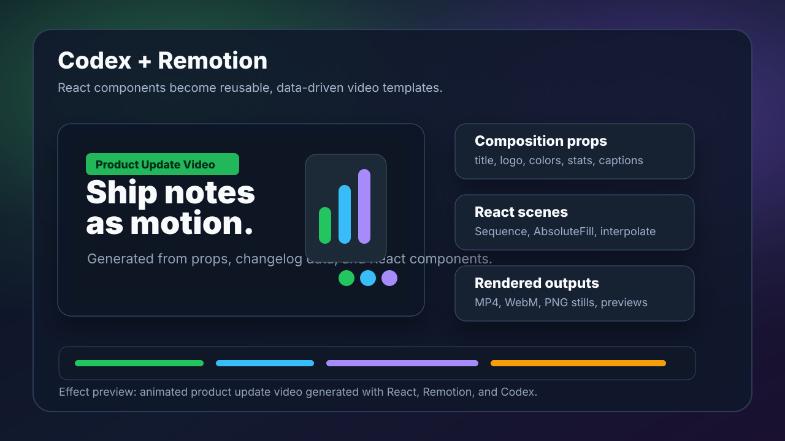

# Codex 集成 Remotion 能做什么：用 React 生成自动化视频

本文介绍 Codex + Remotion 的组合能做哪些视频，以及如何把「写代码」变成「批量生成可预览、可渲染、可自动化的视频」。

## 快速入口

- Remotion GitHub：https://github.com/remotion-dev/remotion
- Remotion 官网：https://www.remotion.dev
- Remotion 文档：https://www.remotion.dev/docs
- Remotion Player：https://www.remotion.dev/player
- Remotion Showcase：https://www.remotion.dev/showcase

如果你只是想快速了解 Remotion 能做什么，优先打开 `https://github.com/remotion-dev/remotion`。Remotion 官方仓库的定位是：用 React 程序化创建视频。



## 一、Remotion 是什么

Remotion 是一个用 React 写视频的框架。它把视频拆成一个个 React 组件，然后按帧渲染成 MP4、WebM 或静态图片。

传统视频工具更像「在时间线上拖素材」，Remotion 更像「写一个可以生成视频的前端应用」。

你可以用熟悉的 Web 技术做视频：

- React 组件
- TypeScript
- CSS / Tailwind
- SVG
- Canvas
- WebGL / Three.js
- JSON 数据
- API 返回的数据
- 图片、音频、字幕、Lottie、图表

Codex 擅长读写代码、组织组件、修复报错、根据需求迭代，所以非常适合和 Remotion 搭配。

## 二、Codex 在 Remotion 流程里负责什么

Codex 可以帮你完成从创意到代码的中间层：

| 环节 | Codex 做什么 | Remotion 做什么 |
| --- | --- | --- |
| 视频策划 | 拆分镜、写脚本、确定节奏 | 提供 composition 结构 |
| 项目搭建 | 创建 Remotion 项目、组织目录 | 提供 Studio 和渲染能力 |
| 场景实现 | 写 React 组件、动画、样式 | 按帧渲染 React 组件 |
| 数据接入 | 定义 props、读取 JSON、生成批量视频 | 参数化 composition |
| 预览修复 | 启动 Studio、渲染 still、修复布局 | 浏览器中预览每一帧 |
| 输出交付 | 生成命令、整理文件、写说明 | 导出 MP4 / WebM / still |

简单说：Codex 负责写视频工程，Remotion 负责把工程变成视频。

## 三、Codex + Remotion 最适合做哪些视频

### 1. 产品发布视频

适合展示：

- 新功能上线
- 产品版本更新
- GitHub release
- App 改版
- SaaS 功能介绍

Codex 可以读取 changelog、README、PR diff，然后生成标题、亮点、数据卡片和过渡动画。Remotion 负责把这些 React 组件渲染成视频。

### 2. 自动化短视频模板

适合做批量内容：

- 每日数据播报
- 每周项目进展
- 电商商品短视频
- 课程片头
- 社媒图文转视频
- 房源、招聘、新闻摘要视频

这类视频的关键是参数化。你只要把标题、图片、价格、日期、Logo、配色作为 props 传进去，就能生成不同版本。

### 3. 数据可视化视频

适合展示：

- 增长曲线
- 排行榜变化
- 股票或加密货币走势
- 用户数据
- 运营指标
- 项目贡献统计

Codex 可以帮你写图表组件、动画时间轴和数据清洗逻辑。Remotion 可以按帧渲染，让柱状图、折线图、数字滚动都和视频时间同步。

### 4. 代码和 PR 讲解视频

适合开源项目、团队协作和技术传播：

- 把 PR diff 变成 60 秒视频
- 把 bug fix 变成动图式讲解
- 把架构图做成动画
- 把 README 内容变成项目介绍视频

Codex 可以读取代码和提交历史，提取重点，再生成视频脚本和 Remotion 组件。

### 5. 带字幕和旁白的教程视频

适合做：

- AI 工具教程
- 命令行操作教程
- API 使用教程
- 产品 onboarding 视频

Remotion 可以处理音频、字幕和画面同步。Codex 可以根据脚本生成字幕分段、场景说明和组件结构。

### 6. 可嵌入网页的视频编辑器

Remotion Player 可以把 Remotion 视频嵌入 React 应用中。这样你可以做一个网页编辑器，让用户修改标题、颜色、图片，然后实时预览视频，最后服务端渲染成 MP4。

适合：

- 企业视频模板平台
- 营销素材生成器
- 课程封面视频编辑器
- 自动化广告视频系统

## 四、和 HyperFrames 的区别

前面我们介绍过 Codex + HyperFrames。Remotion 和 HyperFrames 都适合 AI agent 做视频，但侧重点不同。

| 对比项 | Remotion | HyperFrames |
| --- | --- | --- |
| 核心技术 | React / TypeScript | HTML / CSS / GSAP |
| 最适合 | 组件化、参数化、批量视频 | HTML-native motion graphics |
| 预览方式 | Remotion Studio | HyperFrames Studio |
| 动画方式 | frame、spring、interpolate、Sequence | GSAP timeline + data-* timing |
| 数据驱动 | 很强，天然适合 props 和 JSON | 可以做，但更偏 composition |
| 适合开发者 | React / 前端开发者 | HTML / CSS / 动效开发者 |

如果你要做「批量可复用视频模板」，优先考虑 Remotion。  
如果你要做「AI agent 直接写 HTML 动画视频」，HyperFrames 会更直接。

## 五、创建 Remotion 项目

Remotion 官方推荐用 `create-video` 创建项目。

如果你准备让 Codex 从空目录开始，可以用：

```bash
npx create-video@latest --yes --blank --no-tailwind my-video
cd my-video
npm i
```

如果你想用 Tailwind，也可以选择带 Tailwind 的模板。

启动预览：

```bash
npx remotion studio
```

Remotion Studio 会在浏览器里打开，你可以逐帧看动画、调试 props、检查布局。

## 六、给 Codex 的提示词模板

下面是一个适合 Remotion 的提示词：

```text
请使用 Remotion 制作一个 20 秒横屏产品更新视频。

技术要求：
- 使用 React + TypeScript。
- 创建一个 ProductUpdate composition。
- 尺寸 1920x1080，30fps。
- 使用 props 控制标题、版本号、功能列表、品牌色和 Logo。
- 使用 Sequence 拆分场景。
- 使用 interpolate / spring 做入场动画。
- 先渲染第 30 帧 still 检查布局。

视频结构：
1. 0-4 秒：标题和版本号。
2. 4-10 秒：三个新功能卡片。
3. 10-16 秒：一张数据增长图。
4. 16-20 秒：Logo 和 GitHub 地址收尾。

输出：
- 告诉我 Remotion Studio 预览命令。
- 告诉我渲染 MP4 的命令。
- 如果有报错，先修复再总结。
```

如果要竖屏短视频，把尺寸改成：

```text
尺寸 1080x1920，30fps。
```

## 七、Remotion 里的核心概念

### 1. Composition

Composition 是一个视频入口，定义视频的宽高、帧率、时长和 props。

```tsx
<Composition
  id="ProductUpdate"
  component={ProductUpdate}
  durationInFrames={600}
  fps={30}
  width={1920}
  height={1080}
  defaultProps={{
    title: "AI Guide Book",
    version: "v1.0",
  }}
/>
```

### 2. Frame

Remotion 的核心是 frame。你可以拿到当前帧：

```tsx
const frame = useCurrentFrame();
```

然后根据帧数控制透明度、位置、缩放、颜色和进度。

### 3. Sequence

Sequence 用来安排不同场景出现的时间：

```tsx
<Sequence from={120} durationInFrames={90}>
  <FeatureCard title="Codex" />
</Sequence>
```

### 4. interpolate 和 spring

`interpolate` 适合线性映射：

```tsx
const opacity = interpolate(frame, [0, 30], [0, 1]);
```

`spring` 适合有弹性的自然动效。

### 5. Props

Props 是 Remotion 批量生成视频的关键。你可以把内容、颜色、图片和数据都做成 props。

例如：

```tsx
type VideoProps = {
  title: string;
  subtitle: string;
  features: string[];
  brandColor: string;
};
```

这样同一个模板可以生成很多条不同视频。

## 八、如何做出「效果图」

Remotion 可以先渲染某一帧作为效果图，用来检查布局和给团队预览。

例如渲染第 30 帧：

```bash
npx remotion still ProductUpdate --frame=30 --scale=0.5
```

如果想输出指定文件：

```bash
npx remotion still ProductUpdate --frame=30 --output=preview.png
```

建议每次让 Codex 做完大改后，都先生成一张 still：

```text
请先渲染第 30 帧和第 180 帧的 still，检查标题、卡片和图表是否重叠。
```

这样比直接渲染完整 MP4 更快。

## 九、渲染视频

渲染 MP4：

```bash
npx remotion render ProductUpdate out/product-update.mp4
```

如果项目里有多个 composition，先在 Studio 里确认 composition id。

批量渲染时，可以让 Codex 写一个脚本，把 JSON 数据逐条传给 Remotion：

```text
请写一个 scripts/render-batch.ts，读取 data/videos.json，为每条数据渲染一个 ProductUpdate 视频。
```

这就是 Remotion 的强项：一次写模板，多次生成视频。

## 十、推荐工作流

```text
1. 明确视频用途和平台
2. 让 Codex 创建 Remotion 项目
3. 定义 composition 和 props
4. Codex 编写 React 场景组件
5. 用 Remotion Studio 预览
6. 渲染 still 做效果图检查
7. 修复布局、动效和字幕
8. 渲染 MP4
9. 如需批量生成，加入 JSON 数据和 render script
```

## 十一、常见坑

### 1. 把 Remotion 当普通网页动画写

Remotion 是按帧渲染视频，不是让浏览器自由播放动画。不要依赖 `setInterval`、随机数、真实时间或不可预测副作用。

### 2. 没有参数化

如果所有文案、颜色、图片都写死，Remotion 的价值会少一半。建议从第一版就定义 props。

### 3. 字体和图片路径混乱

视频渲染时要确保字体、图片、音频都能被 Remotion 正确加载。不要使用本机临时路径作为最终素材路径。

### 4. 只看第一帧

动画问题往往出现在中间帧。建议至少渲染几张 still：

```bash
npx remotion still ProductUpdate --frame=30
npx remotion still ProductUpdate --frame=180
npx remotion still ProductUpdate --frame=420
```

### 5. 没有区分预览和最终渲染

Studio 用来预览和调试，`render` 才是最终输出。不要把浏览器预览当成交付文件。

## 十二、截图建议

后续制作图文版时，可以补充这些截图：

- `images/codex-remotion/create-video.png`：`npx create-video@latest` 创建项目
- `images/codex-remotion/studio.png`：Remotion Studio 预览界面
- `images/codex-remotion/composition-code.png`：Composition 和 props 代码
- `images/codex-remotion/still-preview.png`：`npx remotion still` 输出效果图
- `images/codex-remotion/render-output.png`：MP4 渲染输出
- `images/codex-remotion/batch-json.png`：批量视频 JSON 数据

截图时注意遮挡本地路径、私有仓库名、API Key、客户素材和未发布产品信息。

## 十三、适合本项目的玩法

这个 `AI-guide-book` 项目后续可以用 Codex + Remotion 做几类视频：

- 每新增一篇教程，自动生成 15 秒介绍短视频。
- 把 README 文档目录生成项目宣传片。
- 把「准备工作」「Skills」「视频生成」三个章节做成系列片头。
- 把 GitHub commit 历史生成项目更新视频。
- 把每篇文章的重点变成竖屏短视频脚本和画面。

这种方式可以让文档项目不只是文字仓库，还能变成一个可持续生产视频内容的素材库。

## 参考资料

- Remotion GitHub：https://github.com/remotion-dev/remotion
- Remotion 官网：https://www.remotion.dev
- Remotion 文档：https://www.remotion.dev/docs
- Remotion Fundamentals：https://www.remotion.dev/docs/the-fundamentals
- Remotion Parameterized Videos：https://www.remotion.dev/docs/parameterized-rendering
- Remotion Player：https://www.remotion.dev/player
