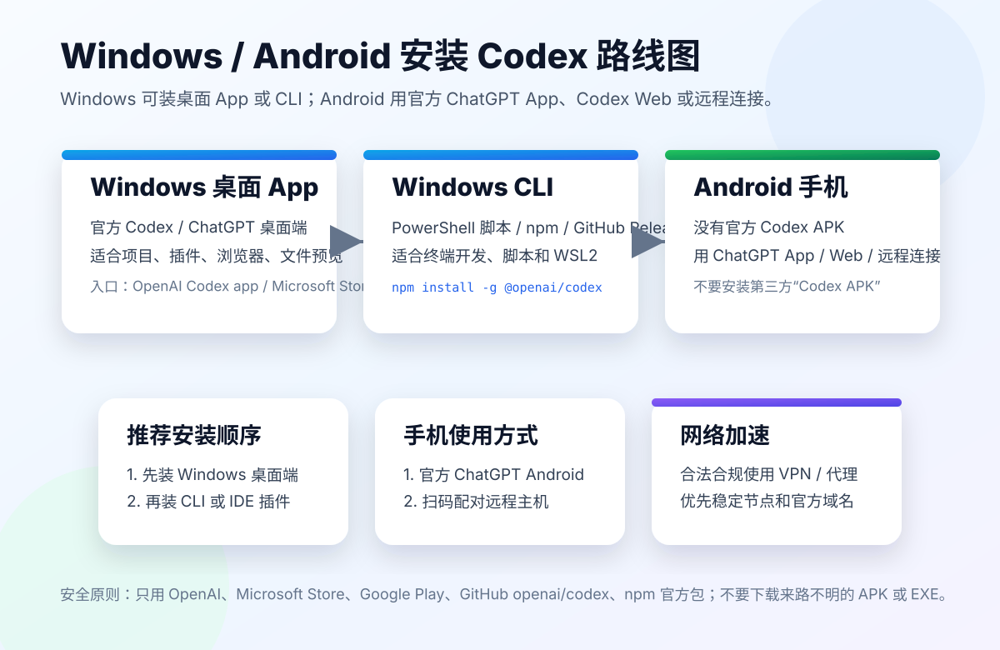

# Windows 和 Android 安装 Codex 教程：官方入口、开源包和 VPN 加速

> 更新日期：2026-07-13  
> 说明：Codex 的安装入口变化很快。本文优先引用 OpenAI 官方文档、Microsoft Store、Google Play 和 openai/codex 开源仓库。不要下载来路不明的 EXE、MSIX、APK 或“破解版安装包”。

这篇教程解决三个问题：

- Windows 怎么快速安装 Codex。
- Android 手机上怎么使用 Codex 相关能力。
- 网络访问慢时，如何用 VPN / 代理做合法合规的加速。



## 一、先说结论

### Windows 有官方安装方式

Windows 推荐三条路线：

```text
路线 A：官方 Codex / ChatGPT 桌面 App
路线 B：Codex CLI
路线 C：IDE 扩展
```

其中桌面 App 适合多数用户，CLI 适合开发者，IDE 扩展适合 VS Code、Cursor、Windsurf 等编辑器用户。

### Android 没有官方 Codex APK

截至本文更新时，没有看到 OpenAI 官方发布的独立 Codex Android APK。

Android 推荐三条路线：

```text
路线 A：安装官方 ChatGPT Android App
路线 B：使用 chatgpt.com/codex 或 ChatGPT Web
路线 C：用 Remote connections 连接 Windows/macOS 主机上的 Codex
```

不要下载第三方“Codex APK”。这类安装包很容易夹带恶意代码、盗号脚本或伪造登录页。

## 二、Windows 路线 A：安装官方桌面 App

官方入口：

- Codex app 文档：https://developers.openai.com/codex/app
- Windows 说明：https://developers.openai.com/codex/windows
- Microsoft Store：https://www.microsoft.com/store/productId/9PLM9XGG6VKS

OpenAI 官方文档说明，Windows 可以使用原生 ChatGPT 桌面 App / Codex App，支持项目、并行任务、worktrees、scheduled tasks、Git、内置浏览器、文件预览、plugins 和 skills 等能力。

### 安装步骤

1. 打开官方 Codex app 页面：

```text
https://developers.openai.com/codex/app
```

2. 选择 Windows 下载入口，或打开 Microsoft Store 页面：

```text
https://www.microsoft.com/store/productId/9PLM9XGG6VKS
```

3. 安装完成后打开 ChatGPT / Codex。

4. 登录你的 ChatGPT 账号。

5. 打开一个项目目录，开始使用 Codex。

### 适合谁

适合：

- 不想折腾命令行的新手。
- 想用插件、浏览器、文件预览的人。
- 想管理多个项目和多条任务线程的人。
- 想在 Windows 桌面环境里使用 Codex 的用户。

### 管理员权限

OpenAI Windows 文档说明，如果你需要 Codex 运行需要管理员权限的命令，可以以管理员身份启动 ChatGPT 桌面 App。Codex agent 会继承这个权限级别。

建议：

```text
默认不要以管理员身份运行。
只有确实需要安装系统依赖或操作受保护目录时再用管理员权限。
```

## 三、Windows 路线 B：安装 Codex CLI

官方入口：

- Codex CLI 文档：https://developers.openai.com/codex/cli
- openai/codex 开源仓库：https://github.com/openai/codex
- GitHub Releases：https://github.com/openai/codex/releases

Codex CLI 是 OpenAI 开源的终端 coding agent，适合在本地仓库里读文件、改代码、运行命令和自动化任务。

### 方式 1：PowerShell 官方脚本

在 PowerShell 里运行：

```powershell
powershell -ExecutionPolicy ByPass -c "irm https://chatgpt.com/codex/install.ps1 | iex"
```

安装后检查：

```powershell
codex --version
codex
```

### 方式 2：npm 安装

如果你已经安装 Node.js，可以用：

```powershell
npm install -g @openai/codex
codex --version
```

适合：

- 已经有 Node.js 环境。
- 想用 npm 管理全局工具。
- 经常在终端里工作的开发者。

### 方式 3：GitHub Release 下载二进制

如果你不想用安装脚本或 npm，可以到开源仓库 Release 下载：

```text
https://github.com/openai/codex/releases
```

选择适合 Windows 的包或二进制文件，下载后放到 PATH 目录。

建议目录：

```text
C:\Tools\codex\
```

然后把它加入环境变量 PATH。

### 第一次运行

进入项目目录：

```powershell
cd D:\projects\your-project
codex
```

登录方式通常有两类：

- 使用 ChatGPT 账号登录。
- 使用 API Key，部分能力可能不同。

## 四、Windows 路线 C：IDE 扩展

官方入口：

- Codex IDE extension：https://developers.openai.com/codex/ide

如果你日常在 VS Code、Cursor、Windsurf 等 IDE 里工作，IDE 扩展是很自然的选择。

基本流程：

```text
打开 IDE
安装/启用 Codex 扩展
登录 ChatGPT
打开项目
在侧边栏打开 Codex
基于当前文件或选中代码提问
```

适合：

- 不想离开编辑器的人。
- 经常围绕当前文件提问的人。
- 需要边看 diff 边改代码的人。

## 五、Windows 上推荐怎么选

| 需求 | 推荐 |
| --- | --- |
| 新手快速开始 | 桌面 App |
| 长任务、多项目、插件 | 桌面 App |
| 终端开发、脚本、CI | Codex CLI |
| VS Code/Cursor/Windsurf 用户 | IDE 扩展 |
| Linux 工具链项目 | WSL2 + Codex CLI |

我的建议：

```text
先装 Windows 桌面 App。
再装 Codex CLI。
最后按需装 IDE 扩展。
```

这样你既有图形界面，也有终端能力。

## 六、Android 路线 A：官方 ChatGPT Android App

官方入口：

- OpenAI Help Center：https://help.openai.com/en/articles/8167604-how-to-find-and-install-the-chatgpt-android-app-on-the-google-play-store
- Google Play：https://play.google.com/store/apps/details?id=com.openai.chatgpt

OpenAI 帮助文档明确说明，Android 官方 App 在 Google Play，发布者应为 OpenAI。

### 安装步骤

1. 打开 Google Play。
2. 搜索：

```text
openai chatgpt
```

3. 确认发布者是 OpenAI。
4. 安装 ChatGPT。
5. 登录你的 ChatGPT 账号。

### 重要提醒

Android 上不要搜索安装：

```text
Codex APK
OpenAI Codex Android APK
Codex Pro APK
ChatGPT Codex cracked APK
```

这些不是官方安装方式。

## 七、Android 路线 B：用 Codex Web

如果你的账号支持 Codex Web，可以在手机浏览器打开：

```text
https://chatgpt.com/codex
```

手机端适合做：

- 查看任务状态。
- 读 Codex 的总结。
- 回复简单指令。
- 检查 PR / 文档 / 计划。

不适合做：

- 大量代码审查。
- 多文件 diff 细看。
- 复杂终端调试。

所以手机更适合“远程控制和查看”，不是完整替代电脑开发环境。

## 八、Android 路线 C：Remote connections 连接电脑 Codex

官方入口：

- Remote connections：https://developers.openai.com/codex/remote-connections

OpenAI 文档说明，可以在主机上的 Codex App 启用 remote access，然后用手机扫描二维码配对。这样手机可以连接那台主机上的 Codex 环境。

适合场景：

- 电脑在家里或办公室跑长任务。
- 你在手机上查看进度。
- 临时回复 Codex 需要的确认。
- 让任务继续执行，而不用一直守在电脑前。

基本流程：

```text
电脑上打开 ChatGPT / Codex App
启用 Remote connections
显示二维码
手机扫码配对
在手机上查看或控制对应主机任务
```

注意：

- 每台手机和每台主机都要配对。
- 主机要保持可访问。
- 不要把配对二维码发给别人。

## 九、Android 上能不能用 Termux 装 Codex CLI

理论上，Android 有 Termux、Node.js、Git 等环境。但这不是 OpenAI 官方推荐的 Codex Android 安装路径。

问题包括：

- Android 不是官方 Codex CLI 目标平台。
- 二进制依赖和 sandbox 可能不兼容。
- npm 包可能缺少 Android 对应构建。
- 文件权限、shell、Git、编辑器体验都不稳定。
- 登录流程可能受浏览器和系统限制影响。

所以本文不把 Termux 作为主路线。

如果你是开发者，想实验，可以自己研究：

```text
Termux + Node.js + Git + npm install -g @openai/codex
```

但不要把它当作普通用户教程，也不要给新手承诺可用。

## 十、VPN / 网络加速怎么配置

Codex、ChatGPT、GitHub、npm、Microsoft Store、Google Play 都依赖稳定网络。

如果你的网络访问慢或打不开，可以使用合法合规的 VPN / 代理工具加速。这里重点是“稳定访问官方服务”，不是下载第三方安装包。

### 1. 优先选择稳定节点

常用选择：

```text
新加坡
日本
香港
美国西海岸
美国东海岸
```

建议按延迟和稳定性选择，不要只看测速峰值。

### 2. Windows 推荐 TUN / 全局模式

安装阶段可能涉及：

- Microsoft Store
- chatgpt.com
- openai.com
- npm registry
- github.com
- objects.githubusercontent.com

如果只开浏览器代理，PowerShell、npm、Git 可能仍然走直连。

更稳的方式：

```text
安装时临时开启 TUN / 全局代理
安装完成后切回规则模式
```

### 3. npm 安装慢时换 registry

如果 `npm install -g @openai/codex` 很慢，可以先确认网络，再考虑 npm 镜像。

例如：

```powershell
npm config get registry
npm config set registry https://registry.npmjs.org/
```

如果你使用镜像，注意包安全和同步延迟。

### 4. GitHub Release 下载慢

GitHub Release 常用域名包括：

```text
github.com
objects.githubusercontent.com
release-assets.githubusercontent.com
```

如果下载中断，可以换稳定节点，或使用浏览器下载后手动放到 PATH。

### 5. Android 推荐系统级 VPN

Android 安装 ChatGPT 官方 App 时，Google Play 也需要稳定网络。

建议：

```text
先打开系统级 VPN
再打开 Google Play
搜索 openai chatgpt
确认发布者 OpenAI
安装完成后再登录
```

不要从不明网站下载 APK 解决网络问题。

## 十一、安装后快速测试

### Windows 桌面 App

测试：

```text
打开 ChatGPT / Codex
登录账号
打开一个项目文件夹
让 Codex 总结项目结构
```

示例：

```text
请阅读当前项目，告诉我主要目录结构和如何运行。
先不要修改文件。
```

### Windows CLI

测试：

```powershell
codex --version
cd D:\projects\your-project
codex "Explain this codebase. Do not edit files."
```

### Android

测试：

```text
打开官方 ChatGPT App
登录账号
确认历史记录同步
打开 chatgpt.com/codex 或查看 Codex 相关入口
```

如果你使用 Remote connections，测试手机能否看到主机任务。

## 十二、常见问题

### 1. Windows 应该装 Codex 还是 ChatGPT？

现在官方文档里 Codex 已经和 ChatGPT 桌面 App 深度整合。普通用户按官方 Codex app 页面或 Microsoft Store 安装即可。

### 2. Microsoft Store 打不开怎么办？

可以走官方 Codex app 页面，或使用 CLI 安装路线。

如果是网络问题，先使用合法 VPN / 代理加速 Microsoft Store 和 OpenAI 官方站点。

### 3. Android 有没有 Codex APK？

没有看到 OpenAI 官方独立 Codex APK。

推荐：

```text
官方 ChatGPT Android App
chatgpt.com/codex
Remote connections
```

不要下载第三方 Codex APK。

### 4. Codex CLI 和桌面 App 可以一起装吗？

可以。推荐一起装。

桌面 App 负责长任务、插件和可视化管理；CLI 负责终端任务和自动化。

### 5. Windows 要不要用 WSL2？

如果你的项目是 Linux 工具链，例如 Python、Node、Rust、Docker、Shell 脚本较多，WSL2 更接近生产环境。

如果只是普通 Windows 项目，原生 PowerShell + Codex CLI 也可以。

## 十三、推荐安装组合

### 新手组合

```text
Windows Codex / ChatGPT 桌面 App
Android 官方 ChatGPT App
```

### 开发者组合

```text
Windows 桌面 App
Codex CLI
VS Code / Cursor / Windsurf IDE extension
Git + Node.js + WSL2
```

### 手机远程组合

```text
电脑安装 Codex App
开启 Remote connections
手机安装官方 ChatGPT App
扫码配对
手机查看和控制长任务
```

## 十四、下载入口汇总

### 官方 Windows

- Codex app：https://developers.openai.com/codex/app
- Windows 指南：https://developers.openai.com/codex/windows
- Microsoft Store：https://www.microsoft.com/store/productId/9PLM9XGG6VKS

### 开源 / CLI

- openai/codex：https://github.com/openai/codex
- GitHub Releases：https://github.com/openai/codex/releases
- Codex CLI 文档：https://developers.openai.com/codex/cli

### Android

- ChatGPT Android 官方说明：https://help.openai.com/en/articles/8167604-how-to-find-and-install-the-chatgpt-android-app-on-the-google-play-store
- Google Play：https://play.google.com/store/apps/details?id=com.openai.chatgpt
- Codex Remote connections：https://developers.openai.com/codex/remote-connections

## 十五、总结

最稳的安装策略是：

```text
Windows：官方桌面 App + Codex CLI
Android：官方 ChatGPT App + Codex Web / Remote connections
```

不要为了“快速安装”去下载第三方 APK 或 EXE。真正快速的方式，是走官方入口、开稳定网络、按系统选择正确安装路线。

如果网络慢，用合法合规的 VPN / 代理加速官方域名；如果手机上要用 Codex，把 Android 当作远程控制和查看任务的设备，而不是完整替代 Windows 开发机。

## 资料来源

- Codex app：https://developers.openai.com/codex/app
- Codex Windows：https://developers.openai.com/codex/windows
- Codex CLI：https://developers.openai.com/codex/cli
- openai/codex：https://github.com/openai/codex
- Codex Remote connections：https://developers.openai.com/codex/remote-connections
- ChatGPT Android 安装说明：https://help.openai.com/en/articles/8167604-how-to-find-and-install-the-chatgpt-android-app-on-the-google-play-store
- Google Play ChatGPT：https://play.google.com/store/apps/details?id=com.openai.chatgpt
