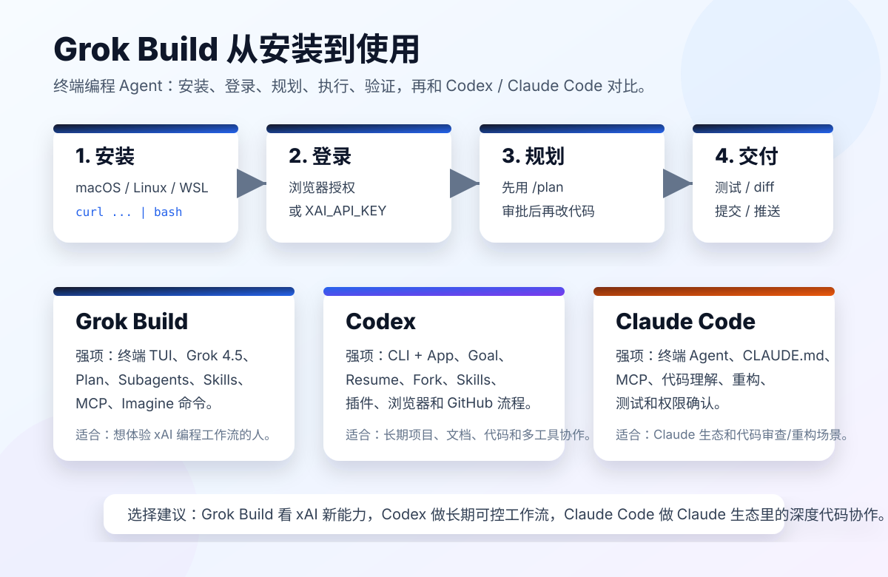

# Grok Build 入门：从安装到使用，再和 Codex、Claude Code 对比

> 说明：很多人会叫它 “Grok Builder”，但 xAI 官方当前名称是 **Grok Build**。本文按官方名称写。

官方入口：

- Grok Build 官网：https://x.ai/cli
- Grok Build 文档：https://docs.x.ai/build/overview
- Grok Build 发布介绍：https://x.ai/news/grok-build-cli
- Grok Build 0.1 API：https://x.ai/news/grok-build-0-1

Grok Build 是 xAI 推出的终端编程 Agent。它和 Codex、Claude Code 的定位类似：不是只在网页里回答问题，而是进入你的代码仓库，读取文件、规划修改、执行命令、生成 diff，并帮助你完成开发任务。



## 一、Grok Build 是什么

Grok Build 是一个运行在终端里的 coding agent / CLI。

按照 xAI 官方说法，它可以通过三种方式使用：

- 交互式 TUI：在终端里打开一个全屏交互界面。
- Headless 模式：用命令行参数直接运行一次任务，适合脚本和自动化。
- ACP：通过 Agent Client Protocol 接入其他应用。

它当前由 Grok 4.5 驱动，并强调几个方向：

- Plan mode：先规划，再执行。
- Subagents：让多个子 Agent 并行研究、测试或构建。
- Skills：把工作流沉淀成可复用命令。
- Plugins / Hooks / MCP：接入外部工具和团队能力。
- Headless mode：在脚本、CI 或自动化流程里调用。
- Git / terminal / code search：围绕真实代码仓库工作。

一句话理解：

```text
Grok Build = xAI 生态里的终端编程 Agent。
```

## 二、安装前准备

建议先准备好：

- 一个 xAI / Grok 可登录账号。
- 一个可以运行终端的开发环境。
- Git 和基础开发工具。
- 一个真实代码仓库。
- 如果不能打开浏览器登录，准备 `XAI_API_KEY`。

官方文档给出的安装平台包括：

- macOS
- Linux
- WSL
- Windows PowerShell

如果你在国内网络环境里安装，可能会遇到脚本下载或认证页面打不开的问题。安装前最好先确认：

```bash
curl --version
git --version
```

如果你要在项目里使用，建议先进入项目目录：

```bash
cd your-project
```

## 三、安装 Grok Build

macOS / Linux / WSL：

```bash
curl -fsSL https://x.ai/cli/install.sh | bash
```

Windows PowerShell：

```powershell
irm https://x.ai/cli/install.ps1 | iex
```

安装完成后，检查命令是否可用：

```bash
grok --version
which grok
```

如果终端提示找不到 `grok`，通常是 PATH 没刷新。可以重启终端，或者检查安装脚本写入的 shell 配置。

## 四、第一次启动和登录

进入你的项目：

```bash
cd your-project
grok
```

官方文档说明，第一次启动时 Grok 会打开浏览器完成认证。

如果是在无法打开浏览器的环境，比如远程服务器、CI、无头环境，可以使用 API Key：

```bash
export XAI_API_KEY="xai-..."
grok
```

更稳的做法是把 API Key 放到你的 shell 环境或密钥管理工具里，不要写进项目仓库。

不要把下面这些内容提交到 Git：

- `XAI_API_KEY`
- `.env`
- 认证 token
- 浏览器登录凭据
- 任何带有密钥的 shell history 截图

## 五、启动一个交互式开发任务

最简单的入口：

```bash
grok
```

进入 TUI 后，可以先让它理解仓库：

```text
Explain this repo.
```

也可以指定文件：

```text
@src/main.ts Walk me through this file.
```

如果要做功能，不建议一上来就让它直接改：

```text
帮我做登录功能。
```

更推荐先让它规划：

```text
/plan 给这个项目增加登录页和用户会话管理。
要求：
- 先读项目结构。
- 说明要改哪些文件。
- 给出测试方式。
- 不要直接写代码，等我批准计划。
```

Grok Build 的 Plan mode 适合复杂任务。官方文档说明，Plan mode 会让它先维护一个工作计划，其他文件写入仍然需要批准。

## 六、常用命令

Grok Build 的 TUI 支持斜杠命令。建议先记住这些：

| 命令 | 用途 |
| --- | --- |
| `/plan [description]` | 进入 Plan mode，先规划再动手 |
| `/view-plan` | 查看当前计划 |
| `/resume` | 恢复之前的 session |
| `/fork` | 把当前 session 分叉成一个 peer agent |
| `/context` | 查看上下文使用情况 |
| `/compact` | 压缩历史上下文 |
| `/model <name>` | 切换模型 |
| `/always-approve` | 切换自动批准模式 |
| `/skills` | 打开 Skills |
| `/mcps` | 打开 MCP 配置 |
| `/plugins` | 打开 Plugins |
| `/feedback` | 给 xAI 反馈问题 |

其中最重要的是：

```text
/plan
/resume
/fork
/context
```

这几个命令决定了你能不能把一个长任务做稳。

## 七、Headless 模式：适合脚本和自动化

如果你不想打开 TUI，可以用 `-p` 直接执行一次任务：

```bash
grok -p "Explain this codebase"
```

也可以输出流式 JSON，方便接入自动化：

```bash
grok -p "Explain the architecture" --output-format streaming-json
```

适合场景：

- CI 里做代码解释。
- 自动生成变更摘要。
- 自动检查文档是否缺失。
- 给 PR 生成 review 初稿。
- 在脚本里调用 Grok 做一次分析任务。

不适合场景：

- 大重构。
- 需要频繁确认计划。
- 需要反复看 diff。
- 需要人工判断设计方向。

这些更适合 TUI。

## 八、推荐工作流

### 1. 先 inspect

官方文档提到可以用：

```bash
grok inspect
```

它会查看当前目录里 Grok 发现了哪些配置、说明、skills、plugins、hooks、MCP 等。

这一步很适合在新项目里先跑：

```bash
cd your-project
grok inspect
```

### 2. 再 plan

```text
/plan 请阅读项目结构，给出实现搜索功能的计划。
要求：
- 不要直接改文件。
- 标出风险文件。
- 给出验证命令。
```

### 3. 审批后执行

确认计划合理后，再让它执行：

```text
按这个计划实现。每完成一个阶段先汇报 diff 和测试结果。
```

### 4. 验证

让 Grok Build 跑项目自己的验证命令：

```text
运行 lint、test、build。失败先解释原因，再修复。
```

### 5. 总结和提交

```text
总结本次修改：
- 改了哪些文件
- 解决了什么问题
- 验证命令结果
- 还有什么风险
```

是否提交由你自己决定。对于新工具，建议前几次不要让它自动提交，先人工 review。

## 九、Grok Build vs Codex vs Claude Code

| 维度 | Grok Build | Codex | Claude Code |
| --- | --- | --- | --- |
| 所属生态 | xAI / Grok | OpenAI / ChatGPT / Codex | Anthropic / Claude |
| 主要入口 | `grok` CLI / TUI | Codex CLI、Codex App、Cloud | `claude` CLI / IDE 协作 |
| 安装方式 | 官方脚本安装 | 官方脚本、npm、Homebrew 等 | 官方安装方式 / Claude Code CLI |
| 长任务控制 | `/plan`、`/resume`、`/fork`、subagents | `/goal`、`codex resume`、`codex fork`、worktrees | resume、CLAUDE.md、MCP、权限确认 |
| 项目规则 | AGENTS.md、skills、plugins、hooks | AGENTS.md、skills、plugins、hooks、rules | CLAUDE.md、commands、MCP |
| 工具扩展 | MCP、plugins、hooks | MCP、plugins、apps、browser、GitHub | MCP、CLI 工具、GitHub 等 |
| 自动化 | `grok -p` headless | `codex exec`、GitHub Action、SDK | headless/CLI 自动化能力 |
| 特色 | Grok 4.5、Imagine 命令、xAI 生态 | 多表面协作、Goal/Resume/Fork、浏览器和插件生态 | Claude 模型代码理解、终端协作、MCP 生态 |
| 适合人群 | 想体验 xAI 新编程 Agent 的用户 | 想做长期项目和多工具工作流的人 | Claude 生态用户和重构/审查场景 |

### 怎么选

如果你想体验 xAI 最新 coding agent：

```text
优先试 Grok Build。
```

如果你已经在用 Codex 写博客、开发 App、生成视频、管理 GitHub：

```text
Codex 更适合做主控工作流。
```

如果你的团队已经围绕 Claude、CLAUDE.md、MCP 建了流程：

```text
Claude Code 更容易接入现有习惯。
```

我的建议不是“三选一”，而是按角色分工：

```text
Codex：主控、文档、仓库协作、浏览器验证、提交推送。
Claude Code：重构、代码审查、复杂逻辑解释。
Grok Build：xAI 模型体验、并行 subagent 探索、快速试新功能。
```

## 十、Grok Build 的优势

### 1. 终端体验完整

它不是网页聊天窗口，而是围绕项目目录工作的终端 TUI。

你可以在仓库里直接让它读代码、写代码、看 diff、运行命令。

### 2. Plan mode 清晰

对于复杂任务，先规划再写代码是必要的。

Grok Build 的 Plan mode 可以减少一上来乱改文件的问题。

### 3. Subagents 适合探索

复杂任务通常不是一条线：

- 查慢接口
- 分析日志
- 看数据库查询
- 对比最近部署
- 写修复方案

Subagents 可以并行处理这些方向。

### 4. xAI 生态联动

Grok Build 支持 `/imagine`、`/imagine-video` 这类命令时，它的边界就不只是代码，还能往图像、视频、内容生成方向扩展。

这对 AI 工具教程、演示页、可视化素材会很有用。

## 十一、使用时的注意事项

### 1. 先确认官方可用性

xAI 官网页面显示 Grok Build Beta 当前可试用，但早期发布说明也提到过 SuperGrok 和 X Premium Plus。不同时间、地区、账号权限可能不同。

所以安装前先看：

```text
https://x.ai/cli
```

### 2. 不要一开始开 always-approve

`/always-approve` 或 `grok --always-approve` 会跳过工具调用确认。

刚开始使用时不建议开。除非你已经确认：

- 当前仓库可信。
- Git 状态干净。
- 任务边界清楚。
- 有测试和回滚方式。

### 3. API Key 不要进仓库

如果使用：

```bash
export XAI_API_KEY="xai-..."
```

不要把这个值写到 README、代码、截图、文章或 `.env` 提交里。

### 4. 大任务一定先 Plan

建议默认这样开始：

```text
/plan 先阅读项目结构，给出修改计划。不要直接改文件。
```

这是所有终端 Agent 的共同纪律。

## 十二、一个完整上手示例

假设你要让 Grok Build 给一个前端项目增加搜索功能：

```bash
cd my-web-app
grok
```

第一轮：

```text
/plan 给文章列表页增加搜索功能。
要求：
- 先阅读项目结构。
- 找到文章列表组件。
- 说明需要修改哪些文件。
- 给出验证命令。
- 不要直接写代码。
```

第二轮：

```text
按计划实现第一版。
要求：
- 不改无关样式。
- 搜索输入为空时显示全部文章。
- 移动端不溢出。
- 完成后运行 lint。
```

第三轮：

```text
请总结 diff，说明测试结果和剩余风险。
```

如果你只想快速了解项目：

```bash
grok -p "Explain this codebase"
```

如果你想在自动化里调用：

```bash
grok -p "Summarize the latest git diff and list risky files" --output-format streaming-json
```

## 十三、总结

Grok Build 是 xAI 进入终端编程 Agent 领域的重要工具。

它值得关注的原因不是“又多了一个 AI 写代码工具”，而是它把 Grok 4.5、Plan mode、Subagents、Skills、Plugins、MCP、Hooks 和 Headless mode 放进同一个终端工作流里。

对个人用户来说，它适合试新模型、快速理解仓库、做功能探索。

对团队来说，它适合评估 xAI 生态能不能进入现有工程流程。

但如果你已经有 Codex 或 Claude Code，不需要马上替换。更稳的方式是：

```text
先把 Grok Build 当成第三个 Agent 试用。
让它做探索、方案比较、代码解释和小功能。
等它在你的项目里稳定，再考虑纳入主工作流。
```

参考资料：

- Grok Build 官网：https://x.ai/cli
- Grok Build 文档：https://docs.x.ai/build/overview
- Modes and Commands：https://docs.x.ai/build/modes-and-commands
- Grok Build 发布介绍：https://x.ai/news/grok-build-cli
- Grok Build 0.1 API：https://x.ai/news/grok-build-0-1
- Codex CLI：https://developers.openai.com/codex/cli
- Claude Code：https://www.anthropic.com/product/claude-code
