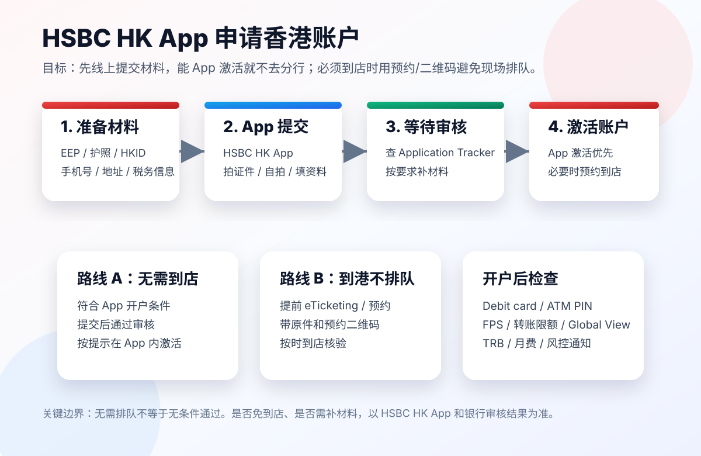

# HSBC HK App 申请香港银行卡攻略：先线上提交，再到香港不排队开户

> 更新日期：2026-07-10  
> 说明：本文整理 HSBC 香港官方公开资料和操作路径，不构成金融、税务、移民或投资建议。账户能否开立取决于 HSBC KYC 审核、申请人身份、所在地区、材料完整度和当时政策。

如果你想开香港银行账户，最不建议的方式是直接冲到香港分行排队。更稳的方式是：

```text
先通过 HSBC HK App 提交申请
能 App 激活就不去分行
必须到香港处理时，提前预约或使用 eTicketing
```

这篇文章重点讲一条“不现场排队”的路径：用 HSBC HK App 先完成申请资料提交，再根据审核结果选择 App 激活或预约到香港分行完成核验。



## 一、先说清楚：全程无需排队是什么意思

这里的“全程无需排队”不是说：

```text
任何人都能 100% 远程开好 HSBC 香港账户。
```

更准确的意思是：

```text
不要现场排队碰运气。
能线上完成就线上完成。
需要到香港时，也提前预约或拿 eTicketing，不做无预约排队。
```

HSBC HK 官方页面有几个关键点：

- HSBC HK App 支持开立账户。
- 部分新客户可以通过 App 开户，不需要去分行。
- 如果人在中国大陆，官方页面说明可准备 EEP 做身份验证和提交申请，并在 90 天内通过 HSBC HK App 激活账户，不要求亲自到分行。
- 如果不满足 App 条件，或银行要求补充核验，可以到香港分行，或提前在线预约。
- HSBC eTicketing 页面说明，开户预约可以在线提前办理，而且免费。

所以这篇的核心策略是：

```text
App 优先，预约兜底。
```

## 二、适合这条路径的人

这条路径适合：

- 想开 HSBC 香港个人账户的人。
- 能下载并使用 HSBC HK App 的人。
- 持有合资格身份证件，例如 HKID、海外护照、港澳通行证/EEP 等。
- 能按要求提供地址、税务、资金来源等信息。
- 不想现场排队，愿意先在线提交资料。
- 如需到港，愿意按预约时间去指定分行。

不适合：

- 材料不真实或无法解释资金来源的人。
- 只想找中介“包开”的人。
- 不愿意提供税务居民信息的人。
- 无法接收短信、邮件或 App 通知的人。
- 认为“提交 App = 一定开户成功”的人。

HSBC 官方也提醒，不要向第三方或中介分享资料，不要通过中介开户。

## 三、准备材料清单

提交前建议准备：

### 1. 身份证件

根据你的身份可能包括：

- 香港身份证 HKID
- 海外护照
- 港澳通行证 / Exit-Entry Permit（EEP）
- 其他 HSBC App 支持的身份证件

HSBC HK 的 App 开户页面说明，国际客户可能需要持有新版本 HKID、海外护照或 EEP，并位于指定国家/地区。

### 2. 手机和 App

准备：

- iPhone 或 Android 手机
- HSBC HK Mobile Banking App
- 稳定网络
- 手机相机可用
- 可以接收短信和邮件

如果 App 要求拍摄证件或自拍，不要用模糊照片。

### 3. 地址信息

准备：

- 当前居住地址
- 地址证明，可能包括银行账单、水电账单、政府文件、租约等
- 英文地址或可被银行接受的地址格式

如果地址和证件、税务信息不一致，可能被要求补材料。

### 4. 税务居民信息

香港银行开户一般会要求税务居民声明。

你需要准备：

- 税务居民国家/地区
- TIN / 税务识别号
- 是否属于美国税务居民等 FATCA/CRS 相关信息

不要乱填。税务信息和资金来源是银行风控重点。

### 5. 开户目的和资金来源

建议提前想清楚：

- 开户目的：储蓄、工资、跨境消费、留学、旅行、投资前置账户等
- 资金来源：工资、经营收入、存款、家庭支持等
- 预计月均余额
- 预计交易国家/地区

银行可能会根据这些信息判断账户用途是否合理。

## 四、第一步：下载 HSBC HK App

官方入口：

- HSBC HK Mobile Banking App：https://www.hsbc.com.hk/ways-to-bank/mobile-apps/banking/
- App 开户页面：https://www.hsbc.com.hk/ways-to-bank/mobile-apps/banking/account-opening/

下载后打开 App。

如果你是新客户，通常从类似入口开始：

```text
I don't have an account yet
Open an account
```

如果你已经是 HSBC 客户，则可能通过：

```text
Log on -> menu -> Products -> Accounts
```

不同 App 版本的按钮文案可能会变，按实际界面为准。

## 五、第二步：在 App 里提交申请

HSBC 官方 App 开户页面给出的新客户流程大致是：

```text
下载 HSBC HK App
选择还没有账户
拍摄身份证件
自拍做人脸识别
填写个人资料
设置网上银行
提交申请
```

如果你使用护照申请，官方页面说明需要拍摄身份证件，整体申请时间预估约 10 分钟。

如果你是香港客户并符合条件，页面显示可通过 App 在较短时间内开立 HSBC One。

如果你是国际客户，页面说明需要满足：

- 合资格新版本 HKID、海外护照或 EEP
- 年龄 18 至 75 岁
- 位于指定国家/地区
- 其他申请条件

提交时注意：

- 证件照片要清晰。
- 自拍不要戴口罩、墨镜。
- 地址信息要和证明材料一致。
- 税务信息不要随意选择。
- 开户目的要真实、合理。

## 六、第三步：检查申请状态和补材料

提交后不要反复重新申请。

如果需要查看状态或补交资料，HSBC 国际开户页面提到可参考 Application Tracker 和 Document Upload。

建议你保留：

- 申请编号
- 提交时间
- App 截图
- 邮件通知
- 短信通知

如果银行要求补材料，优先按 App 或邮件指引上传，不要通过第三方发送个人资料。

## 七、第四步：能 App 激活就不要去分行

这是最省时间的路径。

HSBC 香港国际开户页面明确写到：如果你人在中国大陆，可以准备 EEP 做身份验证和提交申请，并需要在 90 天内通过 HSBC HK App 激活账户，不要求亲自去分行。

这意味着对满足条件的人来说，完整路径可能是：

```text
人在内地
用 HSBC HK App 提交申请
审核通过
按 App 指引在 90 天内激活账户
无需到香港分行排队
```

注意：

- “无需分行”只适用于满足条件的申请路径。
- 如果 App 或银行要求你到店核验，就要按要求处理。
- 激活期限、支持地区、证件要求可能变化，以 App 和官网为准。

## 八、如果必须到香港：用预约避免排队

如果 App 没有通过，或者银行要求你到香港分行完成核验，不要直接去热门分行现场排队。

优先做两件事：

```text
1. 用 HSBC eTicketing / 预约系统提前安排。
2. 带齐原件、申请记录和预约二维码。
```

官方 eTicketing 页面说明，开户可以提前在线预约，且免费。预约成功后页面会生成 QR code，抵达指定分行时用于识别。

HSBC 分行页面也说明，eTicketing 可查看实时排队状态、线上取票，并可在部分分行提前预约开户。

这就是“到香港也不排队”的关键。

## 九、到香港当天怎么安排

### 出发前

确认：

- 预约日期和时间
- 分行地址
- 预约二维码或短信
- 身份证件原件
- 地址证明原件/电子版
- 税务信息
- App 申请记录
- 香港/内地手机号可用
- 邮箱可登录

### 到分行前

建议提前 15-20 分钟到附近。

不要迟到。迟到可能导致预约失效。

### 到分行后

出示：

- 预约二维码或短信
- 证件
- App 申请记录

然后按工作人员指引完成核验、签署或补充资料。

### 离开前

确认：

- 账户是否已开通
- 网上银行是否能登录
- 借记卡如何领取或邮寄
- ATM PIN 如何设置
- FPS 是否可用
- 转账限额是多少
- 是否需要补材料

## 十、HSBC One 和 Premier 怎么选

HSBC HK App 开户页面列出 HSBC One 和 HSBC Premier 等账户。

一般理解：

- HSBC One：普通个人综合账户，适合大多数入门用户。
- HSBC Premier：高端账户，有较高 Total Relationship Balance 要求。

根据 HSBC 页面，非 HKID 持有人在 2026 年 1 月 1 日或之后开 HSBC One，TRB 要求为 HKD10,000；如未维持 TRB，可能有每月 HKD100 的 below balance fee。Premier 的 TRB 要求更高。

所以如果只是日常使用，通常先看 HSBC One。

开户前要确认：

- 当前账户费用
- Total Relationship Balance 要求
- below balance fee
- 借记卡类型
- 是否需要外币账户
- 是否需要投资账户

## 十一、开户后必做设置

开户后建议立即设置：

- HSBC HK App 登录
- Mobile Security Key
- 生物识别登录
- ATM PIN / Debit Card PIN
- FPS 转数快
- 转账限额
- 通知提醒
- eStatement / eAdvice
- Global View / Global Transfers，如你有其他国家 HSBC 账户

如果你是跨境使用，还要检查：

- 入金路径
- 出金路径
- 电汇手续费
- 货币兑换差价
- 是否支持绑定券商或支付工具

## 十二、常见失败原因

### 1. 身份不符合 App 开户条件

例如所在地区、证件类型、年龄、是否已有账户等不满足条件。

解决：

```text
走预约分行路线，或联系 HSBC 国际银行中心。
```

### 2. 证件拍摄失败

常见原因：

- 反光
- 模糊
- 边角缺失
- 证件过期
- 信息和填写内容不一致

解决：

```text
重新拍摄，使用自然光，保证四角完整。
```

### 3. 地址证明不被接受

常见原因：

- 超过有效期
- 姓名不一致
- 地址不完整
- 非银行认可文件

解决：

```text
换最近 3 个月内、姓名和地址清晰的证明。
```

### 4. 开户目的或资金来源不清楚

银行会关注账户用途和资金来源。

解决：

```text
如实说明收入来源、预计用途和交易地区。
```

不要编造用途，也不要使用他人资金做不明来源入金。

## 十三、避坑清单

不要做：

- 不要找“包开 HSBC 香港户”的中介。
- 不要把身份证件、自拍、税务信息发给第三方。
- 不要提交虚假地址。
- 不要用他人手机号和邮箱。
- 不要在 App 审核期间反复提交多次申请。
- 不要到热门分行无预约排队碰运气。

建议做：

- 先用 App 提交申请。
- 保留申请编号和通知。
- 需要到店时提前 eTicketing / 预约。
- 到港前准备原件和电子版。
- 开户后马上检查费用、限额和卡片状态。

## 十四、推荐路线总结

### 最省事路线

```text
HSBC HK App 提交申请
审核通过
App 内激活
无需到香港分行
```

适合满足 App 开户和 App 激活条件的人。

### 稳妥到港路线

```text
HSBC HK App 先提交
收到补材料或到店要求
提前 eTicketing / 预约
按预约时间到香港分行
出示二维码和材料
完成开户
```

适合需要人工核验的人。

### 不推荐路线

```text
什么都不准备
直接去香港热门分行排队
现场才发现材料不齐
当天无法开户
```

这条路线浪费时间，也最容易失败。

## 十五、结论

HSBC HK 现在的开户体验已经明显向线上迁移。正确打开方式不是“去香港排队”，而是：

```text
先 App，后预约。
能线上激活就线上激活。
必须到店就带预约二维码，不现场排队。
```

如果你符合 App 开户条件，整个流程可能不需要去分行。  
如果你必须到香港，也应提前预约或用 eTicketing，把现场排队变成按时核验。

## 资料来源

- HSBC HK App 开户：https://www.hsbc.com.hk/ways-to-bank/mobile-apps/banking/account-opening/
- HSBC HK App：https://www.hsbc.com.hk/ways-to-bank/mobile-apps/banking/
- HSBC 香港账户国际开户说明：https://www.hsbc.com.hk/international/banking-in-hong-kong/
- HSBC eTicketing：https://www.eticketing.hsbc.com.hk/Booking/Index/EN
- HSBC Branch Banking：https://www.hsbc.com.hk/ways-to-bank/branch/
