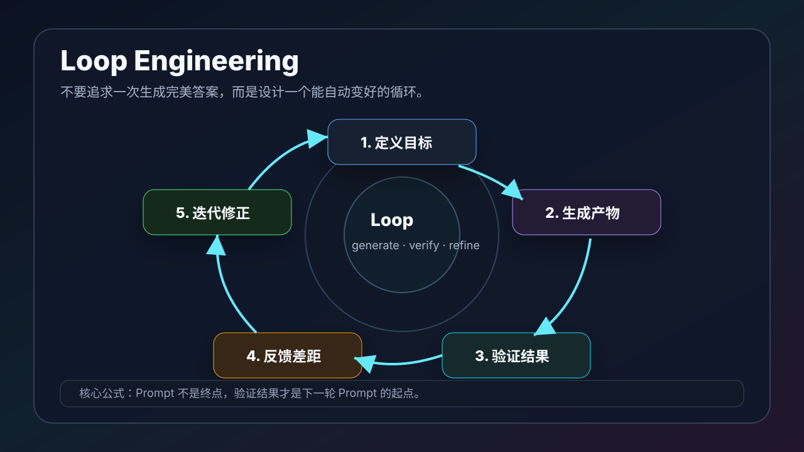

# Loop Engineering：让 AI 产出持续变好的循环工程

`loopegnieering` 可以理解成 **Loop Engineering**，也就是「循环工程」。

它不是某一个工具，也不是某一个固定提示词，而是一种使用 AI 的方法：不要指望一次提问就得到完美结果，而是设计一个可以持续迭代、验证、修正和沉淀的循环。



## 一、为什么需要 Loop Engineering

很多人用 AI 的方式是一次性的：

```text
我问一句 -> AI 回答一句 -> 我复制结果 -> 结束
```

这种方式适合简单问题，但不适合复杂产出。

复杂任务往往需要：

- 多轮修改
- 事实校验
- 运行测试
- 检查截图
- 比较方案
- 调整风格
- 修复错误
- 最后提交或交付

所以更稳定的方式是：

```text
目标 -> 生成 -> 验证 -> 反馈 -> 修正 -> 再验证 -> 交付
```

这就是 Loop Engineering。

## 二、Loop Engineering 的核心思想

Loop Engineering 的核心不是「写一个神级提示词」，而是「设计一个能自我改进的过程」。

可以用一句话概括：

```text
把 AI 的每一次输出，都变成下一轮改进的输入。
```

例如：

- Codex 写完文章后，检查 README 是否更新。
- 写完代码后，运行测试，把报错交给下一轮修复。
- 做完页面后，打开浏览器截图，把视觉问题交给下一轮修复。
- 生成视频后，跑 lint / inspect / still，把布局问题交给下一轮修复。
- 生成 PPT 后，看缩略图，把拥挤页面交给下一轮修复。

这样 AI 不再是一次性回答工具，而是一个可以被反馈驱动的工作系统。

## 三、Loop Engineering 的五个环节

### 1. 定义目标

目标要明确到可以验收。

不要只说：

```text
帮我写一篇文章。
```

更好的是：

```text
请新增一篇中文博客，主题是 Loop Engineering。
要求：
- 放在当前仓库。
- 带一张流程图。
- 更新 README。
- 提交并推送。
```

目标越具体，后面的验证越容易。

### 2. 生成产物

产物可以是：

- Markdown 文章
- 代码
- 测试
- 图片
- PPT
- 视频 composition
- 剪辑计划
- JSON 数据
- 脚本

这一轮不要追求完美，而是先生成一个可检查的版本。

### 3. 验证结果

验证是循环的关键。

不同产物有不同验证方式：

| 产物 | 验证方式 |
| --- | --- |
| 文档 | 检查标题、链接、图片、README 入口 |
| 代码 | 测试、lint、构建 |
| 网页 | 浏览器预览、截图、移动端检查 |
| PPT | 缩略图、可编辑性、字体和版式 |
| Remotion 视频 | still、Studio、render |
| HyperFrames 视频 | lint、inspect、preview、render |
| Premiere 剪辑 | 时间线、字幕、音频、版权、人工审核 |

没有验证，就没有循环。

### 4. 反馈差距

反馈不要只说：

```text
不太好。
```

要说清楚差距：

```text
第二部分太抽象，需要加一个具体例子。
图片没有说明生成、验证、反馈的闭环。
README 入口放错了分组。
```

反馈越具体，下一轮修正越有效。

### 5. 迭代修正

修正不是重来，而是带着验证结果继续改。

例如：

```text
根据刚才的检查结果，只修改 README 分组和文章第三节，不要改其它文件。
```

这能避免 AI 在修一个问题时引入更多无关改动。

## 四、一个简单例子：写文章的 Loop

以本项目为例，写一篇新文章可以这样循环：

```text
第一轮：生成文章和图片
第二轮：检查 README 是否加入口
第三轮：检查图片路径是否有效
第四轮：检查文章是否有快速入口和参考链接
第五轮：提交并推送
```

对应提示词：

```text
请新增一篇文章，主题是【主题】。
要求带图片、更新 README、检查 diff、提交并推送。
完成后告诉我文件路径和 commit hash。
```

如果第一轮文章太泛，就继续：

```text
文章太像概念说明了，请增加一个完整实战流程，并保留原有结构。
```

如果图片不够清晰：

```text
请重画流程图，让它明确展示“生成 -> 验证 -> 反馈 -> 修正”的闭环。
```

这就是文章生产的 Loop Engineering。

## 五、一个代码例子：修 bug 的 Loop

修 bug 时，最常见的循环是：

```text
复现问题 -> 修改代码 -> 跑测试 -> 看错误 -> 再修改
```

可以这样要求 Codex：

```text
请先复现这个 bug。
复现后再修改代码。
修改后运行相关测试。
如果测试失败，根据错误继续修复。
不要改无关文件。
```

这个提示词的重点不是“修 bug”，而是规定了循环。

好的 Loop 会让 AI 自己知道：

- 不能没复现就改。
- 不能没测试就结束。
- 不能大面积重构。
- 不能忽略失败输出。

## 六、一个视频例子：Remotion / HyperFrames 的 Loop

视频生成尤其适合 Loop Engineering。

Remotion 的循环：

```text
写 composition -> 渲染 still -> 检查布局 -> 修复 -> 再渲染 -> render MP4
```

HyperFrames 的循环：

```text
写 HTML composition -> lint -> inspect -> preview -> 修复 -> render
```

提示词可以写成：

```text
请制作一个 15 秒视频。
不要直接给最终结果。
请先生成视觉方案，再实现 composition。
实现后先运行检查命令，根据错误修复。
最后再给我预览和渲染命令。
```

这样 AI 不会只停在“生成代码”，而会进入“生成可验证视频”的循环。

## 七、一个 PPT 例子：从大纲到可交付

生成 PPT 也应该循环：

```text
资料 -> 大纲 -> 页面计划 -> PPTX -> 缩略图检查 -> 修改 -> 交付
```

提示词：

```text
请先生成 PPT 的 claim spine。
确认每页标题、核心观点和证据后，再生成可编辑 PPTX。
生成后请输出预览图，并检查是否有文字拥挤、页面重复和风格不统一。
```

PPT 的 Loop 不只是改文字，还要看缩略图、节奏和可读性。

## 八、Loop Engineering 和普通提示词的区别

| 普通提示词 | Loop Engineering |
| --- | --- |
| 追求一次回答 | 追求多轮变好 |
| 关注输出 | 关注验证 |
| 错了就重问 | 错了就反馈差距 |
| 靠感觉判断 | 靠测试、截图、预览、diff |
| 成功经验容易丢 | 成功经验沉淀成模板或 Skill |

普通提示词是“请求答案”。  
Loop Engineering 是“设计生产线”。

## 九、Loop Engineering 的提示词模板

可以直接使用这个通用模板：

```text
请用 Loop Engineering 的方式完成这个任务。

目标：
【写清楚要交付什么】

循环要求：
1. 先读取现有上下文。
2. 生成第一版产物。
3. 用合适方式验证。
4. 根据验证结果修复。
5. 再次检查。
6. 最后提交或交付。

限制：
- 不要改无关文件。
- 不要跳过验证。
- 如果验证失败，继续修复。
- 完成后总结改动、验证方式和剩余风险。
```

如果是写文章：

```text
请新增一篇文章，并按以下循环执行：
生成文章 -> 检查链接和图片 -> 更新 README -> 检查 diff -> 提交推送。
```

如果是代码：

```text
请按以下循环执行：
复现问题 -> 修改代码 -> 运行测试 -> 根据失败继续修复 -> 提交。
```

如果是视频：

```text
请按以下循环执行：
设计分镜 -> 实现 composition -> 渲染预览帧 -> 修复视觉问题 -> 输出最终渲染命令。
```

## 十、Loop Engineering 最容易踩的坑

### 1. 没有验收标准

如果不知道什么叫完成，AI 也不知道什么时候该停。

### 2. 反馈太抽象

“不好看”“不够高级”“再优化一下”都太抽象。

更好的是：

```text
标题太长，移动端会换三行。
第二张图没有体现验证环节。
代码没有覆盖空数组场景。
```

### 3. 每一轮都重新开始

Loop 的关键是继承上一轮结果，而不是每次推翻重来。

### 4. 不保留中间产物

好的中间产物包括：

- diff
- 截图
- still
- inspect 输出
- 测试结果
- PPT 缩略图
- edit-plan.json
- 提示词模板

这些都是下一轮改进的燃料。

### 5. 不沉淀

如果一个 Loop 跑成功了，就应该沉淀成：

- README 规范
- Skill
- 脚本
- 模板
- 检查清单

否则下次还要重新摸索。

## 十一、适合本项目的 Loop

这个 `AI-guide-book` 项目本身就可以按 Loop Engineering 继续扩展：

```text
提出一个主题
  -> 新增一篇文章
  -> 添加图片
  -> 更新 README
  -> 提交推送
  -> 根据反馈继续补充下一篇
```

它不是一本一次写完的书，而是一个不断增长的内容系统。

后续还可以继续扩展：

- AI 工具选择
- MCP 实战
- 自动化浏览器
- 文档转 PPT
- 文档转视频
- 视频转字幕
- 字幕转短视频
- GitHub 自动化
- 个人知识库
- 课程生产流水线

文章是可以无限发散的，但每篇文章都应该进入同一个循环：生成、验证、沉淀。

## 十二、总结

Loop Engineering 的价值在于，它把 AI 从“回答问题的工具”变成“持续改进的系统”。

真正高效的 AI 使用方式不是问得更玄，而是让每一步都有反馈：

```text
生成结果 -> 检查结果 -> 反馈差距 -> 修正结果
```

当这个循环稳定之后，你就可以把它沉淀成 Skill、脚本、模板和工作流。AI 工具的威力，也是在这种循环里逐渐放大的。

## 参考资料

- Codex Skills：https://developers.openai.com/codex/skills
- OpenAI Skills：https://github.com/openai/skills
- Anthropic Skills：https://github.com/anthropics/skills
- Model Context Protocol：https://modelcontextprotocol.io/docs/getting-started/intro
