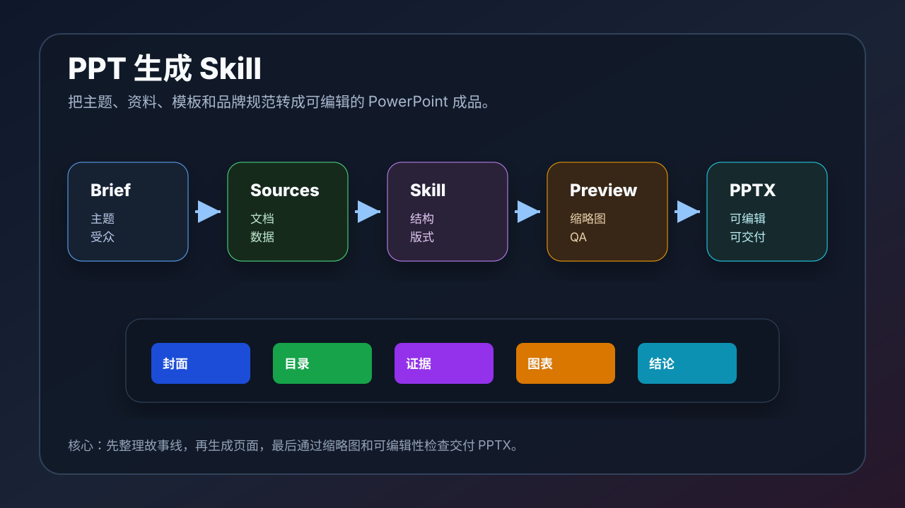

# 生成 PPT 的 Skill：用 AI 做出可编辑的 PowerPoint

本文介绍生成 PPT 的 Skill 能做什么、适合哪些场景、怎么安装和使用，以及如何把一段需求变成一份可编辑、可修改、可交付的 `.pptx` 文件。

## 快速入口

- Anthropic 官方 PPTX Skill：https://github.com/anthropics/skills/tree/main/skills/pptx
- Anthropic Skills 仓库：https://github.com/anthropics/skills
- OpenAI Skills 仓库：https://github.com/openai/skills
- PptxGenJS：https://github.com/gitbrent/PptxGenJS

如果你想最快看到「生成 PPT 的 Skill」长什么样，先打开 `https://github.com/anthropics/skills/tree/main/skills/pptx`。这个目录里包含 `SKILL.md`、PPTX 处理脚本、编辑说明和相关参考文件。



## 一、PPT 生成 Skill 是什么

PPT 生成 Skill 是一套专门指导 AI 处理 `.pptx` 文件的工作流。

它通常能覆盖这些任务：

- 从零创建一份 PowerPoint。
- 根据大纲生成完整演示文稿。
- 读取和分析已有 `.pptx`。
- 按模板生成新 PPT。
- 修改已有 PPT 的文字、图片、图表和备注。
- 合并或拆分多个 PPT。
- 生成演讲者备注。
- 输出可编辑的 `.pptx` 文件，而不是一张张图片。

简单理解：

```text
普通提示词：帮我写一个 PPT 大纲。
PPT Skill：帮我生成一份能打开、能编辑、能继续修改的 PowerPoint 文件。
```

## 二、为什么需要专门的 PPT Skill

PPT 看起来只是文字和图片，但实际结构很复杂。

一个 `.pptx` 文件里包含：

- 页面布局
- 母版和版式
- 文本框
- 图片
- 图表
- 表格
- 主题色
- 字体
- 动画
- speaker notes
- XML 关系文件

如果没有专门的 Skill，AI 容易出现这些问题：

- 只生成文字大纲，不生成真正的 PPT。
- 生成的 PPT 版式单调，全是标题加 bullet。
- 图表不可编辑。
- 字体、颜色、间距不统一。
- 模板被破坏。
- Keynote 或 PowerPoint 打开异常。
- 修改已有 PPT 时误删元素。

PPT Skill 的价值，就是把这些复杂操作变成可重复的步骤。

## 三、适合用 PPT Skill 的场景

### 1. 教程课件

适合把一篇文章变成教学 PPT，例如：

- AI 工具入门课
- Codex 使用教程
- Claude Code Skills 教程
- Remotion / HyperFrames 视频生成课

可以让 AI 根据文章自动拆分章节、生成标题页、知识点页、示例页和总结页。

### 2. 产品介绍

适合做：

- 产品功能介绍
- SaaS 销售材料
- 开源项目介绍
- Demo day 展示
- 客户汇报

重点是把功能点变成清晰故事线，而不是堆信息。

### 3. 投资人或管理层汇报

适合做：

- 商业计划书
- 投资人 pitch deck
- 月度经营汇报
- 项目复盘
- 战略规划

这类 PPT 更强调证据链、数据准确性和页面节奏。

### 4. 模板化批量生成

如果团队经常做同一类 PPT，可以把模板和流程固定下来：

- 每周周报
- 客户报告
- 项目复盘
- 课程讲义
- 数据分析报告

以后只换数据和内容，就能批量生成。

## 四、安装和使用方式

### 方式一：使用 Anthropic 官方 PPTX Skill

官方入口：

```text
https://github.com/anthropics/skills/tree/main/skills/pptx
```

如果你的 AI 工具支持从 GitHub 安装 Skills，可以安装这个目录下的 `pptx` Skill。

安装后，你可以这样调用：

```text
请使用 pptx skill，把这篇文章整理成 12 页教学 PPT。
要求包含封面、目录、核心概念、案例、流程图、总结页。
```

或者：

```text
请使用 pptx skill，读取 template.pptx，按照模板风格生成一份关于 AI 工作流的演示文稿。
```

### 方式二：在 Codex 中使用 Presentations 能力

Codex 里也可以使用 Presentations 插件/Skill 来生成高质量 PowerPoint。

适合场景：

- 需要更强的版式设计。
- 需要输出最终 `.pptx`。
- 需要生成预览图做视觉 QA。
- 需要把数据、图表、叙事和设计结合。

可以这样提示：

```text
请使用 Presentations 能力，基于当前 README 和文章目录，生成一份 10 页 AI-guide-book 项目介绍 PPT。
要求：
- 输出可编辑 PPTX。
- 每页有明确标题和核心观点。
- 使用统一配色和字体。
- 生成预览图并检查可读性。
```

### 方式三：自己写一个项目级 PPT Skill

如果你的团队有固定模板，可以在项目里放：

```text
.agents/skills/ppt-report/SKILL.md
```

示例：

```markdown
---
name: ppt-report
description: Generate this project's standard PowerPoint report from markdown notes, charts, and screenshots.
---

When creating a deck:

1. Read the source markdown.
2. Extract the claim spine.
3. Use the project brand colors.
4. Create 8-12 slides.
5. Include speaker notes for each slide.
6. Render slide previews.
7. Check that text is readable at thumbnail size.
8. Export an editable .pptx file.
```

这种方式适合把团队自己的 PPT 规范沉淀下来。

## 五、生成 PPT 的推荐流程

### 1. 先写清楚输入

最少要给 AI：

- PPT 主题
- 目标受众
- 页数
- 用途
- 语气
- 是否需要图表
- 是否有模板
- 是否有品牌色
- 是否需要演讲者备注

示例：

```text
请生成一份 12 页 PPT，主题是“AI 工具工作流”。
受众是刚开始使用 AI 工具的开发者。
用途是内部分享。
风格专业、清晰，不要太花。
需要包含流程图、工具选择表和总结页。
```

### 2. 先生成故事线

不要直接生成 PPT 文件。先让 AI 输出结构：

```text
请先给出这份 PPT 的 claim spine：
每页标题、核心观点、需要的证据和建议版式。
确认后再生成 PPT。
```

这样可以避免生成一堆漂亮但没有逻辑的页面。

### 3. 再生成页面

确认故事线后，再让 AI 生成 PPT：

```text
请根据确认后的 claim spine 生成可编辑 PPTX。
每页都要有明确观点，不要只堆 bullet。
```

### 4. 生成预览图

生成 PPT 后，建议让 AI 输出缩略图或预览图。

检查重点：

- 标题是否清楚。
- 字号是否足够大。
- 页面是否拥挤。
- 是否所有页面都长得一样。
- 图表是否可读。
- 图片是否变形。
- 是否有错别字。

### 5. 再迭代修改

常见修改包括：

- 减少文字。
- 增加图表。
- 调整章节顺序。
- 统一视觉风格。
- 补充 speaker notes。
- 增加封面和收尾页。

## 六、好提示词模板

可以直接使用这个模板：

```text
请使用 PPTX / Presentations Skill，生成一份可编辑 PowerPoint。

主题：
【填写主题】

受众：
【填写受众】

用途：
【内部分享 / 客户汇报 / 课程教学 / 投资人介绍】

页数：
【8-12 页】

内容来源：
【README、文章、数据表、截图、网页链接等】

设计要求：
- 专业、清晰、有层次。
- 不要每页都做成标题 + bullet。
- 每页要有一个核心观点。
- 尽量使用图表、流程图、对比表和示意图。
- 输出可编辑 .pptx。
- 生成预览图并检查可读性。

请先给出大纲和每页设计计划，确认后再生成 PPT。
```

## 七、常见坑

### 1. 只让 AI 写“大纲”

如果你想要真正的 PowerPoint，要明确说：

```text
输出可编辑 .pptx 文件。
```

否则 AI 可能只给你 Markdown 大纲。

### 2. 页数太多但资料太少

资料不足时，AI 容易编内容。更好的做法是：

- 先限制页数。
- 标注哪些内容可以推断，哪些不能编。
- 要求引用来源。

### 3. 全是 bullet 页

可以明确要求：

```text
不要连续使用超过 2 页标题 + bullet 版式。
必须混合使用流程图、对比表、卡片、图表和总结页。
```

### 4. 模板被破坏

如果使用已有模板，要强调：

```text
请保持 template.pptx 的字体、颜色、页眉页脚、Logo 和版式系统。
只替换内容，不要重建模板。
```

### 5. 没有视觉 QA

PPT 一定要看缩略图。缩略图能快速暴露页面是否单调、过密或风格不统一。

## 八、适合本项目的玩法

这个 `AI-guide-book` 项目很适合用 PPT Skill 做几类材料：

- 把 README 变成项目介绍 PPT。
- 把 Skills 章节变成 AI 工具课件。
- 把 Codex + HyperFrames / Remotion 文章变成视频生成课程。
- 把工作流文章变成 10 页内部分享。
- 每新增一篇文章，自动生成 1-2 页课件补充到总课件里。

这样项目就不只是 Markdown 文档，也可以继续扩展成课程、直播分享、培训材料和社媒内容。

## 九、截图建议

后续制作图文版时，可以补充这些截图：

- `images/ppt-skill/github-pptx-skill.png`：Anthropic PPTX Skill GitHub 页面
- `images/ppt-skill/skill-md.png`：`SKILL.md` 内容结构
- `images/ppt-skill/outline.png`：生成 PPT 前的大纲和 claim spine
- `images/ppt-skill/slide-preview.png`：PPT 缩略图预览
- `images/ppt-skill/final-pptx.png`：最终 `.pptx` 文件打开效果
- `images/ppt-skill/speaker-notes.png`：演讲者备注示例

截图时注意遮挡客户资料、内部数据、未公开产品名和个人信息。

## 十、总结

生成 PPT 的 Skill 不只是“帮你写几页幻灯片”，它真正解决的是一整套流程：

```text
资料 -> 故事线 -> 页面计划 -> 可编辑 PPTX -> 预览检查 -> 迭代修改
```

如果你的工作里经常需要做汇报、课件、产品介绍或项目复盘，PPT Skill 很值得安装和长期使用。

## 参考资料

- Anthropic PPTX Skill：https://github.com/anthropics/skills/tree/main/skills/pptx
- Anthropic Skills：https://github.com/anthropics/skills
- OpenAI Skills：https://github.com/openai/skills
- PptxGenJS：https://github.com/gitbrent/PptxGenJS
