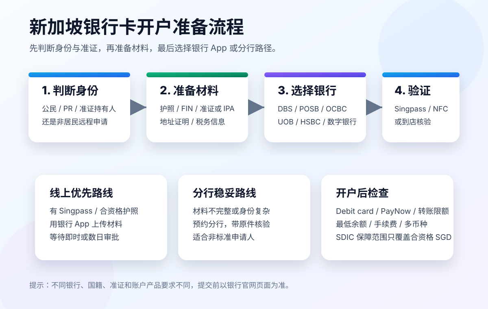

# 新加坡银行卡开户攻略：从材料准备到银行选择

> 更新日期：2026-07-10  
> 说明：本文是开户资料整理，不构成金融、税务或移民建议。银行要求会按国籍、准证、账户产品、KYC 审查和政策变化调整，提交前以银行官网和柜台要求为准。

如果你准备去新加坡工作、留学、长期居住，银行卡基本是第一批要解决的事情。工资入账、租房押金、日常消费、PayNow 转账、Grab/地铁/线上订阅，都会用到本地银行账户或借记卡。



## 一、先判断你属于哪类申请人

新加坡银行卡开户最关键的不是“选哪家银行”，而是先判断你的身份状态。

| 类型 | 常见情况 | 开户难度 |
| --- | --- | --- |
| 新加坡公民 / PR | 有 NRIC、Singpass、长期地址 | 最简单 |
| 准证持有人 | EP、S Pass、Student Pass、Dependant Pass、LTVP 等 | 常规路径 |
| 已获 IPA 但还没拿到准证 | 刚获批工作/学生准证 | 部分银行可接受 |
| 非居民 / 未入境 / 无准证 | 仅旅游、短期访问、海外远程申请 | 难度最高 |

对大多数外国人来说，最稳的开户条件是：

```text
护照 + 有效新加坡准证或 IPA + 地址证明 + 税务居民信息 + 新加坡手机号
```

如果你还没有新加坡准证，也不是银行指定支持的远程开户国籍，普通储蓄账户通常会比较难开。

## 二、开户前准备材料清单

不同银行会有差异，但官方资料里反复出现的材料包括：

### 1. 身份证明

常见材料：

- 护照个人信息页
- 新加坡 NRIC，适用于公民/PR
- 马来西亚 IC，部分银行接受
- 合资格国家/地区的生物芯片护照，部分远程开户路径需要

DBS/POSB 的账户材料说明里明确提到，外国国籍通常需要护照 biodata page。

### 2. 新加坡准证或 IPA

常见材料：

- Employment Pass
- S Pass
- Work Permit
- Student Pass
- Dependant Pass
- Long-Term Visit Pass
- EntrePass
- MOM 或 ICA 的 In-Principle Approval letter

DBS/POSB 针对新加坡新到人士的页面写明，Employment Pass、S Pass、Student Pass 或 MOM/ICA 的 IPA 都可能作为有效材料。

### 3. 地址证明

常见地址证明：

- 水电煤账单
- 电信账单
- 银行或信用卡账单
- 租约
- 学校证明信
- 雇主信
- 政府或银行认可的地址文件

注意两个细节：

- 很多银行要求文件是最近 3 个月内开具。
- 地址最好和申请表填写地址一致。

### 4. 税务居民信息

银行通常会要求你填写税务居民身份和 TIN（Tax Identification Number）。这和 CRS/FATCA 等合规要求有关。

如果你是中国税务居民，一般会被要求填写中国税务识别号。具体填法以银行表格提示和个人税务情况为准。

### 5. 新加坡手机号和邮箱

建议提前准备：

- 新加坡手机号
- 可长期使用的邮箱
- 能接收 OTP 的手机
- 手机支持 NFC，部分银行线上验证 e-passport 会用到

OCBC 的外国人线上开户说明里提到，使用 OCBC Digital app 时需要手机具备 NFC 和相机功能。

## 三、银行选择：先看开户路径，再看账户功能

新加坡常见选择包括：

- DBS / POSB
- OCBC
- UOB
- HSBC
- Standard Chartered
- Citi
- GXS、MariBank 等数字银行

如果你是刚到新加坡的外国人，建议优先看 DBS/POSB 和 OCBC；如果你已有国际银行关系，再看 HSBC、Standard Chartered、Citi；如果你已经有 Singpass，可以把数字银行作为第二账户研究。

## 四、DBS / POSB：新到人士常见选择

官网入口：

- DBS 外国人开户：https://www.dbs.com.sg/personal/deposits/for-foreigners/new-to-singapore
- POSB 外国人开户：https://www.posb.com.sg/personal/deposits/for-foreigners/new-to-singapore
- DBS My Account：https://www.dbs.com.sg/personal/deposits/savings-accounts/my-account

DBS/POSB 的优势是资料说明相对清晰，对工作、学习、居住在新加坡的外国人有专门页面。

常见材料：

```text
护照 / 身份证件
有效准证或 IPA
地址证明
税务居民证明/税务信息
```

POSB 页面说明，外国人申请时可能需要上传身份证明、有效 pass 或 MOM/ICA 的 IPA、住址证明、税务居民证明，审批通常会通过邮件通知。

适合人群：

- 刚到新加坡工作的人
- 留学生
- 有 MOM/ICA IPA 的申请人
- 想走主流本地银行的人

注意点：

- 用 Singpass 会更快，因为可以预填个人信息。
- 没有 Singpass 也可能可以申请，但通常要上传更多材料。
- 审批不是一定即时通过，可能需要 3-5 个工作日或更久。

## 五、OCBC：部分外国人可远程开户

官网入口：

- OCBC 外国人开户文章：https://www.ocbc.com/personal-banking/articles/how-to-open-a-bank-account-in-singapore-for-foreigners.page
- OCBC Digital 开户：https://www.ocbc.com/personal-banking/digital-banking/sg-bank-account.page

OCBC 的特点是对部分外国人提供 App 远程开户路径。

OCBC 官网说明，外国人通过 OCBC Digital app 开户时，通常需要：

- 年满 18 岁
- 持有香港、马来西亚、印度尼西亚或中国大陆的生物芯片护照
- 准备身份证件
- 手机具备 NFC 和相机功能
- 根据情况提供地址证明和相关来源文件

基本流程：

```text
下载 OCBC Digital app
选择 Sign up
选择 Foreigner with e-passport
用 e-passport / ID 做身份验证
上传地址证明等材料
等待审批
```

适合人群：

- 持有支持地区 e-passport 的外国人
- 想在抵达前或刚抵达时远程申请的人
- 想减少分行排队的人

注意点：

- 远程开户资格和支持国籍会变化。
- 地址证明和资金来源文件可能会被要求补交。
- 如果线上流程失败，通常还是要转分行或人工审核。

## 六、UOB：适合作为备选，但要提前确认材料

官网入口：

- UOB Singapore：https://www.uob.com.sg/personal/index.page
- UOB 联系方式：https://www.uobgroup.com/uobgroup/default.page

UOB 是新加坡三大本地银行之一，但公开页面对“外国人线上开普通个人账户”的材料说明不如 DBS/OCBC 集中。

如果你想开 UOB，建议先做两件事：

```text
1. 在线查看具体账户产品要求。
2. 联系 UOB 或预约分行，确认你的准证、国籍和地址证明是否可接受。
```

适合人群：

- 已经在新加坡，有完整准证和地址证明
- 公司工资账户或 HR 推荐 UOB
- 想使用 UOB 信用卡、优惠、分行服务

不建议材料还不齐就直接跑分行碰运气，也不要只凭网上非官方经验判断一定能开。

## 七、HSBC / Standard Chartered / Citi：国际银行路线

以 HSBC 为例，官网说明如果持有有效 FIN 并居住在新加坡，可能需要上传护照副本和地址证明；否则银行会通过邮件发送身份验证说明。

官网入口：

- HSBC Singapore International Account：https://www.hsbc.com.sg/international/open-an-account/

国际银行适合：

- 已经有国际银行关系
- 有跨境转账需求
- 需要多币种服务
- 计划之后申请信用卡、投资、理财或海外账户联动

注意点：

- 账户维护费、最低余额、外币兑换差价要看清楚。
- 不同账户等级要求差异很大。
- 国际银行的 KYC 审核可能更细。

## 八、数字银行：方便，但通常依赖 Singpass

新加坡近年有 GXS、MariBank 等数字银行。

它们的优势是：

- App 体验轻
- 开户快
- 存款利率活动多
- 日常消费和储蓄方便

但对外国人来说，常见限制是：

```text
需要有效新加坡准证 + Singpass
```

所以它们更适合作为第二个账户，而不是所有人的第一个新加坡银行账户。

## 九、Singpass 很重要

Singpass 是新加坡很多线上服务的身份入口。

银行开户时，如果你有 Singpass，常见好处是：

- 自动填充个人信息
- 减少上传文件
- 加快身份验证
- 有机会即时开户

DBS 的开户页面明确提到可以使用 Singpass 预填申请信息，并支持即时开户。Singpass 官方支持页面也提供 FIN 持有人注册 Singpass 的说明。

如果你已经拿到 FIN 和准证，建议优先处理：

```text
准证 / FIN -> Singpass -> 银行账户
```

这条路径通常比“没有 Singpass 直接申请”更顺。

## 十、开户流程建议

### 路线 A：已经在新加坡，有准证和 Singpass

推荐：

```text
DBS/POSB 或 OCBC App 线上申请
```

流程：

```text
下载银行 App
用 Singpass / e-passport 验证身份
上传地址证明和税务信息
等待开户结果
激活 debit card、PayNow、转账限额
```

### 路线 B：刚获批 IPA，还没入境或刚入境

推荐：

```text
先查 DBS/POSB 是否接受 IPA，再准备地址证明和雇主/学校文件
```

注意：

- 部分银行接受 MOM/ICA IPA。
- 但地址证明、手机号、税务信息仍可能被要求。
- 如果 App 不通过，转分行处理。

### 路线 C：OCBC 支持地区 e-passport 持有人

推荐：

```text
尝试 OCBC Digital app 的 Foreigner with e-passport
```

准备：

- NFC 手机
- 生物芯片护照
- 身份证件
- 地址证明
- 资金/来源文件

### 路线 D：无准证、非居民、纯远程

这类最难。

普通本地储蓄账户通常不适合直接尝试。更现实的选择是：

- 等拿到准证或 IPA
- 咨询国际银行的非居民账户
- 使用 Wise / Revolut 等作为过渡收付款工具
- 到新加坡后带材料去分行

不要相信“无准证、无地址、百分百代开”的中介说法。银行 KYC 审查越来越严格，用虚假地址或伪造材料有账户冻结和合规风险。

## 十一、开户后要检查什么

开户成功不等于就完成了。

建议立刻检查：

- 是否有借记卡
- 借记卡是否需要单独申请
- 是否开通 PayNow
- 本地转账限额是多少
- 海外转账限额是多少
- 是否有最低余额要求
- 是否有 fall-below fee
- 是否有多币种账户
- ATM 取现费用
- 海外刷卡汇率和手续费
- 是否支持 Apple Pay / Google Pay
- 是否能接收工资

如果你要长期使用，最好再开通：

- eStatement
- 交易通知
- 转账限额管理
- 设备绑定
- 2FA / 数字 token

## 十二、存款保障：SDIC 只覆盖合资格新币存款

新加坡有 Deposit Insurance Scheme，由 Singapore Deposit Insurance Corporation（SDIC）管理。

MoneySense 和 SDIC 说明，合资格的新加坡元存款在每个 Scheme member 下，按每名存款人最高 S$100,000 提供保障。

要注意：

- 覆盖的是合资格 SGD 存款。
- 外币存款、双币投资、结构性存款、投资产品通常不属于普通存款保障范围。
- 如果你在同一家成员银行开多个账户，通常会合并计算保障限额。

官网入口：

- MoneySense 存款保障：https://www.moneysense.gov.sg/understanding-deposit-insurance/
- SDIC：https://www.sdic.org.sg/

## 十三、常见问题

### 1. 没有新加坡手机号能开户吗？

有些线上流程可能卡在 OTP、App 注册或后续安全验证。建议先准备新加坡手机号，至少要有能长期接收短信和银行通知的号码。

### 2. 刚到新加坡，没有租约怎么办？

可以查看银行是否接受：

- 雇主信
- 学校信
- 临时住宿证明
- 海外地址证明
- 其他银行认可文件

但是否接受以银行审核为准。

### 3. 只有 IPA 可以开户吗？

部分银行路径可能接受 MOM/ICA IPA，例如 DBS/POSB 页面明确提到 IPA。其他银行要逐家确认。

### 4. 中国大陆护照能远程开户吗？

OCBC 官网说明其外国人线上开户路径支持中国大陆等地区的生物芯片护照，但仍需要满足 app 验证、地址证明、来源文件等要求。政策可能变化，提交前看 OCBC 最新页面。

### 5. 最推荐哪家？

没有绝对答案。

如果你刚到新加坡：

```text
优先看 DBS/POSB 和 OCBC。
```

如果你已有国际银行关系：

```text
再看 HSBC、Standard Chartered、Citi。
```

如果你已经有 Singpass：

```text
可以再研究数字银行作为第二账户。
```

## 十四、避坑清单

开户前检查：

- 护照有效期是否足够
- 准证或 IPA 是否清晰
- 地址证明是否在有效期内
- 文件姓名拼写是否一致
- 税务居民信息是否准备好
- 手机是否支持 NFC
- 是否有新加坡手机号
- 是否能接收 OTP
- 是否看过账户费用表

不要做：

- 不要提交虚假地址
- 不要用他人手机号长期绑定
- 不要把银行卡交给别人使用
- 不要相信“无条件包开”的代办
- 不要把银行 OTP、Singpass、API token 发给陌生人

## 十五、总结

新加坡银行卡开户的核心逻辑是：

```text
身份合法 + 材料真实 + 地址可验证 + 税务信息完整
```

最稳路线：

```text
先拿准证 / IPA
再注册 Singpass
准备地址证明和税务信息
优先尝试 DBS/POSB 或 OCBC
线上失败再预约分行
```

如果你只是短期旅游或没有任何新加坡身份，普通本地银行账户难度会明显提高。此时更实际的做法是等准证进展，或者先使用合规的跨境支付工具过渡。

## 资料来源

- DBS 外国人开户：https://www.dbs.com.sg/personal/deposits/for-foreigners/new-to-singapore
- DBS 开户材料：https://www.dbs.com.sg/personal/support/bank-account-opening-documents-required.html
- POSB 外国人开户：https://www.posb.com.sg/personal/deposits/for-foreigners/new-to-singapore
- DBS My Account：https://www.dbs.com.sg/personal/deposits/savings-accounts/my-account
- OCBC 外国人开户：https://www.ocbc.com/personal-banking/articles/how-to-open-a-bank-account-in-singapore-for-foreigners.page
- OCBC Digital 开户：https://www.ocbc.com/personal-banking/digital-banking/sg-bank-account.page
- HSBC 新加坡开户：https://www.hsbc.com.sg/international/open-an-account/
- Singpass 支持：https://portal.singpass.gov.sg/home/ui/support
- MoneySense 存款保障：https://www.moneysense.gov.sg/understanding-deposit-insurance/
- SDIC：https://www.sdic.org.sg/
