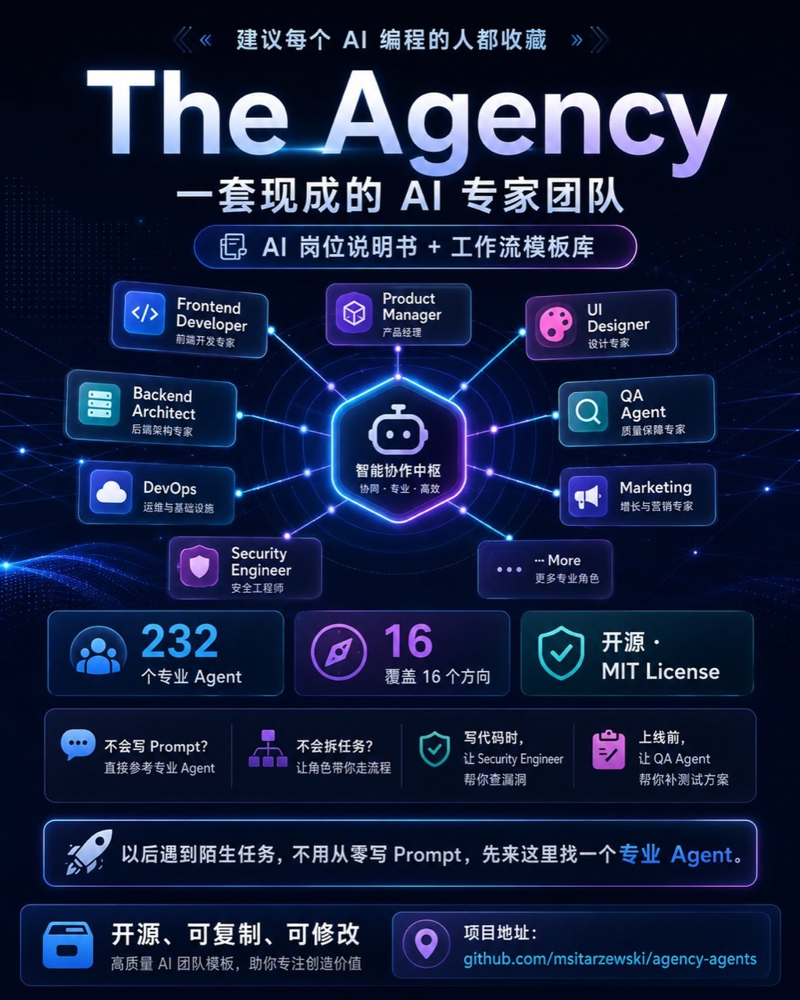

# The Agency：把 AI 编程变成一套专家团队工作流

项目地址：https://github.com/msitarzewski/agency-agents

这篇文章参考下面这张图，介绍如何把 **The Agency** 当成一套 AI 编程专家团队来使用。



The Agency 的核心价值不是让你记住更多 prompt，而是把常见的 AI 编程任务拆成不同岗位：产品经理、前端开发、后端架构、UI 设计、QA、安全、DevOps、营销等。

当你遇到陌生任务时，不需要从零写提示词，可以先找一个专业 Agent，再让它按岗位职责工作。

## 一、The Agency 适合解决什么问题

很多人用 AI 编程时，会把所有要求塞进一个长 prompt：

```text
帮我做一个 App，要好看，要有后端，要能部署，要安全，还要写文档。
```

这种方式的问题是职责太混乱。一个会话同时扮演产品、设计、前端、后端、测试和运维，很容易出现：

- 需求没拆清楚就开始写代码。
- UI 和后端互相影响。
- 写完功能没人测试。
- 上线前没人做安全检查。
- 部署步骤和文档最后才补，容易漏。

The Agency 更适合的方式是：

```text
先选角色，再分任务，再合并结果。
```

图片里展示的方向包括：

- Frontend Developer：前端开发专家
- Backend Architect：后端架构专家
- DevOps：运维与基础设施
- Security Engineer：安全工程师
- Product Manager：产品经理
- UI Designer：设计专家
- QA Agent：质量保障专家
- Marketing：增长与营销专家

这套思路很适合配合 Codex、Claude Code、Cursor 等 AI 编程工具使用。

## 二、不要把它当 prompt 合集，要当岗位说明书

The Agency 更像一套可复用的岗位说明书。

每个 Agent 都应该回答三个问题：

```text
你是谁？
你负责什么？
你不负责什么？
```

例如前端 Agent 的职责可以是：

```text
你是 Frontend Developer Agent。
只负责页面结构、组件、交互状态和浏览器兼容。
不要修改后端 API、数据库 schema、部署配置。
完成后给出修改文件、验证命令和剩余风险。
```

后端 Agent 的职责可以是：

```text
你是 Backend Architect Agent。
只负责 API 设计、数据模型、鉴权边界和服务端实现。
不要修改前端样式、营销文案、部署脚本。
完成后说明接口契约、错误处理和需要前端配合的地方。
```

这样做的重点是控制边界。AI 的能力很强，但如果不给边界，它会主动改很多不该改的东西。

## 三、推荐的 AI 编程专家团队

刚开始不需要一次使用 200 多个 Agent。

建议先固定 7 个核心角色：

| 角色 | 适合任务 |
| --- | --- |
| Product Manager | 拆需求、定义用户流程、写验收标准 |
| UI Designer | 页面布局、视觉风格、组件状态 |
| Frontend Developer | 前端组件、状态管理、浏览器验证 |
| Backend Architect | API、数据库、权限、业务逻辑 |
| QA Agent | 测试用例、回归检查、边界场景 |
| Security Engineer | 权限、输入校验、敏感数据、安全风险 |
| DevOps | 部署、环境变量、CI、运行文档 |

这 7 个角色已经能覆盖大多数 App 开发流程。

后续如果任务变复杂，再补充：

- Docs Agent：专门写文档。
- Data Engineer：处理数据管道。
- SEO Agent：优化搜索流量。
- Marketing Agent：写发布文案和增长方案。
- Support Agent：写 FAQ 和客服话术。

## 四、和 Codex 多 Session 结合使用

The Agency 最实用的方式，是配合 Codex 多 session。

推荐结构：

```text
主控 Session：Product Manager + Tech Lead
前端 Session：Frontend Developer + UI Designer
后端 Session：Backend Architect
测试 Session：QA Agent
安全 Session：Security Engineer
部署 Session：DevOps
```

主控 Session 负责：

- 阅读项目现状。
- 拆分任务。
- 指定每个 Agent 的文件边界。
- 收集结果。
- 解决冲突。
- 最后提交和推送。

工作 Session 负责：

- 只做自己的角色任务。
- 不越界修改无关文件。
- 跑对应验证命令。
- 最后汇报 diff、验证结果和风险。

推荐流程：

```text
1. 主控 session 拆任务。
2. 从 The Agency 选择对应角色。
3. 给每个 session 贴入角色说明。
4. 明确允许修改的文件范围。
5. 各 session 独立实现和验证。
6. 主控 session 合并、检查、提交。
```

## 五、可以直接使用的角色提示词

### Product Manager Agent

```text
你是 Product Manager Agent。

目标：把用户需求拆成可执行任务。

请输出：
- 用户目标
- 核心功能
- 非目标范围
- 页面或接口清单
- 验收标准
- 可分配给前端、后端、QA、安全、DevOps 的任务

要求：
- 不写代码。
- 不直接改文件。
- 每个任务都要有明确完成标准。
```

### Frontend Developer Agent

```text
你是 Frontend Developer Agent。

目标：实现前端页面、组件和交互。

允许修改：
- src/pages/**
- src/components/**
- src/styles/**

不要修改：
- server/**
- db/**
- deploy/**
- README.md

完成后请汇报：
- 修改了哪些文件
- 如何运行和验证
- 移动端是否检查
- 还有哪些前端风险
```

### Backend Architect Agent

```text
你是 Backend Architect Agent。

目标：设计并实现后端接口、数据模型和业务逻辑。

请关注：
- API 契约
- 数据库 schema
- 鉴权边界
- 错误处理
- 日志和可观测性

不要修改前端 UI 和营销文案。

完成后请输出：
- API 列表
- 请求和响应结构
- 运行的测试命令
- 前端需要配合的接口说明
```

### QA Agent

```text
你是 QA Agent。

目标：在上线前检查功能是否可靠。

请完成：
- 正常路径测试
- 异常路径测试
- 空数据测试
- 权限边界测试
- 移动端或窄屏检查
- 回归风险清单

如果发现问题，只先报告问题和复现步骤。
除非明确要求，不要直接改代码。
```

### Security Engineer Agent

```text
你是 Security Engineer Agent。

目标：审查项目中的安全风险。

请重点检查：
- 输入校验
- 权限绕过
- 敏感信息泄露
- 环境变量使用
- 第三方依赖风险
- 日志中是否暴露 token、邮箱、手机号等信息

输出格式：
- 风险等级
- 影响范围
- 复现方式
- 修复建议
```

## 六、一个完整开发流程示例

假设你要用 Codex 做一个 AI 图片提示词管理 App。

可以这样组织：

### 第 1 步：主控 Session 拆任务

```text
请作为主控 session 阅读当前项目。
目标：开发一个 AI 图片提示词管理 App。
请拆成 Product、UI、Frontend、Backend、QA、Security、DevOps 七个任务。
每个任务要写清楚允许修改文件、禁止修改文件、验证方式和交付格式。
先不要改代码。
```

### 第 2 步：UI Designer 先出界面结构

```text
你是 UI Designer Agent。
请设计这个 App 的主要页面结构：
- 提示词列表
- 提示词编辑
- 标签筛选
- 图片预览
- 导出按钮

只输出页面结构、组件清单和交互状态，不写代码。
```

### 第 3 步：Frontend Developer 实现页面

```text
你是 Frontend Developer Agent。
根据 UI Designer 的方案实现页面。
只修改前端目录。
完成后运行 lint，并说明浏览器验证结果。
```

### 第 4 步：Backend Architect 实现数据接口

```text
你是 Backend Architect Agent。
实现提示词的增删改查接口和标签查询接口。
请保持 API 契约清晰，并补充必要测试。
```

### 第 5 步：QA Agent 做上线前检查

```text
你是 QA Agent。
请检查提示词创建、编辑、删除、搜索、标签筛选、空数据和错误状态。
输出问题清单、复现步骤和建议优先级。
```

### 第 6 步：Security Engineer 做安全审查

```text
你是 Security Engineer Agent。
请检查输入校验、权限边界、环境变量、日志泄露和依赖风险。
只输出审查结果，不修改代码。
```

### 第 7 步：主控 Session 合并和提交

```text
请作为主控 session 汇总所有 agent 的结果。
检查冲突、运行验证命令、更新 README。
确认无问题后提交并推送。
```

## 七、常见错误

### 1. 一次开太多 Agent

不要一上来就使用几十个 Agent。角色越多，协调成本越高。

建议从 3 个开始：

```text
Product Manager + Frontend Developer + QA Agent
```

项目变复杂后再加 Backend、Security、DevOps。

### 2. 多个 Agent 改同一批文件

这是最容易造成冲突的地方。

前端 Agent 和 UI Agent 可以讨论同一页面，但不要同时修改同一个组件文件。

更稳的方式是：

```text
UI Agent 只出方案。
Frontend Agent 负责落代码。
QA Agent 只检查。
```

### 3. 没有主控 Session

多个 Agent 不能自动等于团队。

必须有一个主控 session 负责最终判断：

- 哪些建议要采纳。
- 哪些 diff 要合并。
- 哪些问题要延后。
- 什么时候可以提交。

### 4. 没有验证命令

每个 Agent 都要交付验证结果。

不要只说“完成了”，而要说：

```text
已运行 npm run lint。
已运行 npm test。
已打开浏览器检查移动端。
发现 1 个低优先级问题。
```

## 八、如何沉淀成自己的 Skill

如果你经常使用 The Agency，可以把常用角色沉淀成项目内 skill。

例如：

```text
.agents/
  skills/
    agency-product-manager.md
    agency-frontend-developer.md
    agency-backend-architect.md
    agency-qa-agent.md
    agency-security-engineer.md
```

每个文件只放三类信息：

```text
1. 角色职责
2. 文件边界
3. 交付格式
```

这样以后开新项目时，不需要重新写长 prompt，只需要说：

```text
请按 agency-frontend-developer 角色执行这个任务。
```

## 九、总结

The Agency 的价值在于把 AI 编程从“单个聊天窗口”升级成“可组织的专家团队”。

最推荐的用法是：

```text
The Agency 提供角色说明。
Codex 多 session 负责并行执行。
主控 session 负责合并、验证和提交。
```

对于个人开发者，它可以帮你补齐产品、设计、测试、安全和部署视角。

对于团队，它可以把 AI 任务标准化，让每个 AI 会话都有明确岗位、边界和交付格式。

参考项目：

- GitHub：https://github.com/msitarzewski/agency-agents
