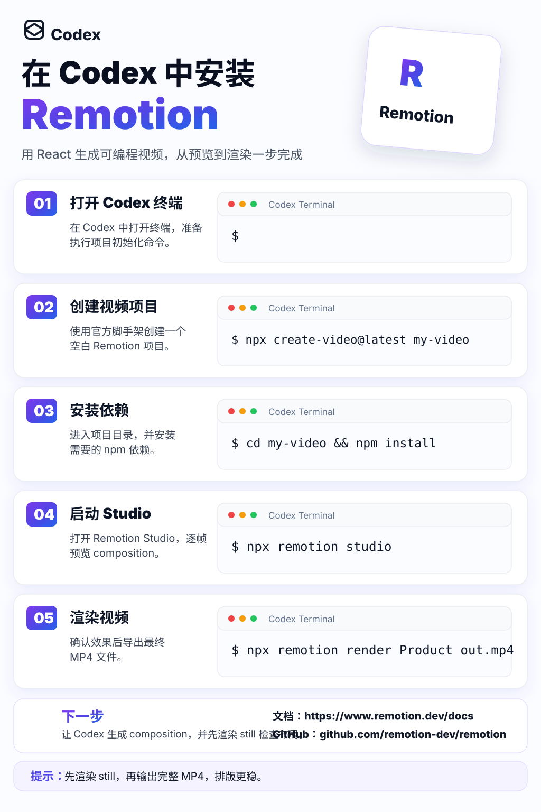

# 教程海报生成工作流：批量生成 AI 工具教程图片

本文基于一张「在 Codex 中安装 HyperFrames」风格的参考图，整理一套可复用的教程海报生成方法。目标是让后续每篇文章都能配一张统一风格的步骤图。

这类图适合用于：

- GitHub README
- 公众号配图
- 小红书 / X / LinkedIn 教程图
- AI 工具安装指南
- Skills 使用教程
- 视频生成流程说明

## 快速入口

- SVG 模板：[templates/tutorial-poster-template.svg](./templates/tutorial-poster-template.svg)
- 示例效果图：[images/tutorial-poster-style-preview.svg](./images/tutorial-poster-style-preview.svg)
- OpenAI Skills：https://github.com/openai/skills
- Anthropic Skills：https://github.com/anthropics/skills



## 一、风格定义

这套图片的核心风格是：

```text
白色科技感教程海报，纵向信息图，圆角卡片布局，紫蓝渐变强调色，左侧步骤说明，右侧终端窗口代码示例，顶部品牌标题，右上角产品卡片，底部资源区和提示区。
```

关键词：

```text
clean white background, purple blue gradient, rounded cards, soft shadow,
terminal mockup, step-by-step tutorial, Chinese typography, modern SaaS style,
light UI, minimal icons, dotted background, glassmorphism, high readability
```

## 二、为什么建议用 SVG 模板

直接用图片模型生成这类教程图，最容易出问题的是：

- 中文乱码
- 命令拼错
- 链接错误
- 编号错乱
- 卡片间距不统一
- 文字重叠

所以更推荐：

```text
先用 Codex 生成 SVG / HTML
再导出 PNG
```

这样每个文字、命令、链接都可控，也方便后续批量替换。

## 三、标准工作流

推荐流程：

```text
1. 确定主题
2. 拆成 5 个步骤
3. 填写模板字段
4. 生成 SVG
5. 检查中文和命令
6. 导出 PNG
7. 放进文章或 README
```

每张图只讲一个主题，步骤不要超过 5 个。

## 四、字段结构

每张图需要这些字段：

```json
{
  "brandName": "Codex",
  "titleLine1": "在 Codex 中安装",
  "titleLine2": "Remotion",
  "subtitle": "用 React 生成可编程视频，从预览到渲染一步完成",
  "productName": "Remotion",
  "productMark": "R",
  "steps": [
    {
      "number": "01",
      "title": "打开 Codex 终端",
      "description": ["在 Codex 中打开终端，准备", "执行项目初始化命令。"],
      "command": ""
    },
    {
      "number": "02",
      "title": "创建视频项目",
      "description": ["使用官方脚手架创建一个", "空白 Remotion 项目。"],
      "command": "npx create-video@latest my-video"
    }
  ],
  "nextStep": "让 Codex 生成 composition，并先渲染 still 检查布局。",
  "docsUrl": "https://www.remotion.dev/docs",
  "githubUrl": "github.com/remotion-dev/remotion",
  "tip": "先渲染 still，再输出完整 MP4，排版更稳。"
}
```

## 五、给 Codex 的主提示词

可以直接复制：

```text
请参考 templates/tutorial-poster-template.svg 的风格，生成一张中文教程 SVG 海报。

要求：
- 尺寸 1024x1536
- 白色科技感背景
- 紫蓝渐变强调色
- 顶部有品牌和大标题
- 右上角有产品卡片
- 主体是 5 个步骤卡片
- 每个步骤左侧是编号、标题、说明
- 每个步骤右侧是终端窗口 mockup
- 底部有“下一步”、文档、GitHub 和提示区
- 中文必须准确
- 命令必须可读
- 不要文字重叠
- 不要使用真实商标，除非我提供 logo 文件

主题：
【填写主题】

字段：
【粘贴 JSON 字段】

输出：
- 生成 SVG 文件
- 文件放到 images/xxx.svg
- 如果命令太长，请自动缩小 terminal 字体或换行
```

## 六、图片模型提示词

如果要用图片模型先生成视觉草图，可以用：

```text
Create a vertical Chinese tutorial infographic poster, 1024x1536, clean white SaaS style, inspired by modern AI tool onboarding cards. Top left brand text "Codex" with a geometric icon. Large bold Chinese headline with one product word in purple-blue gradient. Top right floating rounded product logo card. Main body contains five rounded step cards, each with gradient numbered badge 01-05, Chinese step title, short Chinese description, simple purple line icon, and a terminal mockup on the right showing command-line code. Bottom area contains "下一步" section, resource links, and a tip bar. Use soft shadows, subtle dotted purple background decoration, glassmorphism cards, high readability, modern sans-serif typography, black text, purple accents. No clutter, no dark background, no realistic photos.
```

负面提示词：

```text
不要低清晰度，不要乱码中文，不要拥挤排版，不要暗黑背景，不要复杂插画，不要照片风格，不要 3D 卡通人物，不要文字重叠，不要错误命令，不要随机英文水印。
```

注意：图片模型更适合做视觉方向，不适合生成最终可用中文教程图。最终成品建议用 SVG。

## 七、系列选题

可以批量生成这些图：

- 在 Codex 中安装 HyperFrames
- 在 Codex 中安装 Remotion
- 在 Codex 中使用 Skills
- 在 Claude Code 中安装 Skills
- 用 Codex 多 Session 开发 App
- 用 Codex + Remotion 生成视频
- 用 Claude + Premiere 做视频剪辑
- 用 PPT Skill 生成可编辑 PowerPoint
- 用 Loop Engineering 优化 AI 工作流

每个主题都保持同一套视觉系统，只替换标题、步骤和链接。

## 八、导出 PNG

如果要把 SVG 转成 PNG，可以用浏览器、设计工具，或用命令行工具。

常见方式：

```bash
npx svgexport images/tutorial-poster-style-preview.svg output/tutorial-poster.png 1024:1536
```

也可以用浏览器打开 SVG 后截图，或导入 Figma / Sketch / Illustrator 再导出。

## 九、检查清单

每张图完成后检查：

- 中文是否正确。
- 命令是否真实可执行。
- 链接是否正确。
- 步骤是否真的连贯。
- 终端文字是否太长。
- 卡片之间是否对齐。
- 底部提示是否有价值。
- 图片是否和文章主题对应。

如果一张图用于公开教程，命令一定要再核对一次。

## 十、后续扩展

这个模板后续可以扩展成：

- 横版封面图
- 竖版短视频封面
- PPT 页面模板
- README banner
- 小红书九宫格教程
- 多语言版本
- 自动读取 JSON 批量生成图片的脚本

当文章库继续扩展时，这套海报模板可以成为统一视觉资产。
