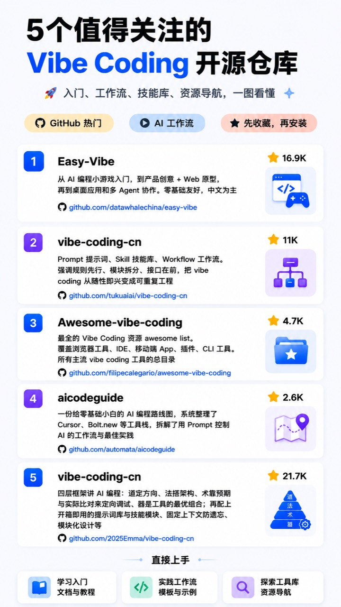

# 5 个值得关注的 Vibe Coding 开源仓库：从入门到工作流搭建

Vibe Coding 不是“随便让 AI 写代码”，更准确地说，它是一种用自然语言、上下文、工具、验证和迭代来驱动软件开发的方式。

如果你刚开始学习 Vibe Coding，不建议只收藏一堆零散教程。更好的路径是先找几个高质量开源仓库，分别解决入门、工作流、工具导航、路线图和方法论这几个问题。



> 说明：图片里的星标数是截图时的参考值，GitHub 数据会持续变化。本文更关注每个仓库适合解决什么问题，以及应该如何组合使用。

## 一、先看总览：这 5 个仓库分别适合谁

| 仓库 | 适合人群 | 主要价值 |
| --- | --- | --- |
| Easy-Vibe | 完全新手、想从小项目入门的人 | 用课程和示例带你从“会说需求”到“能做应用” |
| vibe-coding-cn | 想系统搭建 AI 编程工作流的人 | 中文教程、Prompt、Skill、Context、Quality Gate 和工程闭环 |
| Awesome Vibe Coding | 想快速找工具和资料的人 | Vibe Coding 资源导航和 awesome list |
| AI Code Guide | 想补齐 AI 编程路线图的人 | 从工具、实践、协作方式理解 AI Coding |
| 2025Emma/vibe-coding-cn | 喜欢“道法术器”方法论的人 | 用方法论拆解 AI 编程的方向、法则、术法和工具 |

如果只想快速上手，推荐顺序是：

```text
Easy-Vibe -> vibe-coding-cn -> Awesome Vibe Coding -> AI Code Guide -> 2025Emma/vibe-coding-cn
```

如果你已经会用 Codex、Cursor 或 Claude Code，则可以换成：

```text
vibe-coding-cn -> AI Code Guide -> Awesome Vibe Coding -> Easy-Vibe -> 2025Emma/vibe-coding-cn
```

## 二、Easy-Vibe：最适合从 0 到 1 入门

GitHub：https://github.com/datawhalechina/easy-vibe

Easy-Vibe 是一个偏课程型的 Vibe Coding 入门仓库。它的定位很清楚：让新手理解“会说话就能开始构建应用”这件事。

它适合你在这几种情况下打开：

- 还没有完整做过 AI 编程项目。
- 想从小游戏、网页原型、桌面应用开始练手。
- 不想一上来就被复杂工程概念劝退。
- 希望有中文友好的学习路径。

Easy-Vibe 的优势是入门门槛低。它不是先讲一大堆工程术语，而是用可感知的小任务让你建立信心。

推荐用法：

```text
先按 Easy-Vibe 做 1-2 个小项目。
不要急着追求架构完美。
目标是理解：如何把自然语言需求变成能跑的原型。
```

练习任务可以这样设计：

```text
请帮我做一个最小可用的习惯打卡网页。
要求：
- 可以新增习惯。
- 可以每天打卡。
- 本地保存数据。
- 页面适配手机。
- 先做静态可运行版本，再逐步优化。
```

这个阶段最重要的是“完成一次闭环”，而不是“写出最专业的代码”。

## 三、vibe-coding-cn：中文工作流和工程闭环

GitHub：https://github.com/tukuaiai/vibe-coding-cn

当前 GitHub 会将这个地址跳转到：

```text
https://github.com/tradecatlabs/vibe-coding-cn
```

vibe-coding-cn 更像一套中文 Vibe Coding 工作流教材。它不只讲 Prompt，而是把 Prompt、Skill、Context、Quality Gate、Git 和工程闭环放在一起讲。

这个仓库适合你在这几种情况下使用：

- 已经能让 AI 写代码，但经常失控。
- 项目越写越乱，不知道怎么拆任务。
- 会话上下文经常丢，AI 反复忘记要求。
- 想把提示词、技能库、质量门禁沉淀成团队流程。

它的核心价值是把“随手问 AI”升级为“有流程的 AI 结对编程”。

推荐重点关注这几个概念：

- Prompt：一次性指令，解决单次表达问题。
- Skill：可复用能力，解决高频任务的稳定执行问题。
- Context：持续上下文，解决长期协作中的信息丢失问题。
- Quality Gate：测试、CI、脚本、类型和 schema，用来约束 AI 输出。
- Git 闭环：用提交、分支、回滚和 review 控制风险。

推荐实践方式：

```text
每次让 AI 开发功能前，先写：
1. 目标
2. 非目标
3. 允许修改的文件
4. 禁止修改的文件
5. 验证命令
6. 完成后汇报格式
```

例如：

```text
你是前端实现 Agent。
目标：实现文章列表页搜索功能。
允许修改：src/pages/articles/**、src/components/search/**
禁止修改：server/**、db/**、README.md
验证命令：npm run lint && npm test
完成后请汇报修改文件、验证结果和剩余风险。
```

这就是从“Vibe”走向“可控 Vibe”的关键。

## 四、Awesome Vibe Coding：资源导航和工具库

GitHub：https://github.com/filipecalegario/awesome-vibe-coding

Awesome Vibe Coding 是一个资源清单型仓库。它适合用来发现工具、文章、模板、实践案例和相关项目。

这类 awesome list 的价值不是让你从头读到尾，而是在你遇到具体问题时快速查：

- 有哪些 Vibe Coding 工具？
- 有哪些 AI Coding IDE？
- 有哪些 Prompt 模板？
- 有哪些浏览器、移动端、CLI、插件方向的资源？
- 有哪些值得关注的方法论文章？

推荐用法：

```text
不要收藏后吃灰。
每次遇到一个具体问题，就去里面找对应资源。
```

例如：

```text
我现在想找一个适合 AI Coding 的浏览器自动化工具。
我现在想找一个 AGENTS.md 或 Agent 指令模板。
我现在想找一套 Vibe Coding prompt template。
```

它更像工具箱，而不是课程。

## 五、AI Code Guide：补齐 AI 编程路线图

GitHub：https://github.com/automata/aicodeguide

AI Code Guide 的定位是 AI Coding 路线图。它适合已经知道一些工具，但还没有形成完整理解的人。

它关心的问题包括：

- AI code assistant 到底怎么改变开发方式？
- 开发者应该怎么和 AI 协作？
- AI 写代码时，人应该做什么？
- 有哪些工具、实践和注意事项值得了解？

如果 Easy-Vibe 帮你开始动手，vibe-coding-cn 帮你建立中文工作流，那么 AI Code Guide 更像帮你补全“全局地图”。

推荐阅读方式：

```text
不要只看工具列表。
重点看它如何描述 AI Coding 的工作方式变化。
```

适合配合下面的问题阅读：

```text
我现在是让 AI 做副驾驶，还是我在给 AI 当副驾驶？
哪些代码适合让 AI 生成？
哪些决策必须由人控制？
我的项目有没有足够的测试和回滚机制？
```

这几个问题比“哪个工具最强”更重要。

## 六、2025Emma/vibe-coding-cn：道法术器式方法论

GitHub：https://github.com/2025Emma/vibe-coding-cn

这个仓库更偏方法论和经验总结。它用“道、法、术、器”的结构来理解 Vibe Coding：

- 道：怎么看待 AI 编程。
- 法：如何规划和拆解任务。
- 术：具体提示词、调试和协作技巧。
- 器：IDE、终端、工具和工程环境。

它适合已经做过几个项目后再看。

如果你一开始就看方法论，可能会觉得抽象；但当你经历过 AI 改乱代码、上下文丢失、需求跑偏、测试缺失之后，再看这类内容会更有感觉。

推荐用法：

```text
先做项目，再回头看方法论。
把自己踩过的坑，对照“道法术器”重新整理成规则。
```

例如你可以沉淀出自己的项目规则：

```text
道：人负责目标、边界和判断，AI 负责生成、整理和执行。
法：先写目标和非目标，再拆模块，再写验收标准。
术：每次只让 AI 改一个模块，Debug 只给最小复现。
器：Codex 负责代码执行，Git 负责回滚，测试负责验收。
```

这类总结会逐渐变成你的个人 AI 编程操作系统。

## 七、如何组合使用这 5 个仓库

### 新手路线

```text
Easy-Vibe：先完成小项目
vibe-coding-cn：学习工作流
Awesome Vibe Coding：找工具和模板
AI Code Guide：补全全局路线图
2025Emma/vibe-coding-cn：整理自己的方法论
```

### 开发者路线

```text
vibe-coding-cn：建立工程闭环
AI Code Guide：理解 AI Coding 全局变化
Awesome Vibe Coding：按需找工具
Easy-Vibe：参考课程化表达和案例
2025Emma/vibe-coding-cn：提炼团队规则
```

### 团队路线

```text
vibe-coding-cn：定义 Prompt / Skill / Context / Quality Gate
AI Code Guide：统一团队对 AI Coding 的认知
Awesome Vibe Coding：维护内部工具导航
Easy-Vibe：做新人训练材料
2025Emma/vibe-coding-cn：沉淀团队方法论
```

## 八、建议直接上手的 3 个练习

### 练习 1：用 Easy-Vibe 思路做一个小应用

```text
请帮我做一个最小可用的个人书签管理网页。
要求：
- 可以新增链接。
- 可以按标签筛选。
- 数据保存在 localStorage。
- 先实现可运行版本，不要引入后端。
```

目标：建立“从想法到原型”的体验。

### 练习 2：用 vibe-coding-cn 思路加质量门禁

```text
请为这个项目补充质量门禁：
- lint
- test
- build
- README 使用说明
- 提交前检查清单

先阅读项目结构，再提出计划，不要直接修改。
```

目标：让 AI 输出不只是能跑，还能被验证。

### 练习 3：用 Awesome Vibe Coding 找工具补齐短板

```text
我现在的短板是浏览器自动化测试。
请根据 awesome-vibe-coding 这类资源导航，帮我列出适合 AI Coding 工作流的浏览器测试工具，并说明适用场景。
```

目标：学会按问题找资源，而不是盲目收藏工具。

## 九、收藏之后怎么避免吃灰

建议给自己建一个简单的 Vibe Coding 学习表：

| 周期 | 任务 | 对应仓库 | 产出 |
| --- | --- | --- | --- |
| 第 1 周 | 做一个小应用 | Easy-Vibe | 可运行 demo |
| 第 2 周 | 加工作流和测试 | vibe-coding-cn | README + 验证命令 |
| 第 3 周 | 补工具链 | Awesome Vibe Coding | 工具清单 |
| 第 4 周 | 梳理路线图 | AI Code Guide | 个人学习地图 |
| 第 5 周 | 总结方法论 | 2025Emma/vibe-coding-cn | 自己的 AGENTS.md |

收藏不是目的，能复用才是目的。

真正有价值的沉淀应该是：

- 一个你能反复使用的 Prompt 模板。
- 一个你能交给 Codex 的 Skill。
- 一个你能放进项目的 AGENTS.md。
- 一套你每次开发都会跑的验证命令。
- 一份你踩坑后更新的工作流清单。

## 十、总结

这 5 个仓库可以分工来看：

```text
Easy-Vibe：带你开始。
vibe-coding-cn：帮你建立流程。
Awesome Vibe Coding：帮你找资源。
AI Code Guide：帮你补地图。
2025Emma/vibe-coding-cn：帮你提炼方法论。
```

Vibe Coding 的关键不是“让 AI 多写代码”，而是让 AI 在清晰目标、稳定上下文、明确边界和可验证结果里工作。

当你把这些仓库里的内容转化成自己的 Prompt、Skill、AGENTS.md、测试命令和项目规范时，它们才真正从收藏夹变成生产力。

参考仓库：

- Easy-Vibe：https://github.com/datawhalechina/easy-vibe
- vibe-coding-cn：https://github.com/tukuaiai/vibe-coding-cn
- Awesome Vibe Coding：https://github.com/filipecalegario/awesome-vibe-coding
- AI Code Guide：https://github.com/automata/aicodeguide
- 2025Emma/vibe-coding-cn：https://github.com/2025Emma/vibe-coding-cn
